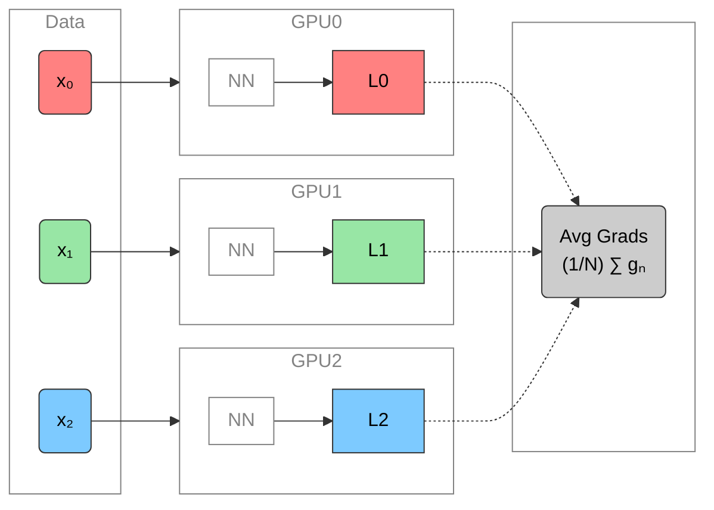

```mermaid
flowchart LR
    subgraph D["`Data`"]
        direction TB
        x("`x₀`")
        x1("`x₁`")
        x2("`x₂`")
    end
    direction LR
    subgraph G0["`GPU0`"]
        direction LR
        subgraph N0["`NN`"]
        end
        L0["`L0`"]
    end
    subgraph G1["`GPU1`"]
        direction LR
        subgraph N1["`NN`"]
        end
        L1["`L1`"]
    end
    subgraph G2["`GPU2`"]
        direction LR
        subgraph N2["`NN`"]
        end
        L2["`L2`"]
    end
    %%subgraph AR["`Average Grads`"]
    %%    direction LR
    %%    ar("`(1/N) ∑ gₙ`")
    %%    %%ar --> bc
    %%end
    subgraph AR["`&nbsp;`"]
        direction TB
        ar("`Avg Grads<br>(1/N) ∑ gₙ`")
        %% bc("`Update Weights`")
    end
    %%subgraph UW["Update Weights"]
    %%    bc("`Update Weights`")
    %%end
    x --> G0
    x1 --> G1
    x2 --> G2
    N0 --> L0
    N1 --> L1
    N2 --> L2
    L0 -.-> ar
    L1 -.-> ar
    L2 -.-> ar
    %% ar -.-> bc
    %% bc -.->
    %%bc -.-> G1
    %%bc -.-> G2
    %%G0 -.-> ar
    %%G1 -.-> ar
    %%G2 -.-> ar
    %%G0 <-.- bc
    %%bc -.-> G0
    %%bc -.-> G1
    %%bc -.-> G2
    %%G2 -.-> ar
    %%X1 -->|"`x₀ W₀ <br>+ x₁ W₁`"|X2

classDef block fill:#CCCCCC02,stroke:#838383,stroke-width:1px,color:#838383
classDef grey fill:#cccccc,stroke:#333,stroke-width:1px,color:#000
classDef red fill:#ff8181,stroke:#333,stroke-width:1px,color:#000
classDef orange fill:#FFC47F,stroke:#333,stroke-width:1px,color:#000
classDef yellow fill:#FFFF7F,stroke:#333,stroke-width:1px,color:#000
classDef green fill:#98E6A5,stroke:#333,stroke-width:1px,color:#000
classDef blue fill:#7DCAFF,stroke:#333,stroke-width:1px,color:#000
classDef purple fill:#FFCBE6,stroke:#333,stroke-width:1px,color:#000
classDef text fill:#CCCCCC02,stroke:#838383,stroke-width:0px,color:#838383
class x,y0,L0 red
class x1,L1 green
class x2,L2 blue
class x3,ar grey
class D,N0,N1,N2,G0,G1,G2,GU block
class AR block
class bc text
```
