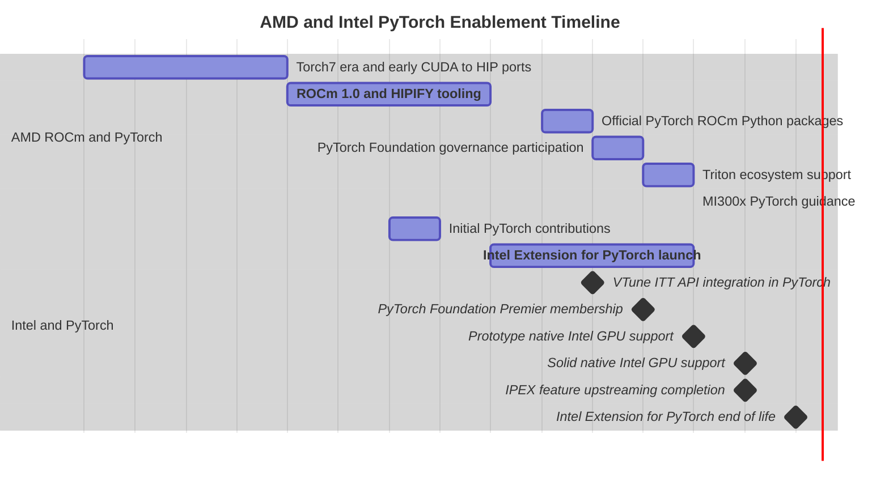
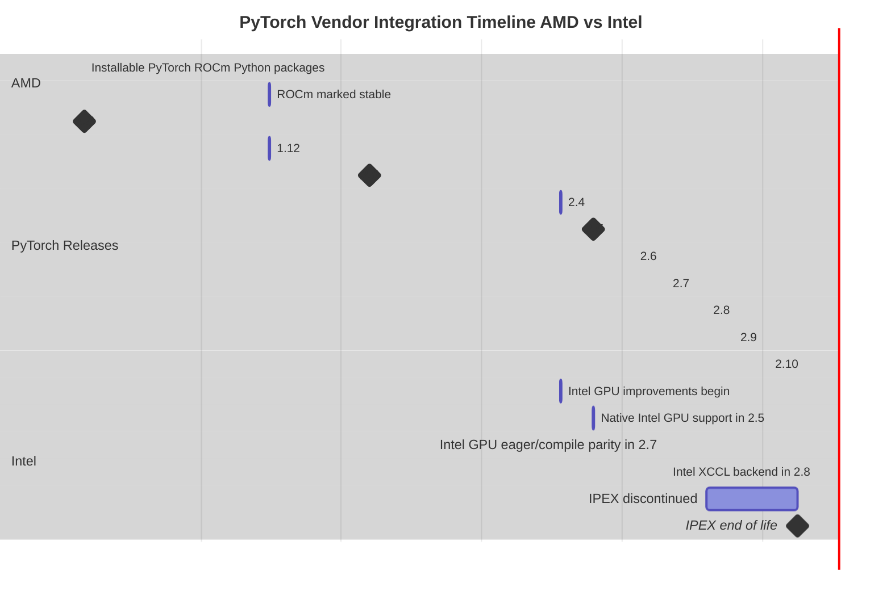

Sam Foreman
2026-01-10

- [AMD Timeline](#amd-timeline)
- [Intel Timeline](#intel-timeline)

In ancient times[^1], back in ~ 2022–2023, virtually all (production)
PyTorch code was designed to run on NVIDIA GPUs.

In April 2023, AMD announced day-zero support for PyTorch 2.0 within the
ROCm 6.0 ecosystem, leveraging new features like TorchDynamo for
performance

> Intel: Mar 2026 (planned): IPEX end-of-life, move to native PyTorch.

## AMD Timeline

- Pre-2021: Early Efforts and Torch7
    - 2012: Torch7 was released, a precursor to PyTorch, written in C++
      and CUDA.
    - ROCm 1.0: AMD demonstrated the ability to port CUDA code to HIP
      (AMD’s C++ dialect for GPU computing) using the HIPIFY tool,
      including ports of Caffe and Torch7.
- 2021-2022: Official Support and Foundation
    - March 2021: PyTorch for the AMD ROCm platform became officially
      available as a Python package, simplifying installation on supported
      Linux systems.
    - September 2022: The PyTorch project joined the independent Linux
      Foundation, with AMD participating as a founding member of the
      PyTorch Foundation governing board.
- 2023: PyTorch 2.0 Integration
    - April 2023: AMD announced day-zero support for PyTorch 2.0 within
      the ROCm 6.0 ecosystem, leveraging new features like TorchDynamo for
      performance improvements.
    - OpenAI Triton Support: The ecosystem grew to include support for
      OpenAI Triton, a key component for high-performance AI workloads.
- 2024-2025: Expanding Accessibility (Windows & Consumer GPUs)
    - June 2024: AMD released guides and information on running PyTorch
      models on AMD MI300x systems, highlighting near drop-in
      compatibility with code written for Nvidia GPUs.
    - September 2025: AMD released a public preview of PyTorch on Windows,
      enabling native AI inference on select consumer Radeon RX 7000 and
      9000 series GPUs and Ryzen AI APUs, without needing workarounds like
      WSL2.
    - October 2024: AMD released a “how-to” guide for using Torchtune, a
      PyTorch library for fine-tuning LLMs, on AMD GPUs.
    - November 2025: Release of AMD Software: PyTorch on Windows Edition
      7.1.1, featuring an update to AMD ROCm 7.1.1.
- Future/Upcoming
    - 2026: AMD is working on its next generation MI450X rack-scale
      solution, which aims to be competitive with NVIDIA’s high-end
      offerings by the second half of 2026.
    - Post-2026: The company has also detailed plans for future MI500
      series data center GPUs, targeting a significant increase in AI
      performance

## Intel Timeline

- 2018: Intel begins contributing to the open-source PyTorch framework.
- 2020: The Intel® Extension for PyTorch\* (IPEX) is launched as a
  separate package to provide optimized performance on Intel CPUs and
  GPUs.
- October 2022[^2]: PyTorch 1.13 is released with integrated support for
  Intel® VTune™ Profiler’s ITT APIs.
- August 2023[^3]: Intel joins the PyTorch Foundation as a Premier
  member, deepening its commitment to the ecosystem.
- July 2024: PyTorch 2.4 debuts with initial (prototype) native support
  for Intel GPUs (client and data center).
- April 2025: PyTorch 2.7 establishes a solid foundation for Intel GPU
  support in both eager and graph modes (torch.compile) on Windows and
  Linux.
- August 2025: Active development of the separate Intel® Extension for
  PyTorch\* ceases following the PyTorch 2.8 release, as most features
  are now upstreamed into the main PyTorch project.
- End of March 2026 (Planned): The Intel® Extension for PyTorch\*
  project will officially reach end-of-life. Users are strongly
  recommended to use native PyTorch directly.

This made sense at the time, as NVIDIA had the vast majority of the GPU
market share and was the only major GPU manufacturer.

This was before the advent of

we were still in the early days of trying to run PyTorch on

I’ve been working on the 🍋 [`ezpz`](https://ezpz.cool) package for a
while now,

[^1]:
    Even now, in 2026, a lot of code is still NVIDIA-centric and is
    rarely designed with multi-platform support in mind.

[^2]:
    [PyTorch 1.13
    release](https://pytorch.org/blog/pytorch-1-13-release/)

[^3]:
    [Intel Joins the PyTorch
    Foundation](https://www.edge-ai-vision.com/2023/08/driving-pytorch-and-ai-everywhere-intel-joins-the-pytorch-foundation/)
