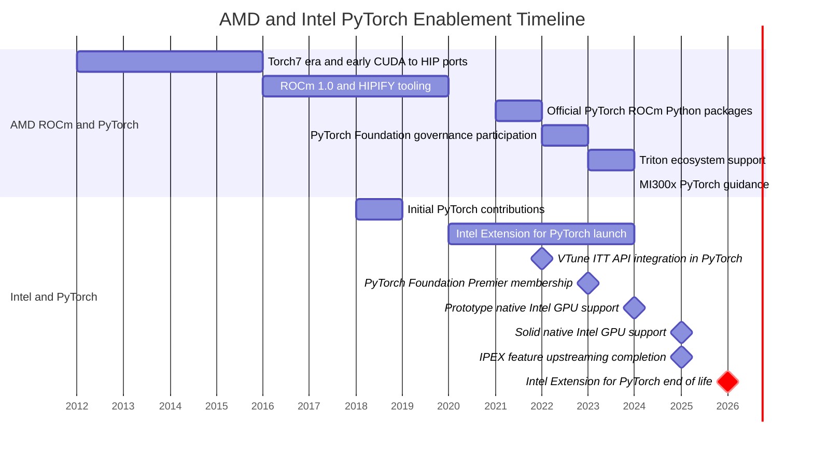
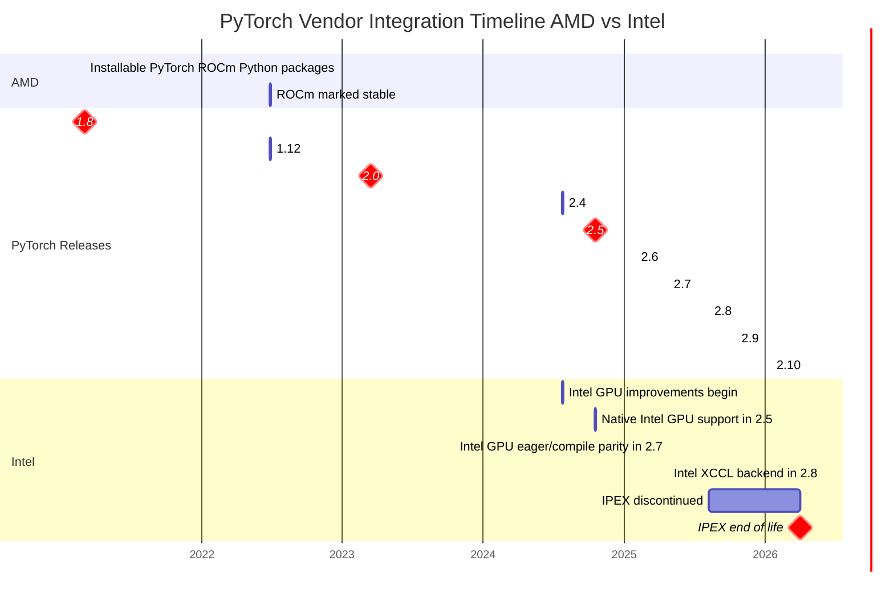

For most of PyTorch's first decade, "running PyTorch" effectively meant
"running PyTorch on NVIDIA". Every distributed training script, every
profiler, every example notebook assumed CUDA. If you wanted to run the
same code on AMD or Intel hardware, you were either going to rewrite a
launch script, port a kernel, or maintain a vendor-specific fork — often
all three.

That picture has changed faster than most people realize. In the last
two years, [PyTorch][pytorch] gained native Intel GPU support, AMD
shipped day-zero ROCm builds for every PyTorch release, and Intel's
out-of-tree extension is now finishing its phased shutdown.[^ipex-eol]
You can write one PyTorch script today and run it across NVIDIA, AMD,
and Intel hardware with no code changes — _if_ you handle the
launch / environment / device-init differences.

That last "if" is what [`ezpz`][ezpz] exists to absorb. This post is
mostly about how the vendor landscape got here, and a little about what
that means for the launcher.

[pytorch]: https://pytorch.org
[ezpz]: https://ezpz.cool

## The two timelines

The clearest way to see the shift is side-by-side: AMD's gradual
ROCm-everywhere strategy, and Intel's faster but later push to merge
IPEX into upstream PyTorch.

```mermaid
%%{init: {'themeCSS': '.titleText{color:var(--foreground1)!important;fill:var(--foreground1)!important;font-size:0.95rem!important;font-weight:700;}.taskText{font-weight:600;font-size:0.74rem!important;}.taskText,.taskTextOutsideLeft,.taskTextOutsideRight,.sectionTitle,.tick text{fill:var(--foreground0)!important;}.taskTextOutsideLeft,.taskTextOutsideRight,.sectionTitle{font-size:0.74rem!important;}.tick text{font-size:0.7rem!important;}.taskTextOutsideRight{text-anchor:start;transform:translateX(0.45ch);}.taskTextOutsideLeft{text-anchor:end;transform:translateX(-0.45ch);}.todayMarker{stroke:var(--red)!important;stroke-width:0.12rem;opacity:0.9;}.grid .tick line{stroke:var(--background3)!important;opacity:0.6;}.section0{fill:color-mix(in oklch,var(--background1) 72%,transparent)!important;}.section1{fill:color-mix(in oklch,var(--blue) 38%,transparent)!important;}.active,.done{fill:color-mix(in srgb,var(--blue) 72%,white 28%)!important;}.crit,.milestone{fill:var(--red)!important;stroke:var(--red)!important;}'}}%%
gantt
    title AMD and Intel PyTorch Enablement Timeline
    dateFormat  YYYY
    axisFormat  %Y

    section AMD ROCm and PyTorch
      Torch7 era and early CUDA to HIP ports        :amd1, 2012, 2016
      ROCm 1.0 and HIPIFY tooling                   :amd2, 2016, 2020
      Official PyTorch ROCm Python packages         :amd3, 2021, 2022
      PyTorch Foundation governance participation   :amd4, 2022, 2023
      Triton ecosystem support                      :amd6, 2023, 2024
      MI300x PyTorch guidance                       :amd7, 2024, 2024

    section Intel and PyTorch
      Initial PyTorch contributions                :i2, 2018, 2019
      Intel Extension for PyTorch launch           :i3, 2020, 2024
      VTune ITT API integration in PyTorch         :milestone, i4, 2022, 1d
      PyTorch Foundation Premier membership        :milestone, i5, 2023, 1d
      Prototype native Intel GPU support           :milestone, i6, 2024, 1d
      Solid native Intel GPU support               :milestone, i7, 2025, 1d
      IPEX feature upstreaming completion          :milestone, i8, 2025, 1d
      Intel Extension for PyTorch end of life      :milestone, crit, i9, 2026, 1d
```

Lining the AMD and Intel work up against the actual PyTorch release
cadence is illuminating — most of the integration milestones land on
specific PyTorch versions:

```mermaid
%%{init: {'themeCSS': '.titleText{color:var(--foreground1)!important;fill:var(--foreground1)!important;font-size:0.95rem!important;font-weight:700;}.taskText{font-weight:600;font-size:0.74rem!important;}.taskText,.taskTextOutsideLeft,.taskTextOutsideRight,.sectionTitle,.tick text{fill:var(--foreground0)!important;}.taskTextOutsideLeft,.sectionTitle{font-size:0.74rem!important;}.taskTextOutsideRight{font-size:0.66rem!important;text-anchor:start;transform:translateX(0.2ch);}.tick text{font-size:0.7rem!important;}.taskTextOutsideLeft{text-anchor:end;transform:translateX(-0.45ch);}.todayMarker{stroke:var(--red)!important;stroke-width:0.12rem;opacity:0.9;}.grid .tick line{stroke:var(--background3)!important;opacity:0.6;}.section0{fill:color-mix(in oklch,var(--orange) 30%,transparent)!important;}.section1{fill:color-mix(in oklch,var(--background2) 76%,transparent)!important;}.section2{fill:color-mix(in oklch,var(--blue) 42%,transparent)!important;}.active,.done{fill:color-mix(in srgb,var(--blue) 72%,white 28%)!important;}.crit,.milestone{fill:var(--red)!important;stroke:var(--red)!important;}'}}%%
gantt
    title PyTorch Vendor Integration Timeline AMD vs Intel
    dateFormat  YYYY-MM-DD
    axisFormat  %Y

section AMD
    Installable PyTorch ROCm Python packages         :amd2, 2021-03-04, 1d
    ROCm marked stable                               :amd3, 2022-06-28, 1d

section PyTorch Releases
    1.8                                             :milestone, crit, pt180, 2021-03-04, 1d
    1.12                                            :pt1120, 2022-06-28, 1d
    2.0                                             :milestone, crit, pt200, 2023-03-15, 1d
    2.4                                             :pt24, 2024-07-24, 1d
    2.5                                             :milestone, crit, pt250, 2024-10-17, 1d
    2.6                                             :pt260, 2025-01-29, 1d
    2.7                                             :pt270, 2025-04-23, 1d
    2.8                                             :crit, pt280, 2025-08-06, 1d
    2.9                                             :pt290, 2025-10-15, 1d
    2.10                                            :pt210, 2026-01-15, 1d

section Intel
    Intel GPU improvements begin                        :int2, 2024-07-24, 1d
    Native Intel GPU support in 2.5                    :int3, 2024-10-17, 1d
    Intel GPU eager/compile parity in 2.7              :int4, 2025-04-23, 1d
    Intel XCCL backend in 2.8                           :int5, 2025-04-23, 1d
    IPEX discontinued                                  :int6, 2025-08-06, 2026-03-31
    IPEX end of life                                   :milestone, crit, int7, 2026-03-31, 1d
```

> **Heads up:** Intel's separate IPEX project reaches end-of-life in
> **March 2026** — by then, native PyTorch is the only supported path
> on Intel GPUs.

## AMD: a long, quiet build-up

AMD's path to first-class PyTorch support is a 14-year project that
mostly happened out of view. The pre-history goes back to the Torch7
era — well before PyTorch existed in its current form — and it's not an
accident that ROCm landed on Caffe and Torch7 first. AMD was building
the porting story (HIP, HIPIFY, the C++ dialect, the toolchain) on the
_previous_ generation of frameworks before the new one became
production-default.

That patience paid off in three big jumps:

- **2021 — installable wheels.** Before March 2021, you couldn't just
  `pip install torch` and get an AMD-compatible build. Once the ROCm
  Python packages went official, AMD became a one-line install on
  supported Linux systems — the same UX as CUDA. PyTorch 1.8 was the
  first release with that working out of the box.
- **2022 — governance.** AMD joined the PyTorch Foundation as a
  founding member when the project moved under the Linux Foundation.
  This was the point at which AMD's integration stopped being "a vendor
  patch" and started being a co-owned roadmap.
- **2023 — day-zero.** With PyTorch 2.0, AMD shipped ROCm 6.0 with
  same-day support, including TorchDynamo / TorchInductor on AMD
  hardware. This was the first release where you could pick up a fresh
  PyTorch and have AMD work _immediately_ — no lag, no porting window.

The rest of the timeline is filling in the corners: OpenAI Triton
support arrived in 2023, MI300x guidance in mid-2024, native PyTorch on
Windows for consumer Radeon cards in late 2025. The overall trajectory
is clear: AMD is no longer playing catch-up on the _framework_. The
remaining gaps are about specific kernels, FlashAttention variants,
custom collectives — work that lives in extensions, not in PyTorch
itself.

## Intel: a much faster, much later push

Intel's story is compressed into a much shorter window — basically four
years vs AMD's fourteen — because Intel arrived after the framework had
already standardized. Instead of a slow, parallel ROCm-style stack,
Intel went the out-of-tree extension route first
(IPEX, 2020) and only started the upstream merge in earnest with
PyTorch 2.4 in 2024.

The integration cadence has been remarkably tight:

- **2.4 (Jul 2024)** — first prototype native Intel GPU support
- **2.5 (Oct 2024)** — solid native Intel GPU support landed
- **2.7 (Apr 2025)** — eager + `torch.compile` parity on Intel GPUs
- **2.8 (Aug 2025)** — XCCL collective backend; IPEX active
  development ceases
- **2.10 / Mar 2026** — IPEX project reaches end-of-life

Notable to me: Intel chose to _finish_ upstreaming before retiring the
extension. The IPEX EOL date isn't where the work stops — it's where
the redundancy stops. The features have already moved.

## What this means in practice

If you're writing a new training script today (early 2026), the
boilerplate problem has shifted. You used to spend most of the lifting
on:

1. Picking the right `torch.distributed` backend (`nccl`, `gloo`,
   `xccl`, `rccl`, ...).
2. Knowing which environment variables your launcher expects on this
   particular cluster (`MASTER_ADDR`, `WORLD_SIZE`, `LOCAL_RANK`,
   `PALS_*`, `PMI_*`, `OMPI_*`, `SLURM_*`...).
3. Handling per-vendor device init quirks (`torch.cuda.set_device` vs
   `xpu.set_device` vs `hip.set_device`).
4. Then, finally, the model code.

Steps 1–3 are now _almost_ the same across vendors. The collective
backends mostly map to the right thing automatically. The device
abstraction is unified under `torch.accelerator` (in 2.7+). What's left
is mostly the launch boilerplate — which is what 🍋 [`ezpz`][ezpz]
takes care of:

- `ezpz launch` figures out the launcher (`mpiexec`, `srun`,
  `torchrun`, `deepspeed`) from the environment.
- `ezpz_setup_*` shell helpers normalize the rank/size variables
  across PBS / SLURM / standalone.
- `ezpz yeet` distributes your environment to every node so you don't
  pay the Lustre-import tax — covered in [Running 50k Python
  Processes on Aurora](/posts/2026/05/01).
- The Python entry points stay vendor-agnostic; device init goes
  through one helper that picks `cuda` / `xpu` / `hip` based on what's
  actually available.

The point isn't that `ezpz` is doing anything magical — it's that the
_framework_ finally caught up enough that a small, vendor-agnostic
launcher can exist at all. Five years ago, this post would have been
about writing per-vendor shims. Today it's about deleting them.

## Detailed timelines

For reference, the full chronology:

### AMD

- **Pre-2021 — Torch7 era and CUDA→HIP ports.** Torch7 was released in
  2012 as a precursor to PyTorch (C++ + CUDA). With ROCm 1.0, AMD
  demonstrated CUDA→HIP conversion using HIPIFY, including ports of
  Caffe and Torch7.
- **March 2021** — PyTorch for AMD ROCm becomes officially available
  as a Python package on supported Linux systems.
- **September 2022** — PyTorch joins the Linux Foundation; AMD is a
  founding member of the PyTorch Foundation governing board.
- **April 2023** — AMD ships day-zero support for PyTorch 2.0 within
  the ROCm 6.0 ecosystem, including TorchDynamo/TorchInductor.
- **2023** — OpenAI Triton support extended to AMD GPUs.
- **June 2024** — MI300x PyTorch guidance published, with near
  drop-in compatibility for code written for NVIDIA GPUs.
- **September 2025** — Public preview of PyTorch on Windows for select
  consumer Radeon RX 7000/9000 series GPUs and Ryzen AI APUs (no
  WSL2 needed).
- **October 2024** — How-to guide for Torchtune (PyTorch LLM
  fine-tuning library) on AMD GPUs.
- **November 2025** — AMD Software: PyTorch on Windows Edition 7.1.1
  with ROCm 7.1.1.
- **2026 / post-2026** — MI450X rack-scale solution targeting NVIDIA
  high-end parity in H2 2026; MI500 series in development.

### Intel

- **2018** — Intel begins contributing to upstream PyTorch.
- **2020** — Intel Extension for PyTorch (IPEX) launches as a separate
  package for Intel CPUs and GPUs.
- **October 2022**[^pt113] — PyTorch 1.13 ships with integrated
  Intel VTune ITT API support.
- **August 2023**[^intel-pt-foundation] — Intel joins the PyTorch
  Foundation as a Premier member.
- **July 2024** — PyTorch 2.4 with prototype native Intel GPU support
  (client + data center).
- **April 2025** — PyTorch 2.7 establishes solid Intel GPU support in
  both eager and graph modes (`torch.compile`) on Windows and Linux.
- **August 2025** — IPEX active development ceases following the
  PyTorch 2.8 release; most features are upstreamed.
- **End of March 2026** _(planned)_ — IPEX reaches end-of-life. Use
  native PyTorch directly.

[^ipex-eol]:
    Even now, in 2026, plenty of code is still NVIDIA-centric and is
    rarely designed with multi-platform support in mind — but the
    framework no longer is.

[^pt113]: [PyTorch 1.13 release](https://pytorch.org/blog/pytorch-1-13-release/)

[^intel-pt-foundation]:
    [Intel Joins the PyTorch
    Foundation](https://www.edge-ai-vision.com/2023/08/driving-pytorch-and-ai-everywhere-intel-joins-the-pytorch-foundation/)
