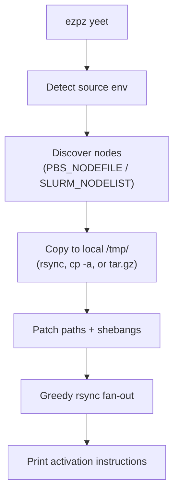
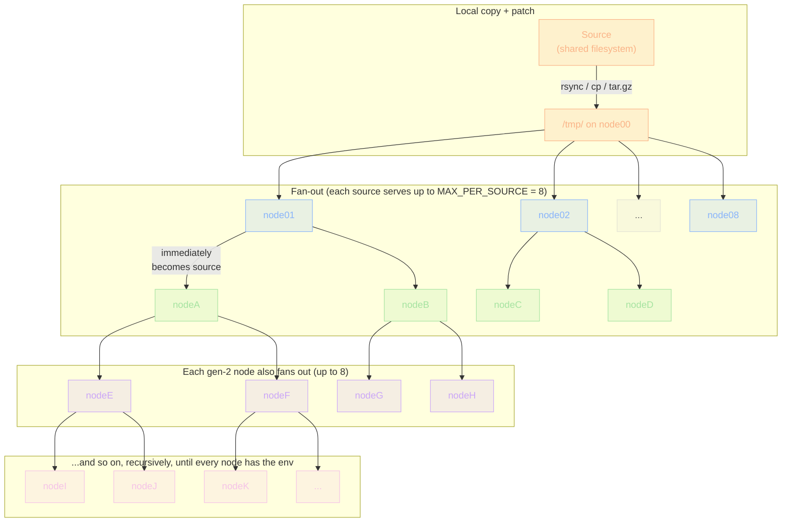

import ScalingChart from '@/components/ScalingChart.astro'

On large HPC clusters, every Python import that touches the shared filesystem is
a small tax — and at scale, a small tax paid by every rank turns into minutes of
dead time before training even starts.
[`ezpz yeet`][cli-yeet] copies any directory or tarball to node-local `/tmp/`
storage on every worker in your job, so subsequent imports, checkpoint loads,
and config reads hit local SSD instead of Lustre.

This post covers what `yeet` does, how it scales, and a 10-point benchmark sweep
on [Aurora][aurora] from 8 to 4096 nodes.

[cli-yeet]: https://ezpz.cool/cli/yeet/
[aurora]: https://www.alcf.anl.gov/aurora

> **Note**: `ezpz yeet-env` was renamed to `ezpz yeet`. The old name
> still works as a deprecated alias.

## What it does

Inside an interactive job allocation:

```bash
ezpz yeet                          # no args → syncs the active venv
ezpz yeet .venv.tar.gz             # positional shorthand for --src
ezpz yeet --src /path/to/dataset   # any directory or tarball
```

The default flow (no args):

1. Detect the active Python environment via `sys.prefix`.
2. Discover all nodes from the job's hostfile (PBS or SLURM).
3. Copy the environment to `/tmp/<env-name>/` on the current node.
4. Patch `activate` scripts, shebangs, and symlinks for the new `/tmp/`
   location.
5. Distribute the patched copy to every remote node via a greedy rsync fan-out.

For non-venv sources (datasets, model checkpoints, generic directories), step 4
is skipped and the trailing message changes to a generic "Synced to `\{dst}`/ on N
node(s)".

After `yeet`, switch to the local copy and launch:

```bash
deactivate 2>/dev/null
source /tmp/.venv/bin/activate
cd /path/to/your/project        # shared FS for data/outputs
ezpz launch python3 -m your_app.train
```

`/tmp/` is node-local — keep your working directory on a shared filesystem so
all ranks can read inputs and write outputs.

## CLI surface

```text
ezpz yeet [SRC] [--src PATH] [--dst PATH] [--hostfile PATH]
          [--copy | --compress] [--dry-run]
```

| Arg / Flag         | Default                 | Description                                                                           |
| ------------------ | ----------------------- | ------------------------------------------------------------------------------------- |
| `SRC` (positional) | —                       | Source path. Shorthand for `--src`. Mutually exclusive with `--src`                   |
| `--src`            | active venv / conda env | Source path. May also be a `.tar.gz` / `.tgz` — see [tarball source](#tarball-source) |
| `--dst`            | `/tmp/<basename>/`      | Destination on each node                                                              |
| `--hostfile`       | auto-detect             | Hostfile for node list                                                                |
| `--copy`           | —                       | Use `cp -a` for the local copy (faster on Lustre)                                     |
| `--compress`       | —                       | `tar.gz` → copy → extract (least Lustre metadata I/O)                                 |
| `--dry-run`        | —                       | Preview without transferring                                                          |

### Choosing a local copy method

The default `rsync` is best for incremental updates (after a `pip install`,
etc.) but slow for initial copies on Lustre because it `stat()`s every file.
For the first transfer, prefer one of the faster methods:

| Method       | Best for                 | How it works                                |
| ------------ | ------------------------ | ------------------------------------------- |
| `--copy`     | fast initial copy        | `cp -a` — sequential dir walk, no checksums |
| `--compress` | slow Lustre / large envs | `tar.gz` → copy 1 file → extract locally    |
| _(default)_  | incremental updates      | `rsync -rlD` — only transfers changed files |

```bash
# First time: compress for minimal Lustre I/O
ezpz yeet --compress

# Or: cp for simpler fast copy
ezpz yeet --copy

# After pip install: rsync only sends diffs
ezpz yeet
```

All three methods only affect the local Lustre → `/tmp/` copy.
**Remote node distribution always uses rsync.**

### Tarball source

If you already have a `.tar.gz` (e.g. one built earlier with `ezpz tar-env`, or
shipped with a project), pass it directly:

```bash
ezpz yeet --src /lus/.../my-env.tar.gz
```

This is similar to `--compress` but skips the create step — the tarball is
copied to `/tmp/` and extracted there:

1. `cp /lus/.../my-env.tar.gz /tmp/my-env.tar.gz`
2. `tar -xzf /tmp/my-env.tar.gz --strip-components=1 -C /tmp/my-env/`
3. Patch shebangs / activate scripts (auto-detected from `bin/activate`)
4. Delete the tarball
5. Fan-out `/tmp/my-env/` to all worker nodes via rsync

Both `.tar.gz` and `.tgz` are recognized.
Default destination is `/tmp/<basename-without-suffix>/`.

### Generic (non-venv) sources

`yeet` works on any directory:

```bash
# A pre-downloaded HF model checkpoint
ezpz yeet ~/models/Llama-3.1-8B

# A dataset shard
ezpz yeet --src /lus/datasets/imagenet-shard-0
```

When the source isn't a venv (no `bin/activate`) and isn't a conda env (no
`conda-meta/`), the path-patching step is skipped.

## How it works



### Local copy + patch

`yeet` first copies the source to `/tmp/<env>/` on the current node using
`rsync` (default), `cp -a` (`--copy`), or `tar.gz` (`--compress`).
If this fails, distribution is aborted immediately — no broken environment gets
propagated.

After copying, the venv is patched **once in place**:

- Replaces hardcoded `VIRTUAL_ENV` paths in `bin/activate`, `bin/activate.csh`,
  `bin/activate.fish`.
- Re-links `python3` symlinks to the system Python.
- Updates `pyvenv.cfg`.
- Rewrites shebangs in every entry-point script (`ezpz`, `pip`, `torchrun`,
  etc.) — `pip` bakes absolute paths into these at install time, so without this
  step they'd still point at the original Lustre location.

This patched copy in `/tmp/` becomes the source for all subsequent rsyncs — no
per-node patching, no SSH round-trips needed.

### Greedy fan-out

A single source can only push to ~8 nodes at a time before the source NIC
saturates, so `yeet` uses a **greedy streaming fan-out**:
each node that finishes immediately becomes a source for the next available
target.

A single thread pool manages all rsyncs.
Each source is capped at `MAX_PER_SOURCE=8` concurrent outbound rsyncs.
As each rsync completes:

- That node is registered as a new source.
- New rsyncs are submitted using whichever source has the fewest active
  transfers (load-balanced).

The fan-out tree grows recursively — each newly-served node immediately
becomes a source for up to 8 more:



Faster nodes don't wait for slower ones:
if `node01` finishes in 15 s but `node08` takes 30 s, `node01` is already
serving new targets while `node08` is still receiving.
The result is approximately `O(log N)` wall-clock at moderate scale, until
per-node contention starts to dominate (more on that below).

## Scaling on Aurora: 8 → 4096 nodes

Full 10-point sweep using the tarball broadcast mode (`ezpz yeet --src
.venv.tar.gz`) on Aurora, measured 2026-04-30 to 2026-05-01.
The benchmark harness lives in [saforem2/torchtitan@ezpz][bench-repo] along with
the raw CSV and plotting script.

Each job ran `ezpz yeet --src .venv.tar.gz`, then 10 training steps of `agpt_2b`
to verify the broadcast venv was functional.
`first_step_seconds` is the wall-clock from job start to the first training step
— a useful proxy for total time-to-train, including import + initialization on
top of the `yeet` itself.

[bench-repo]: https://github.com/saforem2/torchtitan/tree/ezpz/torchtitan/experiments/ezpz/docs/scaling/yeet_env

| Nodes | yeet (s) | First-step (s) | Per-node (ms) |
| ----: | -------: | -------------: | ------------: |
|     8 |     69.7 |           29.3 |         8,712 |
|    16 |     89.7 |           31.6 |         5,606 |
|    32 |     89.2 |           20.9 |         2,788 |
|    64 |     91.2 |           34.6 |         1,425 |
|   128 |    110.4 |           30.5 |           862 |
|   256 |    132.9 |           37.6 |           519 |
|   512 |    174.5 |           44.5 |           341 |
|  1024 |    255.4 |           60.8 |           249 |
|  2048 |    421.4 |           94.8 |           206 |
|  4096 |    750.6 |          194.0 |           183 |

<div class="figure-row">

<ScalingChart
    id="wall-clock"
    title="total wall-clock"
    xLabel="nodes"
    yLabel="yeet-env wall-clock (seconds)"
    x={[8, 16, 32, 64, 128, 256, 512, 1024, 2048, 4096]}
    series={[
        {
            name: 'measured',
            color: 'blue',
            data: [69.7, 89.7, 89.2, 91.2, 110.4, 132.9, 174.5, 255.4, 421.4, 750.6],
        },
    ]}
    refs={[
        {
            name: 'linear (∝ N)',
            color: 'foreground3',
            dash: [6, 4],
            data: [70, 140, 280, 560, 1120, 2240, 4480, 8960, 17920, 35840],
        },
        {
            name: 'log N',
            color: 'foreground3',
            dash: [1, 4],
            data: [70, 93.3, 116.7, 140, 163.3, 186.7, 210, 233.3, 256.7, 280],
        },
    ]}
/>

<ScalingChart
    id="per-node"
    title="per-node amortized"
    xLabel="nodes"
    yLabel="per-node amortized cost (ms)"
    x={[8, 16, 32, 64, 128, 256, 512, 1024, 2048, 4096]}
    series={[
        {
            name: 'measured',
            color: 'red',
            marker: 'square',
            data: [8712, 5606, 2788, 1425, 862, 519, 341, 249, 206, 183],
        },
    ]}
    refs={[
        {
            name: 'ideal amortization (∝ 1/N)',
            color: 'foreground3',
            dash: [6, 4],
            data: [8712, 4356, 2178, 1089, 544.5, 272.2, 136.1, 68.1, 34, 17],
        },
        {
            name: 'log N / N',
            color: 'foreground3',
            dash: [1, 4],
            data: [8712, 3267, 1306.8, 544.5, 233.4, 102.1, 45.4, 20.4, 9.3, 4.3],
        },
    ]}
/>

</div>

### Two regimes

- **8–64 nodes is extract-bound.** Total wall-clock is roughly flat at 70–91 s;
  per-node cost falls 8.7 s → 1.4 s as more nodes share the fixed-cost local
  extraction.
- **≥128 nodes is broadcast-bound.** Total wall-clock grows super-linearly.
  Each 2× in node count adds ~1.5–1.8× wall-clock (256→512:
  1.31×, 512→1024:
  1.46×, 1024→2048:
  1.65×, 2048→4096:
  1.78×) — the broadcast tree depth and per-leaf bandwidth contention both grow
  with scale.

Per-node amortized cost drops monotonically from 8.7 s/node at N=8 to 0.18
s/node at N=4096 — a **48× efficiency gain** over the sweep.
Even at the full-Aurora 4096-node scale, the pre-launch overhead is **under 13
minutes**.

First-step latency stays under a minute through 1024 nodes and only really
starts to climb at 2048+ — consistent with `init_process_group` overhead growing
with world size.
At 4096 nodes the first step lands in 3 min 14 s, so total time-to-train (yeet +
first step) is about 16 minutes.

### Why tarball broadcast scales so much better than per-file rsync

The pre-tarball `yeet` mode (per-file rsync) was projected to take 1–2 hours at
256+ nodes — per-file metadata cost dominates over Lustre.
Switching to a single compressed tarball (`--compress` or pre-built `--src
foo.tar.gz`) reduces the Lustre side to one sequential read regardless of node
count, so the broadcast itself is the only thing that scales with N.

## Reproducing

The benchmark submits one PBS job per node count.
PBS limits concurrent submissions per user, so chain via `qsub -W depend` or a
polling wrapper:

```bash
# 8/16/32/64/128/256 → debug-scaling
for N in 8 16 32 64 128 256; do
    qsub -q debug-scaling -l select=$N -l walltime=00:30:00 \
        -N yeet-n$N \
        torchtitan/experiments/ezpz/scripts/yeet_env_scaling_test.sh
done

# 512/1024 → prod (auto-routes to small)
for N in 512 1024; do
    qsub -q prod -l select=$N -l walltime=01:00:00 \
        -N yeet-n$N \
        torchtitan/experiments/ezpz/scripts/yeet_env_scaling_test.sh
done

# 2048/4096 → prod (auto-routes to prod-large)
for N in 2048 4096; do
    qsub -q prod -l select=$N -l walltime=01:00:00 \
        -N yeet-n$N \
        torchtitan/experiments/ezpz/scripts/yeet_env_scaling_test.sh
done

# Plot once results have landed
python3 torchtitan/experiments/ezpz/docs/scaling/yeet_env/plot_yeet_env_scaling.py
```

Each job:
30-min walltime (1 h for ≥1024N), `time yeet-env`, then 10 training steps of
`agpt_2b` to verify the broadcast venv works.
Results land in `.yeet-env-scaling-results.csv` in the repo root.

## Complete workflow

```bash
# 1. Get an interactive allocation
qsub -A <project> -q debug -l select=2 -l walltime=01:00:00 -I

# 2. Distribute the environment
ezpz yeet

# 3. Activate the local copy
deactivate 2>/dev/null
source /tmp/<env-name>/bin/activate

# 4. Launch from a shared filesystem path
cd /path/to/your/project
ezpz launch python3 -m your_app.train
```

## See also

- [`ezpz yeet` CLI reference](https://ezpz.cool/cli/yeet/)
- [`ezpz launch`](https://ezpz.cool/cli/launch/) — distributed launcher
  (respects `$VIRTUAL_ENV` so it Just Works after `yeet` + activate)
- [`ezpz.utils.yeet_env`](https://ezpz.cool/api/ezpz/utils/yeet_env/) — Python
  API reference
- [Shell environment helpers](https://ezpz.cool/cli/shell/) — `ezpz_setup_*`
  (including `ezpz_setup_xpu` for Intel GPUs)
