Sam Foreman
2025-10-15

- [🌐 Distributed Training](#globe_with_meridians-distributed-training)
    - [🚀 Scaling: Overview](#rocket-scaling-overview)
    - [🐢 Training on a Single
      Device](#turtle-training-on-a-single-device)
    - [🕸️ Parallelism Strategies](#spider_web-parallelism-strategies)
    - [👬 Training on Multiple GPUs: Data
      Parallelism](#two_men_holding_hands-training-on-multiple-gpus-data-parallelism)
    - [▶️ Data Parallel: Forward
      Pass](#arrow_forward-data-parallel-forward-pass)
    - [◀️ Data Parallel: Backward
      Pass](#arrow_backward-data-parallel-backward-pass)
    - [🔄 Collective
      Communication](#arrows_counterclockwise-collective-communication)
    - [Reduce](#reduce)
    - [🐣 Getting Started: In
      Practice](#hatching_chick-getting-started-in-practice)
    - [📝 Plan of Attack](#pencil-plan-of-attack)
    - [🚀 Going Beyond Data
      Parallelism](#rocket-going-beyond-data-parallelism)
    - [Going beyond Data Parallelism: DeepSpeed +
      `ZeRO`](#going-beyond-data-parallelism-b58fc729-690b-4000-b19f-365a4093b2ff7b7b3c2069636f6e696679206c6f676f73206d6963726f736f66742d69636f6e203e7d7d-deepspeed--zero)
    - [🕸️ Additional Parallelism
      Strategies](#spider_web-additional-parallelism-strategies)
    - [Pipeline Parallelism (PP)](#pipeline-parallelism-pp)
    - [Tensor Parallel (TP)](#tensor-parallel-tp)
    - [Tensor Parallel (TP)](#tensor-parallel-tp-1)
    - [Tensor (/ Model) Parallel Training:
      Example](#tensor--model-parallel-training-example)
    - [🏗️ Aurora](#building_construction-aurora)
- [🌌 AuroraGPT (2024–)](#milky_way-auroragpt-2024)
    - [🧪 AuroraGPT: Open Science Foundation
      Model](#test_tube-auroragpt-open-science-foundation-model)
    - [🧰 AuroraGPT: Toolbox](#toolbox-auroragpt-toolbox)
    - [🏋️ Challenges: In Practice](#weight_lifting-challenges-in-practice)
    - [💾 AuroraGPT: Training](#floppy_disk-auroragpt-training)
    - [🍹 AuroraGPT: Blending Data,
      Efficiently](#tropical_drink-auroragpt-blending-data-efficiently)
    - [📉 Loss Curve: Training AuroraGPT-7B on 2T
      Tokens](#chart_with_downwards_trend-loss-curve-training-auroragpt-7b-on-2t-tokens)
    - [✨ Features](#sparkles-features)
    - [✨ Features (even more!)](#sparkles-features-even-more)
- [🧬 MProt-DPO](#dna-mprot-dpo)
    - [🧬 Scaling Results (2024)](#dna-scaling-results-2024)
    - [🧬 MProt-DPO: Scaling Results](#dna-mprot-dpo-scaling-results)
    - [🚂 Loooooooooong Sequence
      Lengths](#steam_locomotive-loooooooooong-sequence-lengths)
- [🌎 AERIS (2025)](#earth_americas-aeris-2025)
    - [👀 High-Level Overview of
      AERIS](#eyes-high-level-overview-of-aeris)
    - [➕ Contributions](#heavy_plus_sign-contributions)
    - [⚠️ Issues with the Deterministic
      Approach](#warning-issues-with-the-deterministic-approach)
    - [🎲 Transitioning to a Probabilistic
      Model](#game_die-transitioning-to-a-probabilistic-model)
    - [🌀 Sequence-Window-Pipeline Parallelism
      `SWiPe`](#cyclone-sequence-window-pipeline-parallelism-swipe)
    - [🚀 AERIS: Scaling Results](#rocket-aeris-scaling-results)
    - [🌪️ Hurricane Laura](#tornado-hurricane-laura)
- [📓 References](#notebook-references)
- [❤️ Acknowledgements](#heart-acknowledgements)

## 🌐 Distributed Training

### 🚀 Scaling: Overview

- ✅ **Goal**:
    - Minimize: Cost (i.e. amount of
      time spent training)
    - Maximize: Performance

    > [!NOTE]
    >
    > ### 📑 Note
    >
    > See [🤗 Performance and
    > Scalability](https://huggingface.co/docs/transformers/v4.46.0/performance)
    > for more details

In this talk, we will explore the intricacies of training foundation
models on supercomputers. We will discuss the architecture of these
models, the computational requirements, and the strategies employed to
optimize training processes. Attendees will gain insights into the
latest advancements in hardware and software that facilitate efficient
model training at scale.

### 🐢 Training on a Single Device

Figure 1: **SLOW** !! model size limited by GPU memory

### 🕸️ Parallelism Strategies

- **Data Parallelism**
    - Split _data_ across workers
    - Easiest to implement
    - _No changes to model_

- **Model Parallelism**
    - Split _model_ across workers
- **Hybrid Parallelism**
    - Combine data + model parallelism
    - More complex to implement
    - Requires changes to model

### 👬 Training on Multiple GPUs: Data Parallelism

Figure 2: Each GPU receives **unique** data at each step

- See [🤗 Methods and tools for efficient training on a single
  GPU](https://huggingface.co/docs/transformers/v4.46.0/perf_train_gpu_one)

### ▶️ Data Parallel: Forward Pass

```mermaid
flowchart LR
    subgraph D["`Data`"]
        direction TB
        x("`x0`")
        x1("`x1`")
        x2("`x2`")
    end
    direction LR
    subgraph G0["`GPU0`"]
        direction LR
        subgraph N0["`NN`"]
        end
        L0["`Loss`"]
    end
    subgraph G1["`GPU1`"]
        direction LR
        subgraph N1["`NN`"]
        end
        L1["`Loss`"]
    end
    subgraph G2["`GPU2`"]
        direction LR
        subgraph N2["`NN`"]
        end
        L2["`Loss`"]
    end
    ar("`Avg. Grads (∑ₙgₙ)/N`")
    x --> G0
    x1 --> G1
    x2 --> G2
    N0 --> L0
    N1 --> L1
    N2 --> L2
    L0 -.-> ar
    L1 -.-> ar
    L2 -.-> ar
classDef eblock fill:#CCCCCC02,stroke:#838383,stroke-width:0px,color:#838383
classDef block fill:#CCCCCC02,stroke:#838383,stroke-width:1px,color:#838383
classDef grey fill:#cccccc,stroke:#333,stroke-width:1px,color:#000
classDef red fill:#ff8181,stroke:#333,stroke-width:1px,color:#000
classDef orange fill:#FFC47F,stroke:#333,stroke-width:1px,color:#000
classDef yellow fill:#FFFF7F,stroke:#333,stroke-width:1px,color:#000
classDef green fill:#98E6A5,stroke:#333,stroke-width:1px,color:#000
classDef blue fill:#7DCAFF,stroke:#333,stroke-width:1px,color:#000
classDef purple fill:#FFCBE6,stroke:#333,stroke-width:1px,color:#000
classDef text fill:#CCCCCC02,stroke:#838383,stroke-width:0px,color:#838383
class x,y0,L0 red
class x1,L1 green
class x2,L2 blue
class x3,ar grey
class N0,N1,N2,G0,G1,G2,GU block
class D eblock
class AR block
class bc text
```

Figure 3: Average gradients across all GPUs

### ◀️ Data Parallel: Backward Pass

Figure 4: Send global updates back to each GPU. See: [PyTorch /
Distributed Data
Parallel](https://pytorch.org/tutorials/intermediate/ddp_tutorial.html)

### 🔄 Collective Communication

- **Broadcast**: Send data from one node to all other nodes
- **Reduce**: Aggregate data from all nodes to one node
    - **AllReduce**: Aggregate data from all nodes to all nodes
- **Gather**: Collect data from all nodes to one node
    - **AllGather**: Collect data from all nodes to all nodes
- **Scatter**: Distribute data from one node to all other nodes

### Reduce

- Perform a _reduction_ on data across ranks, send to individual

Figure 5: Reduce operation: one rank receives the reduction of input
values across ranks

### 🐣 Getting Started: In Practice

- 📦 **Distributed Training Frameworks**:
    - 🍋 [saforem2 / `ezpz`](https://github.com/saforem2/ezpz)
    - 🤖 [Megatron-LM](https://github.com/NVIDIA/Megatron-LM)
    - 🤗 [Accelerate](https://huggingface.co/docs/accelerate/index)
    - 🔥 PyTorch
        - [DDP](https://docs.pytorch.org/tutorials/intermediate/ddp_tutorial.html)
          /
          [FSDP](https://docs.pytorch.org/tutorials/intermediate/FSDP_tutorial.html)
- 🚀 [DeepSpeed](https://www.deepspeed.ai/)
    - [ZeRO Offloading](https://www.deepspeed.ai/tutorials/zero/)
    - [Megatron-DeepSpeed](https://github.com/argonne-lcf/Megatron-DeepSpeed)

- 🧠 **Memory Management**:
    - FSDP vs. ZeRO
    - Activation Checkpointing
    - Mixed Precision Training
    - Gradient Accumulation
    - Offloading to CPU/NVMe

> [!IMPORTANT]
>
> ### 🔄 Keeping things in Sync
>
> **Computation stalls during communication !!**
>
> Keeping the communication to computation ratio small is important for
> effective scaling.

### 📝 Plan of Attack

Figure 6: General strategy for scaling model training

### 🚀 Going Beyond Data Parallelism

- ✅ Useful when model fits on single GPU:
    - ultimately **limited by GPU memory**
    - model performance limited by size
- ⚠️ When model does not fit on a single GPU:
    - Offloading (can only get you so far…):
        - [DeepSpeed + `ZeRO`](https://www.deepspeed.ai/tutorials/zero/)
        - 🔥 [PyTorch +
          `FSDP`](https://pytorch.org/blog/introducing-pytorch-fully-sharded-data-parallel-api/)
    - Otherwise, resort to [model parallelism
      strategies](#additional-parallelism-strategies)

### Going beyond Data Parallelism: DeepSpeed + `ZeRO`

- Depending on the `ZeRO` stage (1, 2, 3), we can offload:
    1.  **Stage 1**: optimizer states $\left(P_{\mathrm{os}}\right)$
    2.  **Stage 2**: gradients + opt. states
        $\left(P_{\mathrm{os}+\mathrm{g}}\right)$
    3.  **Stage 3**: model params + grads + opt. states
        $\left(P_{\mathrm{os}+\mathrm{g}+\mathrm{p}}\right)$

Figure 7: [DeepSpeed](deepspeed.ai) +
[`ZeRO`](https://www.deepspeed.ai/tutorials/zero-offload/)

### 🕸️ Additional Parallelism Strategies

- **Tensor (/ Model) Parallelism** (`TP`):
    - 🤗 [Tensor
      Parallelism](https://huggingface.co/docs/text-generation-inference/en/conceptual/tensor_parallelism)
    - 🔥 [Large Scale Transformer model training with Tensor Parallel
      (TP)](https://pytorch.org/tutorials/intermediate/TP_tutorial.html)
- **Pipeline Parallelism** (`PP`):
    - 🔥
      [PyTorch](https://pytorch.org/docs/main/distributed.pipelining.html),
      [DeepSpeed](https://deepspeed.readthedocs.io/en/latest/pipeline.html)
- **Sequence Parallelism** (`SP`):
    - [DeepSpeed
      Ulysses](https://github.com/microsoft/DeepSpeed/blob/master/blogs/deepspeed-ulysses/README.md)
    - [Megatron / Context
      Parallelism](https://docs.nvidia.com/megatron-core/developer-guide/latest/api-guide/context_parallel.html)
    - [Unified Sequence Parallel
      (USP)](https://arxiv.org/abs/2405.07719v3)
        - [feifeibear/`long-context-attention`](https://github.com/feifeibear/long-context-attention)
- [x]
  [argonne-lcf/`Megatron-DeepSpeed`](https://github.com/argonne-lcf/Megatron-DeepSpeed)
    - Supports 4D Parallelism (`DP` + `TP` + `PP` + `SP`)

### Pipeline Parallelism (PP)

- Model is split up **vertically** (layer-level) across multiple GPUs
- Each GPU:
    - has a portion of the full model
    - processes _in parallel_ different stages of the pipeline (on a small
      chunk of the batch)
- See:
    - 🔥 [PyTorch / Pipeline
      Parallelism](https://pytorch.org/docs/main/distributed.pipelining.html)
    - [DeepSpeed / Pipeline
      Parallelism](https://deepspeed.readthedocs.io/en/latest/pipeline.html)

Figure 8: Pipeline Parallelism

### Tensor Parallel (TP)

### Tensor Parallel (TP)

- Split up network over multiple workers
- Each receives disjoint subset
- All communication associated with subsets are distributed
- Communication whenever dataflow between two subsets
- Typically **more complicated** to implement than data parallel
  training
- Suitable when the model is too large to fit onto a single device (CPU
  / GPU)

### Tensor (/ Model) Parallel Training: Example

Want to compute:
$y = \sum_{i} x_{i} W_{i} = x_0 * W_0 + x_1 * W_1 + x_2 * W_2$  
where each GPU has only its portion of the full weights as shown below

1.  Compute: $y_{0} = x_{0} * W_{0}\rightarrow$ `GPU1`
2.  Compute: $y_{1} = y_{0} + x_{1} * W_{1}\rightarrow$ `GPU2`
3.  Compute: $y = y_{1} + x_{2} * W_{2} = \sum_{i} x_{i} W_{i}$ ✅

Figure 11

🔭 AI-for-Science
[source](https://x.com/tenderizzation/status/1944591320796090606)
([@tenderizzation](https://twitter.com/tenderizzation))
 

ChatGPT: [explain this
image](https://chatgpt.com/share/688ab77e-9ca0-800a-8ab0-a293e06b3cce)

### 🌀 Sequence-Window-Pipeline Parallelism `SWiPe`

- `SWiPe` is a **novel parallelism strategy** for Swin-based
  Transformers
- Hybrid 3D Parallelism strategy, combining:
    - Sequence parallelism (`SP`)
    - Window parallelism (`WP`)
    - Pipeline parallelism (`PP`)

Figure 23

Figure 24: `SWiPe` Communication Patterns

### 🚀 AERIS: Scaling Results

Figure 25: AERIS: Scaling Results

- **10 EFLOPs** (sustained) @ **120,960
  GPUs**
- See (Hatanpää et al. (2025)) for additional details
- [arXiv:2509.13523](https://arxiv.org/abs/2509.13523)

### 🌪️ Hurricane Laura

Figure 26: Hurricane Laura tracks (top) and intensity (bottom).
Initialized 7(a), 5(b) and 3(c) days prior to 2020-08-28T00z.

## 📓 References

Hatanpää, Väinö, Eugene Ku, Jason Stock, et al. 2025. _AERIS: Argonne
Earth Systems Model for Reliable and Skillful Predictions_.
[https://arxiv.org/abs/2509.13523](https://arxiv.org/abs/2509.13523).

Price, Ilan, Alvaro Sanchez-Gonzalez, Ferran Alet, et al. 2024.
_GenCast: Diffusion-Based Ensemble Forecasting for Medium-Range
Weather_. [https://arxiv.org/abs/2312.15796](https://arxiv.org/abs/2312.15796).

Song, Shuaiwen Leon, Bonnie Kruft, Minjia Zhang, et al. 2023.
_DeepSpeed4Science Initiative: Enabling Large-Scale Scientific Discovery
Through Sophisticated AI System Technologies_.
[https://arxiv.org/abs/2310.04610](https://arxiv.org/abs/2310.04610).

## ❤️ Acknowledgements

> This research used resources of the Argonne Leadership Computing
> Facility, which is a DOE Office of Science User Facility supported
> under Contract DE-AC02-06CH11357.

[^1]:
    🏆 [Aurora Supercomputer Ranks Fastest for
    AI](https://www.intel.com/content/www/us/en/newsroom/news/intel-powered-aurora-supercomputer-breaks-exascale-barrier.html)

[^2]:
    Each node has 6 Intel Data Center GPU Max 1550 (code-named “Ponte
    Vecchio”) tiles, with 2 XPUs per tile.

[^3]: Implemented by Marieme Ngom

[^4]:
    Relative to PDE-based models, e.g.:
    [GFS](https://www.ncdc.noaa.gov/data-access/model-data/model-datasets/global-forcast-system-gfs)

[^5]:
    [GenCast: A Generative Model for Medium-Range Global Weather
    Forecasting](https://arxiv.org/html/2312.15796v1) (Price et al.
    (2024))

[^6]:
    Demonstrated on up to 120,960 GPUs on Aurora and 8,064 GPUs on
    LUMI.
