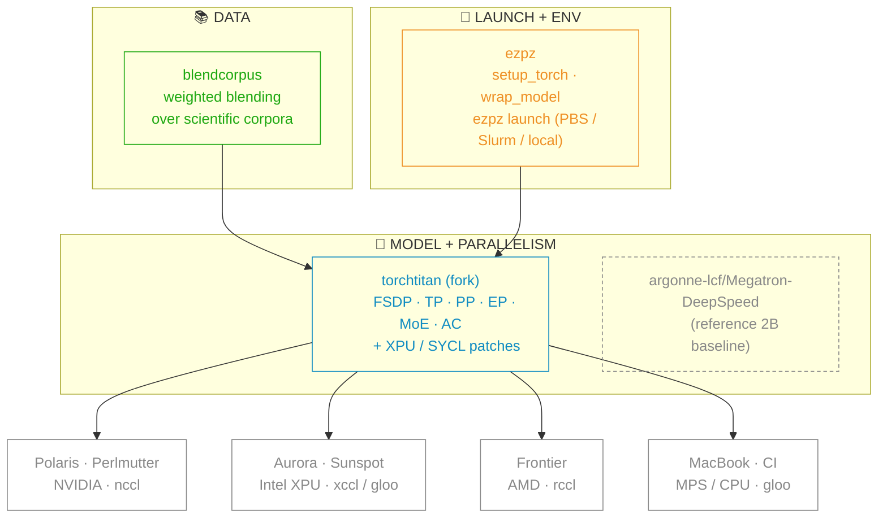
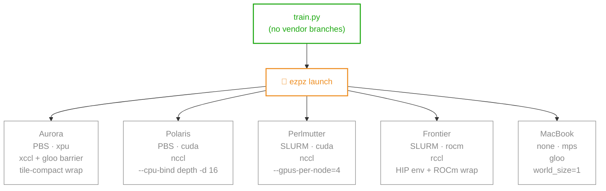
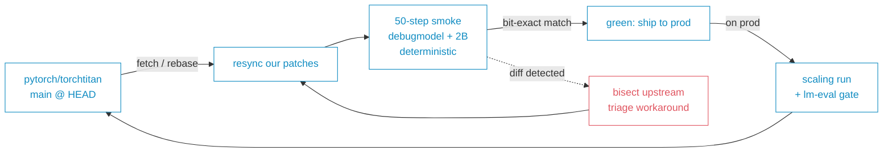

import Slide from '@/components/slides/Slide.astro'
import SpeakerNotes from '@/components/slides/SpeakerNotes.astro'
import Cols from '@/components/slides/Cols.astro'
import Col from '@/components/slides/Col.astro'

export const ASSETS = 'https://samforeman.me/assets'

{/*───────────────────────────────────────────────────────────────
1 — Title
───────────────────────────────────────────────────────────────*/}

<Slide id="title-slide">

# <span style="color:var(--foreground0);">Production Pre-Training at Scale:</span>

## <span style="color:var(--foreground1);">The Good, the Bad, and the Restarts</span>

## <span style="color:var(--foreground2);">_Lessons from AuroraGPT_</span>

&nbsp;  
&nbsp;

**Sam Foreman**[^anl], Venkat Vishwanath[^anl], AuroraGPT Team  
_{new Date(frontmatter.date).toISOString().slice(0, 10)}_


[^anl]: Argonne National Laboratory

</Slide>

{/*───────────────────────────────────────────────────────────────
2 — Outline / TOC
───────────────────────────────────────────────────────────────*/}

<Slide id="outline">

## Outline

1. **The stack** — `blendcorpus` · `torchtitan-fork` · `ezpz` (the _good_)
2. **AuroraGPT-2B** — the reference run on Aurora (3,072 GPUs, ~7.77T tokens)
3. **Why we moved to `torchtitan`** — what we gained, what we agreed to pay
4. **The fork tax** — upstream-sync as a workflow
5. **Silent bug #1** — bf16 master ⇒ RMSNorm frozen
6. **Silent bug #2** — TP loss reported / `dp_world_size`
7. **Vendor-portability war stories** (the _bad_)
8. **Operational reality** — bad-node failover at 512N
9. **What generalizes — what doesn't**
10. **The ask** — open questions for TPC

</Slide>

<Slide id="notes">

## Notes

- How to do _production training_ on a _rapidly evolving_ software
  stack?
  - **while also mitigating hardware and system failures** ?

- Tension between:
  - long running continuous (weeks/months+) pre-training jobs
  - typical facility scheduling policies (e.g. 8-12 hours per day)
- In addition to:
  - node failures
  - file system instabilities
  - (silent!) HW failures
  - _frequent checkpointing and restarting to mitigate_

</Slide>

{/*───────────────────────────────────────────────────────────────
3 — Stack diagram
───────────────────────────────────────────────────────────────*/}

<Slide id="stack">

## The stack in one slide



**The claim:** same code, every vendor — no `if device == "xpu"` branches in user code. Megatron-DeepSpeed sits alongside as the reference baseline (the 2B production model was trained there before we cut over to torchtitan).

</Slide>

<Slide>

## `blendcorpus` — the boring layer that breaks first

**What it does**

- Weighted blending across N scientific corpora; deterministic shard
  indexing so a given `(global_step, dp_rank)` always sees the same
  bytes
- Weight-stable resumption: changing per-corpus weights mid-run doesn't
  re-shuffle history

**Where it bites**

- **Upstream shard churn** — corpus owners re-emit shards (dedup,
  re-tokenization). Same logical corpus, different bytes → silent
  history drift unless you pin shard SHAs in the manifest.
- **Cross-backend dataloader skew** — `num_workers`, prefetch, NUMA
  pinning behave differently on XPU vs CUDA hosts. Same seed, different
  arrival order on the GPU → not reproducible across vendors.

> Smoke test catches this: bit-exact first-step loss requires the
> dataloader to deliver identical batches across runs, vendors, and
> resumptions.

</Slide>

<Slide id="ezpz">

## 🍋 `ezpz` — write once, launch anywhere

```python
import ezpz, torch

rank = ezpz.setup_torch()       # device + backend autodetect, init pg
model = ezpz.wrap_model(model)  # FSDP by default; DDP / FSDP+TP optional
```

```bash
ezpz launch python -m torchtitan.train --config-file ./config.toml
#  ↑ auto: nccl/xccl/rccl/gloo · mpiexec/srun · PBS/Slurm/local
#         per-cluster CPU bindings · tile-compact wrappers
```

Without `ezpz`, the same launch on Aurora is ~6 lines of `mpiexec
--cpu-bind verbose,list:1-7:8-15:...` with a `gpu_tile_compact.sh`
wrapper; Polaris is different bindings + `torch.distributed.run`;
Perlmutter is `srun`. With `ezpz`, the _training code_ and the _launch
command_ are both unchanged across all five sites.

</Slide>

{/*───────────────────────────────────────────────────────────────
🍋 ezpz dispatch — one source, five targets
───────────────────────────────────────────────────────────────*/}

<Slide id="ezpz-dispatch">

## 🍋 `ezpz launch` — one source, five targets



Everything below `ezpz launch` is per-site bookkeeping that _would_
otherwise leak into the training code or a per-cluster submit script.

</Slide>

{/*───────────────────────────────────────────────────────────────
AuroraGPT-2B (Megatron-DeepSpeed reference baseline)
───────────────────────────────────────────────────────────────*/}

<Slide id="agpt-2b">

## AuroraGPT-2B — the reference run on Aurora

| Spec         | Value                                                                               |
| ------------ | ----------------------------------------------------------------------------------- |
| Architecture | Llama 3-style, 1.986B params, 12 layers, GQA (16h / 4 kv), 8192 ctx                 |
| Tokenizer    | `google/gemma-7b` SentencePiece, vocab=256K                                         |
| Hardware     | **256 Aurora nodes × 12 Intel Max GPUs = 3,072 GPUs**, BF16                         |
| Framework    | Megatron-DeepSpeed (ZeRO Stage 0), SophiaG (β=0.9/0.95, ρ=0.01, wd=0.1, LR=2.28e-5) |
| Stages       | 3 (pretrain · continued-pretrain · math+code), **~7.77T total tokens**              |

This is the **pre-`torchtitan` reference**. Everything that follows is
the migration story: same scale, same data, what changed and what
broke when we cut over.

</Slide>

<Slide id="agpt-2b-loss">

## 2B reference — training loss

<figure>
    
    <figcaption>
        (1.) Pretrain[^stage1] → (2.) continued-pretrain[^stage2] → (3.)
        math+code[^stage3]
    </figcaption>
</figure>

</Slide>

{/*───────────────────────────────────────────────────────────────
2B training loss comparison — MDS full trajectory vs TT v2
───────────────────────────────────────────────────────────────*/}

<Slide id="agpt-2b-loss-compare">

## 2B loss — MDS full trajectory vs `torchtitan`

<figure>
    
    <figcaption>
        Same-node-count comparison (256N, GBS=6,144). MDS reference:
        full 3-stage curve (~163K logged steps). TT v2 (fp32, 256N):
        15.4K steps → loss 2.78, pulled from W&B. TT-v2 tracks the
        MDS pretrain trajectory through ~700B tokens — the cutover
        preserved training behavior at matched config.
    </figcaption>
</figure>

</Slide>

{/*───────────────────────────────────────────────────────────────
2B eval comparison — MDS vs TT v2
───────────────────────────────────────────────────────────────*/}

<Slide id="agpt-2b-eval">

## 2B eval — MDS reference vs `torchtitan`

<figure>
    
    <figcaption>
        MDS (SophiaG): 28 evals, 5K→140K steps through
        (1.) Pretrain[^stage1] → (2.) continued-pretrain[^stage2]
        (~7T tokens; stage (3.) math+code[^stage3] not yet eval'd)
        · TT v2 (fp32-master, 512N): 13 evals, 1K→13K steps (~1.3T
        tokens) — tracks the MDS pretrain trajectory at matched
        token budget. *(The bf16-broken v1 baseline lives on the
        20B smoking-gun slide.)*
    </figcaption>
</figure>

</Slide>

{/*───────────────────────────────────────────────────────────────
Why move off MDS — and what broke
───────────────────────────────────────────────────────────────*/}

<Slide id="why-titan">

## Why we moved to `torchtitan`

|                                  | Megatron-DeepSpeed (v1)                  | torchtitan + ezpz (v2)                             |
| -------------------------------- | ---------------------------------------- | -------------------------------------------------- |
| Upstream status                  | **unmaintained** (no active development) | active, `pytorch/torchtitan` main, weekly+ commits |
| Parallelism authoring            | hand-wired MP/DP/PP groups               | DTensor mesh + FSDP2 (declarative)                 |
| New strategies (FSDP+TP, EP, CP) | weeks of plumbing                        | hours, via `parallel_dims`                         |
| MoE                              | **not supported**                        | first-class in DTensor                             |
| Cross-vendor                     | Aurora-only patches in our fork          | one launcher, four backends                        |

**The trade-off we accepted:** living on a fast-moving upstream
(`pytorch/torchtitan main`) instead of a tagged release. That trade
is the "fork tax" — the rest of this talk.

</Slide>

{/*───────────────────────────────────────────────────────────────
The fork tax
───────────────────────────────────────────────────────────────*/}

<Slide id="fork-tax">

## The fork tax — upstream-sync as a workflow



- ~6× weekly resyncs over 6 weeks
- Smoke gate: bit-exact loss + grad-norm + peak memory at `--debug.deterministic --debug.seed=42`
- Every "did upstream change something?" question gets a numeric answer in ≤30 min

</Slide>

{/*───────────────────────────────────────────────────────────────
Silent killer #1 — bf16 RMSNorm freeze
───────────────────────────────────────────────────────────────*/}

<Slide id="bf16-freeze">

## Silent bug #1 — bf16 master ⇒ RMSNorm frozen

**Symptom.** Loss curves looked reasonable. lm-eval scores didn't
move — ARC-Easy stuck at **~0.27** (random baseline) for 17K+ steps.

**Cause.** `training.dtype=bfloat16` → bf16 master copy. RMSNorm
weights init at `1.0`; bf16 ULP at scale 1.0 is `~7.8e-3`. Per-step
optimizer update is `~1.6e-5` — **every update rounds to zero**. All
25 RMSNorm tensors stayed at exactly `1.0` from step 100 → 17,400.

**Why other params trained fine.** Linear layers init at `std≈0.02` →
bf16 ULP at scale `0.02` is `~3.8e-5`, same magnitude as the update.
RMSNorm's larger init scale = coarser ULP = updates lost in rounding.

**Fix.** Default `training.dtype=float32`, FSDP
`MixedPrecisionPolicy(param_dtype=bf16, reduce_dtype=fp32)`. Master is
fp32; forward/backward stay bf16. Extra ~1 GB master at 2B, ~10 GB at
20B — under budget.

</Slide>

<Slide id="bf16-freeze-evidence">

## Silent bug #1 — the smoking gun


<figcaption>
    **v1** (bf16 master, 256N): ARC-Easy `0.27` flat across 2,500 steps · **v2**
    (fp32 master, 512N): ARC-Easy `0.27 → 0.44` by step 800 · HellaSwag breaking
    out.
</figcaption>

> **Lesson:** loss looks like training. lm-eval is the only ground
> truth for "is the model actually learning?" Add a periodic eval gate.

</Slide>

{/*───────────────────────────────────────────────────────────────
Silent killer #2 — TP loss reporting
───────────────────────────────────────────────────────────────*/}

<Slide id="tp-loss">

## Silent bug #2 — TP loss reported / `dp_world_size`

- **Symptom**: Step-1 loss for `agpt_*` (vocab=256128) should be `ln(256128) ≈
12.45`
  - On TP=1 we see `12.95` ✓
  - On TP=2 after upstream commit `1786292d` (2026-04-27):
    - step-1 reported as `1.07` ✗ — exactly `12.84 / 12` where `dp_world_size = 12`

- **Cause**: `_dist_reduce()` short-circuits on DTensor with
  `full_tensor()`
  - But the loss is **Replicated on the TP mesh**, and the reduction was
      requested over `batch_mesh` (orthogonal)
  - The short-circuit silently drops the cross-batch sum

- **Why it survived review**: Gradients + optimizer steps are correct
  - Only the `loss:` field that lands in stdout / W&B is wrong
  - Loss curves look "reasonable" — just `1/12` of the true value
  - Filed as `pytorch/torchtitan#3204`; our workaround calls `loss.full_tensor()`
      before `dist_sum` in `ezpz/trainer.py:503-516`

- **Lesson**: Bit-exact smoke caught this immediately; the prior 2B TP=1
  baseline gave us a number to disagree with

</Slide>

{/*───────────────────────────────────────────────────────────────
Vendor portability war stories
───────────────────────────────────────────────────────────────*/}

<Slide id="vendor-bugs">

## Vendor-portability war stories _(the "bad")_

- **SDPA backend ignored inside FSDP** — XPU `OVERRIDEABLE` kernel
  is **23× faster** than `MATH`, but `sdpa_kernel()` is silently
  dropped under FSDP wrappers.
  → reorder backend list, force `OVERRIDEABLE` first.

- **`DeviceMesh` in saved tensors** _(torch 2.13 + AC + TP=2)_ —
  AOT-autograd assertion fires on every 80B-family config.
  → `compile=OFF` or pin torch 2.10.

- **Config defaults are NVIDIA-shaped** — vocab projection at LBS=8
  OOMs on Intel Max (the "sensible default" asked for 31 GiB).
  → XPU-aware default microbatch.

- **Compile is noise** — 2-3% TPS band across compile attempts is
  the floor. Treat anything inside it as noise, not a regression.

</Slide>

{/*───────────────────────────────────────────────────────────────
Operational reality — failover wrapper
───────────────────────────────────────────────────────────────*/}

<Slide id="restarts">

## Operational reality — bad-node failover

**6+ production jobs killed by bad-node failures in 2 weeks.** Pattern:
PBS gives us 256 / 512 nodes, one is bad, training crashes or hangs
after N hours, walltime gone.

| Job     | Trajectory  | Failure                                           |
| ------- | ----------- | ------------------------------------------------- |
| 8459818 | 2B 256N v2  | `shepherd died from signal 9` after step 2070     |
| 8460302 | 20B 512N v2 | signal 9 at end of walltime                       |
| 8470102 | 20B 256N v2 | gloo TCP `Connection closed by peer` after ~3h    |
| 8479579 | 20B 512N v2 | **silent hang** at step 803 (heartbeat continued) |

**Failover wrapper:** request `select=N+spare` (~2%, min 4). Split
into active + spare pool. On crash, scrape bad nodes from log, swap a
spare in, retry.

```bash
qsub -q prod -l select=522 -v NHOSTS_TRAIN=512 \
    submit_agpt_2b_aurora_venv_failover.sh
```

Handles 6 recurring crash modes. **Does not handle silent hangs** —
those still need a heartbeat watchdog.

</Slide>

{/*───────────────────────────────────────────────────────────────
What generalizes / open questions / fin
───────────────────────────────────────────────────────────────*/}

<Slide id="generalizes">

## What generalizes — what doesn't

**Generalizes across vendors / sites / models**

- Bit-exact deterministic smoke gate after every upstream sync
- lm-eval as the ground truth for "is it actually learning?"
- Spare-node failover wrapper — same idea on Slurm
- Launcher / env autodetect — push every vendor-shaped assumption _out_ of training code

**Doesn't generalize** _(needs per-(config, hardware, version) tuning)_

- `torch.compile` decisions
- AC boundaries (MoE + AC + compile = grief)
- EP↔FSDP frontier
- Collective tuning (XCCL vs gloo fallbacks, NCCL env)

</Slide>

<Slide id="ask">

## Open questions — the ask

- A **portable bit-exact regression suite** across vendors — does
  anyone have one?
- **`torch.compile` at 1T scale** — defensible decision tree?
- **Async-checkpoint Pareto frontier**: recovery time × frequency ×
  storage cost in production
- **Optimizer failure at 80B+**: SophiaG + Muon both diverge —
  algorithmic or numerical?
- **MoE EP↔FSDP** scaling boundaries at 16B / 64B / 100B
- **Silent-hang detection** — heartbeat watchdog patterns that
  actually work

</Slide>

<Slide id="thanks">

## Thanks

**AuroraGPT team** — Venkat Vishwanath, the AI/ML Group at ALCF,
collaborators across ANL.

**Argonne Leadership Computing Facility** — Aurora time, Sunspot
staging.

**Code & docs**

- `ezpz` — [github.com/saforem2/ezpz](https://github.com/saforem2/ezpz)
- `torchtitan` fork (experiments/ezpz) —
  [github.com/saforem2/torchtitan](https://github.com/saforem2/torchtitan/tree/ezpz/torchtitan/experiments/ezpz)
- These slides — [https://sam.onl/talks/2026/06/03](https://sam.onl/talks/2026/06/03)

Questions?

</Slide>

[^stage1]: [allenai/olmo-mix-1124](https://hf.co/datasets/allenai/olmo-mix-1124) — 0 → 4.67T tokens
[^stage2]: [allenai/dolmino-mix-1124](https://hf.co/datasets/allenai/dolmino-mix-1124) — 4.67T → 7.06T tokens
[^stage3]: NVIDIA/\{[Nemotron-CC-Math-v1](https://hf.co/datasets/nvidia/Nemotron-CC-Math-v1), [Code-CC-v1](https://huggingface.co/datasets/nvidia/Code-CC-v1)\} — 7.06T → 7.77T tokens
