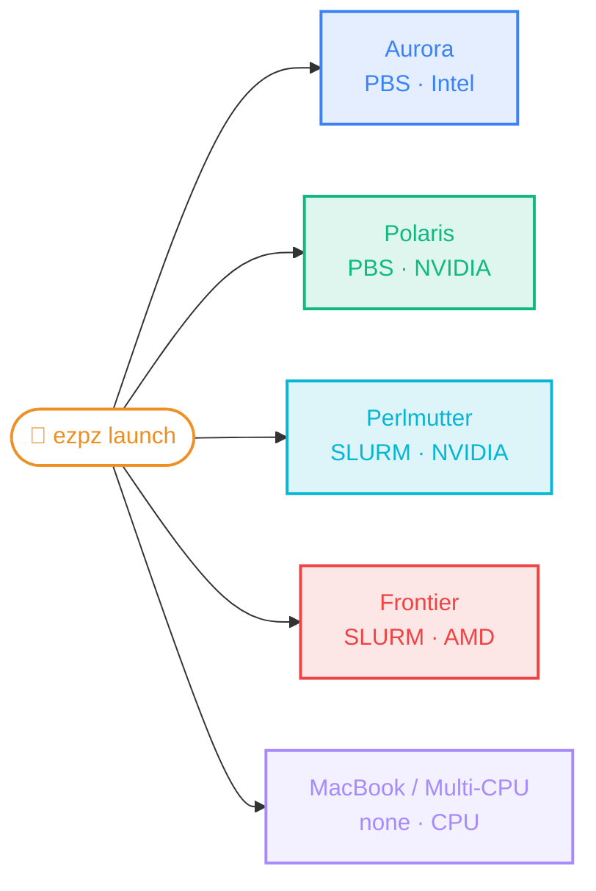
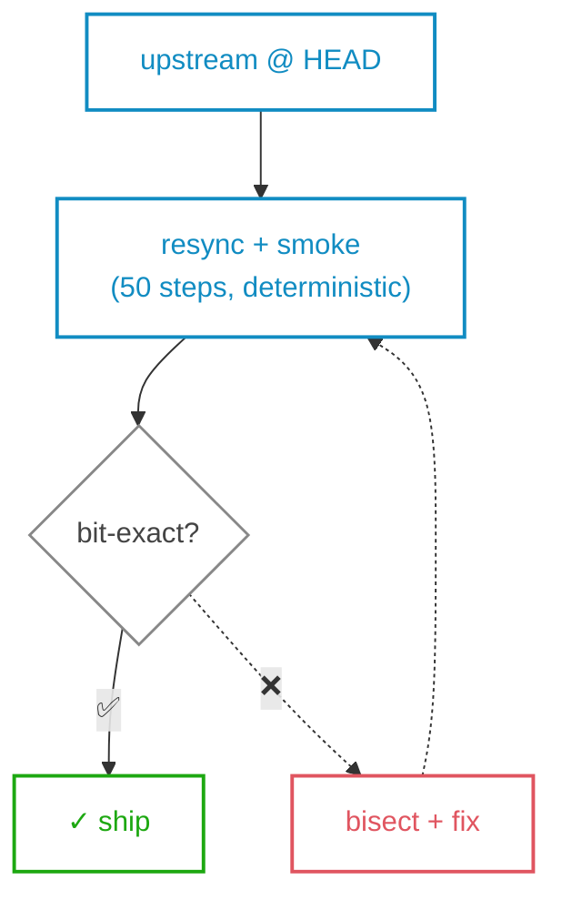
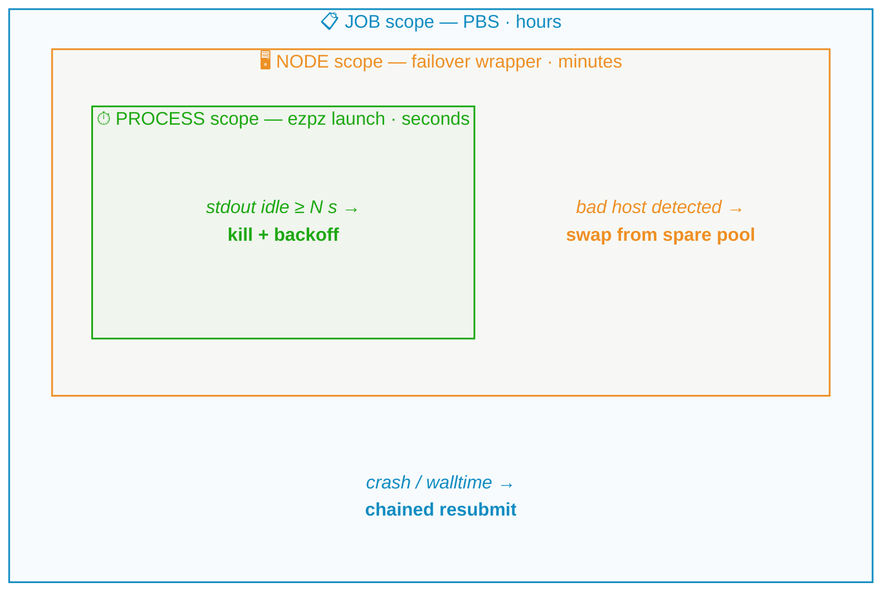
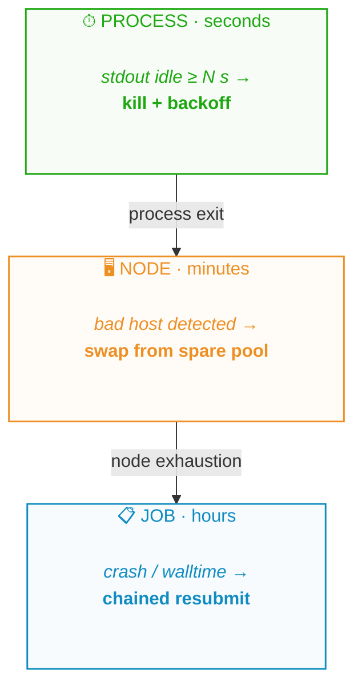
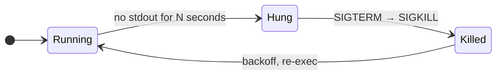
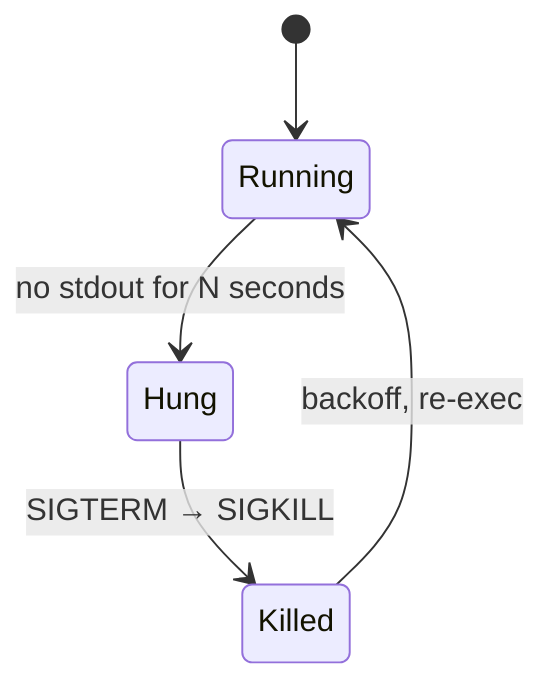

import Slide from '@/components/slides/Slide.astro'
import SpeakerNotes from '@/components/slides/SpeakerNotes.astro'
import Cols from '@/components/slides/Cols.astro'
import Col from '@/components/slides/Col.astro'

export const ASSETS = 'https://samforeman.me/assets'

{/*───────────────────────────────────────────────────────────────
1 — Title
───────────────────────────────────────────────────────────────*/}

<Slide id="title-slide">

# <span style="color:var(--foreground0);">Production Pre-Training at Scale:</span>

## <span style="color:var(--foreground1);">The Good, the Bad, and the Restarts</span>

## <span style="color:var(--foreground2);">_Lessons from AuroraGPT_</span>

&nbsp;  
&nbsp;

**Sam Foreman**[^anl], Nathan Nichols, Varuni Sastry, Samuel Wheeler, Khalid Hossain, Huihuo Zheng, Murali Emani, Filippo Simini, Marieme Ngom, Ethan Wong, Venkat Vishwanath  
_{new Date(frontmatter.date).toISOString().slice(0, 10)}_


[^anl]: Argonne National Laboratory

</Slide>

{/*───────────────────────────────────────────────────────────────
2 — Outline / TOC
───────────────────────────────────────────────────────────────*/}

<Slide id="outline">

## Outline

<div class="outline-grid">

<div>

1. **The Good**
    - **CODING AGENTS**
    - AuroraGPT-2B — the reference run on Aurora
    - Moving to `torchtitan`
2. **The Bad**
    - The fork tax (living on a fast-moving upstream)
    - Vendor-portability pitfalls (silent fallbacks, NVIDIA-shaped defaults)
    - At scale, failure is the default

</div>

<div>

3. **The Restarts**
    - 3 layers of recovery (process · node · job)
    - Timeout & heartbeat watchdog
    - `--auto-retry` with spare nodes
    - What generalizes — what doesn't
4. **Open Questions for TPC**

_Backups_: optimizer experiments (Mano · Muon · SophiaG · LR-finder), silent-correctness bugs (bf16 RMSNorm freeze, TP loss reporting), `blendcorpus` deep-dive, bad-node failover ops

</div>

</div>

<style>{`
  /* Tighten heading -> content spacing for this slide only. */
  #outline > .slide-inner > h2 { margin-block-end: 0.25lh; }
  #outline .outline-grid {
      display: grid;
      grid-template-columns: 1fr 1fr;
      gap: 2ch;
      align-items: start;
  }
  /* Outer list margins were eating extra space at column tops. */
  #outline .outline-grid > div > ol:first-child { margin-block-start: 0; }
  /* Mobile (<=768px): stack columns vertically so the slide stays
     readable on narrow screens. */
  @media (max-width: 768px) {
      #outline .outline-grid {
          grid-template-columns: 1fr;
          gap: 0.5lh;
      }
  }
`}</style>

</Slide>

<Slide id="notes">

## Notes

- How to do _production training_ on a _rapidly evolving_ software
  stack?
    - across \{Intel, NVIDIA, AMD\} hardware?
    - **while also mitigating hardware and system failures** ?

- Tension between:
    - long running continuous (weeks/months+) pre-training jobs
    - typical facility scheduling policies (e.g. 8-12 hours per day)
- In addition to:
    - node failures
    - file system instabilities
    - (silent!) HW failures
    - _frequent checkpointing and restarting to mitigate_

</Slide>

{/*───────────────────────────────────────────────────────────────
3 — Stack diagram
───────────────────────────────────────────────────────────────*/}

<Slide id="stack">

## The stack in one slide

**Current stack:**

- 🍋 [`saforem2/ezpz`](https://github.com/saforem2/ezpz): `setup_torch` · `wrap_model` · `ezpz launch`
- 🧠 [`saforem2/torchtitan@ezpz`](https://github.com/saforem2/torchtitan/tree/ezpz): FSDP · TP · PP · EP · MoE · AC + XPU/SYCL
- 📚 [`zhenghh04/blendcorpus`](https://github.com/zhenghh04/blendcorpus): weighted blending over multiple datasets

**Old stack (reference):**

- 🪦 [`argonne-lcf/Megatron-DeepSpeed`](https://github.com/argonne-lcf/Megatron-DeepSpeed): pre-`torchtitan` 2B baseline (SophiaG, ~7.77T tokens)

**The claim:** same code, every vendor — no `cuda` in user code !

</Slide>

<Slide id="ezpz">

<div class="ezpz-grid">

<div class="ezpz-text">

## 🍋 `ezpz`: write once, launch anywhere

```python
# train.py

import ezpz
# auto device + backend selection
rank = ezpz.setup_torch()
print(rank)
```

```bash
ezpz launch python3 train.py
```

Same code, same launch command, every site. No per-cluster `mpiexec` / `srun` invocations, CPU bindings, or tile-compact wrappers. Full docs: [ezpz.cool](https://ezpz.cool).

</div>

<div class="ezpz-diagram">



</div>

</div>

<style>{`
  #ezpz .ezpz-grid {
    display: grid;
    grid-template-columns: 1fr 1fr;
    gap: 3ch;
    align-items: center;
    flex: 1;
    min-height: 0;
    width: 100%;
  }
  #ezpz .ezpz-text { min-width: 0; display: flex; flex-direction: column; justify-content: center; }
  #ezpz .ezpz-text > h2 { margin-block-start: 0; }
  #ezpz .ezpz-text pre.astro-code { width: 100%; }
  #ezpz .ezpz-diagram { min-width: 0; display: flex; flex-direction: column; justify-content: center; }
  #ezpz .ezpz-diagram .mermaid svg { width: 100%; max-width: 100%; }
  @media (max-width: 768px) {
    #ezpz .ezpz-grid {
      grid-template-columns: 1fr;
      gap: 1lh;
    }
  }
`}</style>

</Slide>

{/*───────────────────────────────────────────────────────────────
AuroraGPT-2B (Megatron-DeepSpeed reference baseline)
───────────────────────────────────────────────────────────────*/}

<Slide id="agpt-2b">

## AuroraGPT-2B: the reference run on Aurora

<div class="tight-table">

| Spec            | Value                                                       |
| --------------- | ----------------------------------------------------------- |
| Architecture    | 1.986B params, 12 layers, GQA (16h / 4 kv)                  |
| Tokenizer       | SentencePiece, vocab=256K                                   |
| Hardware        | **256 Aurora nodes × 12 Intel Max GPUs = 3,072 GPUs**, BF16 |
| Framework       | Megatron-DeepSpeed (ZeRO Stage 0)                           |
| Optimizer       | SophiaG (β=0.9/0.95, ρ=0.01, wd=0.1, LR=2.28e-5)            |
| Training Config | **50M tok/batch** (8192 ctx · LBS=2)                        |
| Stages          | 3 (pretrain · continued-pretrain · math+code)               |
| Tokens          | **~7.77T total**                                            |

</div>

This is the **pre-`torchtitan` reference**. Everything that follows is
the migration story: same scale, same data, what changed and what
broke when we cut over.

</Slide>

{/*───────────────────────────────────────────────────────────────
Why MDS in the first place — the pre-torchtitan landscape
───────────────────────────────────────────────────────────────*/}

<Slide id="mds-context">

## Why MDS first: the only option at the time

When AuroraGPT kicked off, MDS was the **only** LLM pre-training framework that ran:

- [x] at scale
- [x] on Intel XPU

Supporting context:

- **PyTorch FSDP1** had Intel XPU gaps — collectives, AC patterns, optimizer-state sharding
- **torchtitan** existed as a research project but not yet on XPU / not yet usable for our config
- **blendcorpus** had a stable MDS integration; the data pipeline was already a known quantity
- The fork was _ours_ — every Aurora-specific patch could land same-day

MDS was the pragmatic choice. By mid-2026 the calculus changed — `torchtitan` + DTensor + FSDP2 closed the gap and the MDS fork's maintenance cost crossed over.

</Slide>

{/*───────────────────────────────────────────────────────────────
Why SophiaG — large-batch optimizer comparison
───────────────────────────────────────────────────────────────*/}

<Slide id="optimizer-comparison">

## Why SophiaG: large-batch stability at 50M tok/batch

<figure>
    <picture>
        <source
            media="(max-width: 768px)"
            srcset="/talks/2026-06-03/figures/optimizer-comparison-mobile.svg"
        />
        
    </picture>
    <figcaption>
        256N · GBS=6,144 · 50M tok/batch. **SophiaG** is the only one
        that stays in the low-loss band with bounded grad norms.
    </figcaption>
</figure>

</Slide>

<Slide id="agpt-2b-loss">

## 2B reference: training loss

<figure>
    <picture>
        <source
            media="(max-width: 768px)"
            srcset="/talks/2026-06-03/figures/loss-2b-reference-mobile.svg"
        />
        
    </picture>
    <figcaption>
        (1.) Pretrain[^stage1] → (2.) continued-pretrain[^stage2] → (3.)
        math+code[^stage3]
    </figcaption>
</figure>

</Slide>

{/*───────────────────────────────────────────────────────────────
2B reference + TT overlay — MDS 3-stage chart with TT v2 256N drawn on top
───────────────────────────────────────────────────────────────*/}

<Slide id="agpt-2b-loss-with-tt">

## 2B reference + `torchtitan` overlay

<figure>
    <picture>
        <source
            media="(max-width: 768px)"
            srcset="/talks/2026-06-03/figures/loss-2b-reference-with-tt-mobile.svg"
        />
        
    </picture>
    <figcaption>
        Same MDS trajectory as the reference chart, with the `torchtitan` 256N
        production run drawn on the same axes: starts inside the MDS pretrain
        region and tracks the same loss-vs-tokens curve.
    </figcaption>
</figure>

</Slide>

{/*───────────────────────────────────────────────────────────────
Why move off MDS — and what broke
───────────────────────────────────────────────────────────────*/}

<Slide id="why-titan">

## Why we moved to `torchtitan`

|                                          | MDS | TT  |
| :--------------------------------------- | :-: | :-: |
| Actively maintained upstream             | ❌️  | ✅  |
| Declarative parallelism (DTensor, FSDP2) | ❌️  | ✅  |
| FSDP+TP / EP / CP without plumbing       | ❌️  | ✅  |
| MoE support                              | ❌️  | ✅  |
| Cross-vendor from one launcher           | ❌️  | ✅  |

**The trade-off we accepted:** living on a fast-moving upstream
(`pytorch/torchtitan main`) instead of a tagged release. That trade
is the "fork tax", the rest of this talk.

<style>{`
  #why-titan table { table-layout: fixed; width: 100%; max-width: 70ch; }
  #why-titan table th:nth-child(1), #why-titan table td:nth-child(1) { width: auto; }
  #why-titan table th:nth-child(2), #why-titan table td:nth-child(2),
  #why-titan table th:nth-child(3), #why-titan table td:nth-child(3) {
    width: 6ch; text-align: center;
  }
`}</style>

</Slide>

{/*───────────────────────────────────────────────────────────────
2B training loss comparison — MDS full trajectory vs TT v2
───────────────────────────────────────────────────────────────*/}

<Slide id="agpt-2b-loss-compare">

## 2B loss: MDS full trajectory vs `torchtitan`

<figure>
    <picture>
        <source
            media="(max-width: 768px)"
            srcset="/talks/2026-06-03/figures/loss-2b-compare-mobile.svg"
        />
        
    </picture>
    <figcaption>
        256N / GBS=6,144. At matched tokens, **δ ≈ 0.02** — within run-to-run
        noise. The cutover preserved training behavior.
    </figcaption>
</figure>

</Slide>

{/*───────────────────────────────────────────────────────────────
2B eval comparison — MDS vs TT v2
───────────────────────────────────────────────────────────────*/}

<Slide id="agpt-2b-eval">

## 2B eval: MDS reference vs `torchtitan`

<figure class="eval-grid eval-grid-2b">
    
    
    
    
    
    <figcaption>
        Data:
        [`docs/evals/agpt/2b`](https://github.com/saforem2/torchtitan/tree/ezpz/torchtitan/experiments/ezpz/docs/evals/agpt/2b),
        production run:
        [`docs/production/agpt/2b`](https://github.com/saforem2/torchtitan/tree/ezpz/torchtitan/experiments/ezpz/docs/production/agpt/2b)
    </figcaption>
</figure>

</Slide>

{/*───────────────────────────────────────────────────────────────
20B eval comparison — v1 (broken) vs v2 256N / 512N
───────────────────────────────────────────────────────────────*/}

<Slide id="agpt-20b-eval">

## 20B eval: all-production overlay (2B + 20B)

<figure class="eval-grid eval-grid-20b">
    
    
    
    
    
    <figcaption>
        Data:
        [`docs/evals/agpt/20b`](https://github.com/saforem2/torchtitan/tree/ezpz/torchtitan/experiments/ezpz/docs/evals/agpt/20b),
        production run:
        [`docs/production/agpt/20b`](https://github.com/saforem2/torchtitan/tree/ezpz/torchtitan/experiments/ezpz/docs/production/agpt/20b)
    </figcaption>
</figure>

</Slide>

{/*───────────────────────────────────────────────────────────────
The fork tax
───────────────────────────────────────────────────────────────*/}

<Slide id="fork-tax">

<div class="fork-tax-grid">

<div class="fork-tax-text">

## The fork tax: upstream-sync as a workflow

- ~6× weekly resyncs over 6 weeks
- Smoke gate: bit-exact loss + grad-norm + peak memory at `--debug.deterministic --debug.seed=42`
- Every "did upstream change something?" question gets a numeric answer in ≤30 min

</div>

<div class="fork-tax-diagram">



</div>

</div>

<style>{`
  /* Full-bleed grid: left col holds the H2 + bullets (top-aligned),
     right col holds the mermaid diagram and spans the full slide
     height. Grid itself claims flex: 1 from the slide-inner so it
     reaches the bottom; min-height: 0 lets the mermaid SVG shrink
     to its column. */
  #fork-tax .fork-tax-grid {
    display: grid;
    grid-template-columns: 1fr 1fr;
    gap: 3ch;
    align-items: stretch;
    flex: 1;
    min-height: 0;
    width: 100%;
  }
  @media (max-width: 768px) {
    #fork-tax .fork-tax-grid {
      grid-template-columns: 1fr;
      gap: 1lh;
    }
  }
  #fork-tax .fork-tax-text {
    min-width: 0;
    display: flex;
    flex-direction: column;
    justify-content: center;
  }
  #fork-tax .fork-tax-text > h2 { margin-block-start: 0; }
  #fork-tax .fork-tax-diagram {
    min-width: 0;
    display: flex;
    flex-direction: column;
    justify-content: center;
  }
  #fork-tax .fork-tax-diagram .mermaid svg,
  #fork-tax .fork-tax-diagram pre.astro-code {
    width: 100%;
    max-width: 100%;
  }
`}</style>

</Slide>

{/*───────────────────────────────────────────────────────────────
Vendor portability war stories
───────────────────────────────────────────────────────────────*/}

<Slide id="vendor-bugs">

## Cross-version churn: APIs shift faster than vendor support catches up

**Cross-version churn.** Upstream APIs shift faster than vendor support catches up.

`DeviceMesh` + AC + TP=2 + torch 2.13 → AOT-autograd assertion on every 80B config; pin torch 2.10 until it lands.

</Slide>

{/*───────────────────────────────────────────────────────────────
"The Restarts" — motivation: at scale, failure is the default
───────────────────────────────────────────────────────────────*/}

<Slide id="restarts-motivation">

## The Restarts: At Scale, Failure is the Default

Production pre-training is long, large, and routinely interrupted:

- **Llama 3 405B** — 16K H100s · 54 days · **419** failures (≈ **1 every 3h**); 99% recovered via automation[^llama3]
- **OPT-175B** — 35 manual restarts + 100+ cycled hosts in 2 mo on ~1K A100s[^opt]
- **BLOOM-176B** — frequent loss spikes; embedding-norm + checkpoint cadence on 384 A100s × 3.5 mo[^bloom]
- **GLM-130B** — loss spikes "increasingly frequent"; some recover, others go to NaN[^glm]

> **At our scale, the question isn't _if_ training breaks — it's _how cheaply you recover._**

[^llama3]: [Llama 3 herd of models](https://arxiv.org/abs/2407.21783) (Meta AI, 2024), §3.3.2 (Training reliability)

[^opt]: [OPT-175B chronicles + dev log](https://github.com/facebookresearch/metaseq/blob/main/projects/OPT/chronicles/OPT175B_Logbook.pdf) (Zhang et al., 2022)

[^bloom]: [BLOOM: A 176B-Parameter Open-Access Multilingual Language Model](https://arxiv.org/abs/2211.05100) (BigScience, 2022)

[^glm]: [GLM-130B: An Open Bilingual Pre-Trained Model](https://arxiv.org/abs/2210.02414) (Zeng et al., ICLR 2023)

</Slide>

{/*───────────────────────────────────────────────────────────────
"The Restarts" — three layers of recovery at different scopes
───────────────────────────────────────────────────────────────*/}

<Slide id="restart-cascade">

## "The Restarts": three layers of recovery

Bad-node failover, hang-watchdog, and PBS resubmit each operate at a
different scope. Together they turn "lost a 12 h walltime" into
"lost a 10 min sub-step."

<div class="cascade-desktop">



</div>

<div class="cascade-mobile">



</div>

**Inner loops catch most failures; outer loops catch the rest.**

<style>{`
  /* Russian-doll cluster titles rendered as colored chip-badges
     (like the sidebar [t]alks / [p]osts / [w]ork chips). Mermaid
     emits each cluster as <g class="cluster {classDef-name}">;
     inside that lives a <g class="cluster-label"> > <foreignObject>
     > <div> > <span class="nodeLabel">. Style the span as the chip:
     square corners, no border, light tinted bg, dark text — matching
     sidebar chip aesthetic (default foreground color, not the
     accent, so the text reads cleanly on the tinted bg). */
  #restart-cascade .mermaid .cluster .cluster-label foreignObject {
      overflow: visible;
  }
  #restart-cascade .mermaid .cluster .cluster-label span {
      display: inline-block;
      padding: 0 1ch;
      color: var(--foreground0, #222) !important;
      font-weight: 600;
  }
  #restart-cascade .mermaid .cluster.jobC .cluster-label span {
      background: #118cc218;
  }
  #restart-cascade .mermaid .cluster.nodeC .cluster-label span {
      background: #ee8f2418;
  }
  #restart-cascade .mermaid .cluster.procC .cluster-label span {
      background: #1da81118;
  }
  /* Body text inside each cluster — match the cluster's accent color.
     Mermaid's default node style applies a black fill via the inline
     foreignObject span color, so classDef color is overridden. Force
     it via CSS scoped to the classDef class on the node group. */
  #restart-cascade .mermaid g.node.jobTxt .nodeLabel,
  #restart-cascade .mermaid g.node.jobTxt span,
  #restart-cascade .mermaid g.node.jobTxt p {
      color: #118cc2 !important;
  }
  #restart-cascade .mermaid g.node.nodeTxt .nodeLabel,
  #restart-cascade .mermaid g.node.nodeTxt span,
  #restart-cascade .mermaid g.node.nodeTxt p {
      color: #ee8f24 !important;
  }
  #restart-cascade .mermaid g.node.procTxt .nodeLabel,
  #restart-cascade .mermaid g.node.procTxt span,
  #restart-cascade .mermaid g.node.procTxt p {
      color: #1da811 !important;
  }
  /* Descender clip fix — mermaid's node foreignObject has overflow:
     hidden and the inner <p> has a tight line-height that cuts off
     descenders (g, p, y, q) on the bottom row of multi-line labels.
     Make the foreignObject visible and pad the p slightly so the
     descender on "pool" (and any future labels with descenders) is
     fully rendered. NB: the modal popout (.mermaid-modal) clones the
     SVG outside this #restart-cascade scope — see slides.css for
     the global rule that catches the modal case too. */
  #restart-cascade .mermaid g.node foreignObject {
      overflow: visible;
  }
  #restart-cascade .mermaid g.node p {
      line-height: 1.35;
      padding-bottom: 0.1em;
  }
  /* Depth-of-field on the russian-doll clusters. Each scope gets a
     progressively softer + larger drop-shadow so inner = closer to
     viewer (more shadow above it, smaller blur), outer = further
     away (broader, softer shadow). The colors are tinted to each
     box's accent so the depth cue carries the same blue/orange/
     green semantics as the borders and badges — not just neutral
     gray. drop-shadow works on SVG elements (vs box-shadow which
     doesn't) and respects the rect's actual outline. */
  #restart-cascade .mermaid g.cluster.jobC > rect {
      filter: drop-shadow(0 4px 12px #118cc230);
  }
  #restart-cascade .mermaid g.cluster.nodeC > rect {
      filter: drop-shadow(0 3px 8px #ee8f2438);
  }
  #restart-cascade .mermaid g.cluster.procC > rect {
      filter: drop-shadow(0 2px 5px #1da81140);
  }
  /* Bump font size on the russian-doll diagram so labels are legible
     from the back of a room. Mermaid sets text via inline foreignObject
     <span> / <p> children — override the computed font-size on both. */
  #restart-cascade .mermaid .cluster .cluster-label span,
  #restart-cascade .mermaid g.node span,
  #restart-cascade .mermaid g.node p {
      font-size: 1.25em;
  }
  /* Keep mermaid labels on one line — the slide-global
     word-break: break-word rule (applied to tables) was bleeding
     into mermaid foreignObject text and breaking node labels mid-word
     (e.g. stdout idle would split across multiple lines). Reset to
     default + force nowrap on the inner elements so mermaid sizes
     the box to the text instead of the text wrapping inside a
     fixed box. */
  #restart-cascade .mermaid g.node foreignObject,
  #restart-cascade .mermaid g.node foreignObject *,
  #restart-cascade .mermaid .cluster .cluster-label *,
  #restart-cascade .mermaid g.node span,
  #restart-cascade .mermaid g.node p {
      white-space: nowrap !important;
      word-break: normal !important;
      overflow-wrap: normal !important;
  }
  /* On narrow viewports let the nested mermaid fill the slide width;
     the russian-doll nesting reads cleanly even on phones (mermaid
     stacks children top-down when there's no horizontal room).
     A separate mobile-only variant broke the interactive controls
     (mermaid-render.ts processes every .mermaid block once and the
     duplicated render path was tearing down the viewport wrapper). */
  /* Desktop/mobile variant swap. Default: nested russian-doll on
     desktop. On narrow viewports: hide the nested version, show the
     tall sibling-stack version. Both render via the same mermaid
     pipeline; only one is visible at a time so interactive controls
     attach to the visible block. */
  #restart-cascade .cascade-mobile { display: none; }
  @media (max-width: 768px) {
      #restart-cascade .cascade-desktop { display: none; }
      #restart-cascade .cascade-mobile { display: block; }
      #restart-cascade .mermaid svg {
          width: 100%;
          max-width: 100%;
          height: auto;
      }
  }
`}</style>

</Slide>

{/*───────────────────────────────────────────────────────────────
The heartbeat watchdog — ezpz launch --timeout / --retries
───────────────────────────────────────────────────────────────*/}

<Slide id="watchdog">

## Silent-hang detection: `ezpz launch --timeout / --retries`

**The problem.** `xccl` on XPU silently ignores
`train_timeout_seconds`, so a torchtitan job stuck in a hung
collective sits consuming the full PBS walltime instead of aborting.
Every collective hang quiets stdout (every rank blocks in the same
call, nothing reaches the log) — that's the signal we can act on.

```bash
ezpz launch --timeout 600 --retries 3 \
    python -m torchtitan.train --config-file ./config.toml
```

- **`--timeout SECONDS`** — kill the launched process if its stdout
  goes **idle** (not walltime) for this many consecutive seconds.
  Returns exit code 124 (matches GNU `timeout(1)`).
- **`--retries N`** — re-execute on any non-zero exit (including
  the watchdog's 124) up to N times. Exponential backoff:
  5s → 10s → 20s → 40s → 60s (capped).

**Scope caveat.** Watches only the process `ezpz launch` spawns
directly. If `qsub` runs a wrapper script that internally invokes
`python train.py`, the watchdog needs to live inside that script (or
you wrap the inner call with `ezpz launch` too).

</Slide>

{/*───────────────────────────────────────────────────────────────
Watchdog state machine — one cycle in detail
───────────────────────────────────────────────────────────────*/}

<Slide id="watchdog-fsm">

## `ezpz launch --timeout`: one hang/recover cycle

<div class="watchdog-desktop">



</div>

<div class="watchdog-mobile">



</div>

Every collective hang shows up as **silence on stdout** — the process is "alive" by `kill -0` but nothing is happening. The watchdog fires on the _absence_ of progress, not on a heartbeat ping.

<style>{`
  /* Desktop/mobile mermaid variant swap, same pattern as restart-cascade. */
  #watchdog-fsm .watchdog-mobile { display: none; }
  @media (max-width: 768px) {
      #watchdog-fsm .watchdog-desktop { display: none; }
      #watchdog-fsm .watchdog-mobile { display: block; }
      #watchdog-fsm .mermaid svg {
          width: 100%;
          max-width: 100%;
          height: auto;
      }
  }
`}</style>

</Slide>

{/*───────────────────────────────────────────────────────────────
What generalizes / open questions / fin
───────────────────────────────────────────────────────────────*/}

{/*───────────────────────────────────────────────────────────────
ezpz launch --auto-retry — new failover wrapper (PR #144)
───────────────────────────────────────────────────────────────*/}

<Slide id="auto-retry">

## `--auto-retry`: bad-node failover, on tap

Allocate spares up front, swap them in on failure:

```bash
# 522 nodes allocated, train on 512, keep 10 as spares.
# Loop until success, walltime, or spare exhaustion.
ezpz launch --auto-retry --np 512 -- python -m torchtitan.train …
```

- Classifies each attempt's exit → `success` / `walltime` / `bad-node` / `stuck-pre-training`
- On bad-node: scrapes the failing host from the log, swaps in a spare, re-execs
- Guards against config bugs: 2 consecutive attempts with zero `step=` markers → stop (don't burn the whole spare pool on a broken run)

Ships in [`saforem2/ezpz#144`](https://github.com/saforem2/ezpz/pull/144). Same scraper as the bash-lib path; pure-Python loop on top.

</Slide>

{/*───────────────────────────────────────────────────────────────
Failover wrapper validation — the silent hang it was built for
───────────────────────────────────────────────────────────────*/}

<Slide id="failover-validation">

## Failover wrapper: caught a real silent hang in production

**Job `8505298`, 2026-05-23.** Attempt 1 trains cleanly steps 1→37, then
log goes **completely silent** at step 37. No traceback, no MPI error,
no rank dying. Just dead.

<div class="tight-table">

| Time (CT) | Event                                                       |
| --------- | ----------------------------------------------------------- |
| 21:06:41  | step 37 logged · `loss 11.80 · tps 3,919`                   |
| 21:36:41  | **30 min dead air** · `ezpz launch --timeout=1800` SIGTERMs |
| 21:36:43  | wrapper classifies exit 124 → silent-hang (not walltime)    |
| 21:36:43  | no traceback to scrape → **blind swap** of rank-0 host      |
| 21:36:45  | attempt 2 launches on swapped node set                      |
| 21:57:49  | walltime hit · step 296 · loss 5.68 · ckpts persisted       |

</div>

**Three new pieces had to fire in sequence on a real-world hang to
prove production-readiness:** `--timeout=1800` watchdog · `exit 124`
classification distinct from PBS `exit 143` · `failover_swap_one_blind()`
when no specific bad node can be identified. They did.

Full writeup: [`docs/experiments/agpt/aurora/20260523-failover-silent-hang-recovery-8505298.md`](https://github.com/saforem2/torchtitan/blob/ezpz/torchtitan/experiments/ezpz/docs/experiments/agpt/aurora/20260523-failover-silent-hang-recovery-8505298.md)

<style>{`
  #failover-validation table th:nth-child(1),
  #failover-validation table td:nth-child(1) { width: 12ch; white-space: nowrap; }
  #failover-validation table th:nth-child(2),
  #failover-validation table td:nth-child(2) { width: auto; }
`}</style>

</Slide>

<Slide id="generalizes">

## What generalizes, what doesn't

**Generalizes across vendors / sites / models**

- Bit-exact deterministic smoke gate after every upstream sync
- lm-eval as the ground truth for "is it actually learning?"
- Spare-node failover wrapper — same idea on Slurm
- Launcher / env autodetect — push every vendor-shaped assumption _out_ of training code

**Doesn't generalize** _(needs per-(config, hardware, version) tuning)_

- `torch.compile` decisions
- AC boundaries (MoE + AC + compile = grief)
- EP↔FSDP frontier
- Collective tuning (XCCL vs gloo fallbacks, NCCL env)

</Slide>

{/*───────────────────────────────────────────────────────────────
ezpz yeet — env broadcast at scale
───────────────────────────────────────────────────────────────*/}

<Slide id="yeet-env" size="sm">

## `ezpz yeet`: Efficiently Running 50k Python Processes

<div class="yeet-env-grid">

<div class="yeet-env-table tight-table">

| Nodes | yeet (s) | First-step (s) | Per-node (ms) |
| ----: | -------: | -------------: | ------------: |
|     8 |     69.7 |           29.3 |         8,712 |
|    16 |     89.7 |           31.6 |         5,606 |
|    32 |     89.2 |           20.9 |         2,788 |
|    64 |     91.2 |           34.6 |         1,425 |
|   128 |    110.4 |           30.5 |           862 |
|   256 |    132.9 |           37.6 |           519 |
|   512 |    174.5 |           44.5 |           341 |
|  1024 |    255.4 |           60.8 |           249 |
|  2048 |    421.4 |           94.8 |           206 |
|  4096 |    750.6 |          194.0 |           183 |

</div>

<div class="yeet-env-figures">

<figure>
    
</figure>

</div>

</div>

**Two regimes.** 8–64 nodes extract-bound (~70–91s flat, per-node cost
falls 8.7s → 1.4s); ≥128 nodes broadcast-bound, each 2× in nodes adds
~1.5–1.8× wall-clock. **48× per-node efficiency gain** over the sweep.

Full write-up: [sam.onl/posts/2026/05/01](https://sam.onl/posts/2026/05/01/#scaling-on-aurora-8--4096-nodes)

<style>{`
  #yeet-env .yeet-env-grid {
      display: grid;
      grid-template-columns: minmax(0, 1fr) minmax(0, 1.2fr);
      gap: 2ch;
      align-items: start;
  }
  @media (max-width: 768px) {
      #yeet-env .yeet-env-grid {
          grid-template-columns: 1fr;
      }
  }
  #yeet-env .yeet-env-table table {
      font-size: 0.85em;
      width: 100%;
  }
  #yeet-env .yeet-env-figures {
      display: flex;
      flex-direction: column;
      gap: 1ch;
  }
  #yeet-env .yeet-env-figures figure { margin: 0; }
  #yeet-env .yeet-env-figures img { width: 100%; height: auto; }
`}</style>

</Slide>

<Slide id="ask">

## Open questions: the ask

- A **portable bit-exact regression suite** across vendors — does
  anyone have one?
- **`torch.compile` at 1T scale** — defensible decision tree?
- **Async-checkpoint Pareto frontier**: recovery time × frequency ×
  storage cost in production
- **Optimizer failure at 80B+**: SophiaG + Muon both diverge —
  algorithmic or numerical?
- **MoE EP↔FSDP** scaling boundaries at 16B / 64B / 100B
- **Make `xccl` honor `train_timeout_seconds`** so we don't have to
  rely on an stdout-idle watchdog as the hang-detection ground truth

</Slide>

<Slide id="thanks">

## Thanks

**AuroraGPT team**: Venkat Vishwanath, the AI/ML Group at ALCF,
collaborators across ANL.

**Argonne Leadership Computing Facility**: Aurora time, Sunspot
staging.

**Code & docs**

- `ezpz`: [github.com/saforem2/ezpz](https://github.com/saforem2/ezpz)
- `torchtitan` fork (experiments/ezpz):
  [github.com/saforem2/torchtitan](https://github.com/saforem2/torchtitan/tree/ezpz/torchtitan/experiments/ezpz)
- These slides: [sam.onl/talks/2026/06/03](https://sam.onl/talks/2026/06/03)

> This research used resources of the Argonne Leadership Computing
> Facility, which is a DOE Office of Science User Facility supported
> under Contract DE-AC02-06CH11357.

Questions?

</Slide>

{/*───────────────────────────────────────────────────────────────
APPENDIX — silent-correctness bugs (deep-dive backup slides)
───────────────────────────────────────────────────────────────*/}

<Slide id="appendix">

## Appendix: backup slides

Material that didn't make the main path but is here for Q&A.

**Silent-correctness bugs** — the two bugs that almost killed the v1
production runs. Loss looked fine, training kept going, and only an
external eval gate (or a bit-exact smoke comparison) flagged that
something was wrong.

- **Bug #1**: bf16 master ⇒ RMSNorm frozen — every update rounds to
  zero at scale 1.0
- **Bug #2**: TP loss reported as `true_loss / dp_world_size` —
  looked reasonable on plots, caught only by smoke comparison

**`blendcorpus`** — the data layer (deterministic shard indexing,
weight-stable resumption; pain: upstream shard churn, dataloader skew
across backends).

**Operational reality — bad-node failover** — the production
table + qsub wrapper that swaps spares in on crash.

**Optimizer + LR-finder** — AdamW · Muon · SophiaG sweep across
\{2B, 20B, 80B\} on Aurora / Sunspot / Polaris; speedrun rounds with
Mano + QK-Norm; `yeet-env` tarball broadcast scaling.

> [!TIP]
> **`xccl` train-timeout fix incoming upstream.** An official fix
> for `xccl` honoring `train_timeout_seconds` on XPU is landing in
> a nightly PyTorch release — the stdout-idle watchdog (see main
> path) won't stay load-bearing.

</Slide>

{/*───────────────────────────────────────────────────────────────
Appendix: Operational reality — failover wrapper
───────────────────────────────────────────────────────────────*/}

<Slide id="restarts">

### Operational reality — bad-node failover

**5+ production jobs killed by bad-node failures in 2 weeks.** Pattern:
PBS gives us 256 / 512 nodes, one is bad, training crashes or hangs
after N hours, walltime gone.

<div class="tight-table">

| Job     | Trajectory  | Failure                                           |
| ------- | ----------- | ------------------------------------------------- |
| 8459818 | 2B 256N v2  | `shepherd died from signal 9` after step 2070     |
| 8470102 | 20B 256N v2 | gloo TCP `Connection closed by peer` after ~3h    |
| 8479579 | 20B 512N v2 | **silent hang** at step 803 (heartbeat continued) |

</div>

**Failover wrapper:** request `select=N+spare` (~2%, min 4). Split
into active + spare pool. On crash, scrape bad nodes from log, swap a
spare in, retry.

```bash
qsub -q prod -l select=522 -v NHOSTS_TRAIN=512 \
    submit_agpt_2b_aurora_venv_failover.sh
```

Handles 6 recurring crash modes. **Does not handle silent hangs** —
those still need a heartbeat watchdog.

<style>{`
  /* Pin the Job + Trajectory columns to just the width they need;
     let Failure (the long, prose-y cell) take the rest. */
  #restarts table th:nth-child(1), #restarts table td:nth-child(1) { width: 10ch; }
  #restarts table th:nth-child(2), #restarts table td:nth-child(2) { width: 14ch; }
  #restarts table th:nth-child(3), #restarts table td:nth-child(3) { width: auto; }
  /* Codeblock: span full slide width so the short qsub command has
     visual presence instead of shrinking to its tiny max-content box. */
  #restarts pre.astro-code { width: 100%; }
`}</style>

</Slide>

{/*───────────────────────────────────────────────────────────────
Appendix: LR-finder methodology + cross-optimizer sweep
───────────────────────────────────────────────────────────────*/}

<Slide id="lr-finder">

### LR-finder — exponential sweep, blow-up / 10

Smith 2015 / Gugger: exponentially ramp LR over ~10% of training,
record EMA-smoothed loss, pick LR at the steepest descent (or
blow-up point / 10 as a conservative default).

<figure>
    
    <figcaption>
        Cross-optimizer sweep on Aurora (Intel Max 1550, 2 nodes / 24 XPUs).
        Source:
        [`docs/experiments/lr-finder`](https://github.com/saforem2/torchtitan/tree/ezpz/torchtitan/experiments/ezpz/docs/experiments/lr-finder)
    </figcaption>
</figure>

</Slide>

{/*───────────────────────────────────────────────────────────────
Appendix: LR-finder 2B detail + optimal-LR bars
───────────────────────────────────────────────────────────────*/}

<Slide id="lr-finder-results">

### LR-finder — 2B sweep + optimal LR per config

<div class="lr-finder-grid">

<figure>
    
    <figcaption>2B sweep — flat / descent / blow-up signature.</figcaption>
</figure>

<figure>
    
    <figcaption>
        Optimal LR per config. AdamW most tolerant; SophiaG ~10× lower.
    </figcaption>
</figure>

</div>

**Findings:** AdamW most LR-tolerant; SophiaG needs ~10× lower LR;
SophiaG + Muon both break at 80B (bf16 overflow in Newton-Schulz /
Hessian estimate on 9216-dim matrices).

<style>{`
  #lr-finder-results .lr-finder-grid {
      display: grid;
      grid-template-columns: 1fr 1fr;
      gap: 2ch;
      align-items: start;
  }
  #lr-finder-results .lr-finder-grid figure {
      margin: 0;
  }
  @media (max-width: 768px) {
      #lr-finder-results .lr-finder-grid {
          grid-template-columns: 1fr;
      }
  }
`}</style>

</Slide>

{/*───────────────────────────────────────────────────────────────
Appendix: Optimizer speedrun rounds — Mano / AdamW / Muon
───────────────────────────────────────────────────────────────*/}

<Slide id="optimizer-speedrun">

### Optimizer speedrun — Mano LR sweep, WSM, Schedule-Free

<div class="opt-speedrun-grid">

<figure>
    
    <figcaption>
        Round 5 speedrun: 8 nodes, GBS=384, 10B tokens. Dual view — by step and
        by tokens consumed.
    </figcaption>
</figure>

<div class="opt-speedrun-text">

**Headline numbers (Round 3, 10B tokens / 8N / GBS=384):**

<div class="tight-table">

| Rank | Config          | Loss      | TPS/GPU |
| ---: | :-------------- | :-------- | ------: |
|    1 | AdamW           | **2.711** |   7,354 |
|    2 | AdamW + QK-Norm | 2.720     |   7,480 |
|    3 | Mano + QK-Norm  | 2.854     |   7,346 |
|    4 | Mano            | 2.875     |   7,429 |
|    5 | Muon            | DNF       |       — |

</div>

**AdamW wins at GBS=384.** Mano lands ~0.16 behind — LR finder was
tuned at GBS=48 and the manifold update under-shoots at large batch.

</div>

</div>

<style>{`
  #optimizer-speedrun .opt-speedrun-grid {
      display: grid;
      grid-template-columns: minmax(0, 1.3fr) minmax(0, 1fr);
      gap: 2ch;
      align-items: start;
  }
  #optimizer-speedrun .opt-speedrun-grid > figure { margin: 0; }
  #optimizer-speedrun .opt-speedrun-grid > figure > img {
      width: 100%; height: auto;
  }
  @media (max-width: 768px) {
      #optimizer-speedrun .opt-speedrun-grid {
          grid-template-columns: 1fr;
      }
  }
`}</style>

</Slide>

{/*───────────────────────────────────────────────────────────────
Appendix: Silent killer #1 — bf16 RMSNorm freeze
───────────────────────────────────────────────────────────────*/}

<Slide id="bf16-freeze">

### Silent bug #1 — bf16 master ⇒ RMSNorm frozen

**Symptom.** Loss curves looked reasonable. lm-eval scores didn't
move — ARC-Easy stuck at **~0.27** (random baseline) for 17K+ steps.

**Cause.** `training.dtype=bfloat16` → bf16 master copy. RMSNorm
weights init at `1.0`; bf16 ULP at scale 1.0 is `~7.8e-3`. Per-step
optimizer update is `~1.6e-5` — **every update rounds to zero**. All
25 RMSNorm tensors stayed at exactly `1.0` from step 100 → 17,400.

**Why other params trained fine.** Linear layers init at `std≈0.02` →
bf16 ULP at scale `0.02` is `~3.8e-5`, same magnitude as the update.
RMSNorm's larger init scale = coarser ULP = updates lost in rounding.

**Fix.** Default `training.dtype=float32`, FSDP
`MixedPrecisionPolicy(param_dtype=bf16, reduce_dtype=fp32)`. Master is
fp32; forward/backward stay bf16. Extra ~1 GB master at 2B, ~10 GB at
20B — under budget.

</Slide>

<Slide id="bf16-freeze-evidence">

### Silent bug #1 — the smoking gun


<figcaption>
    **v1** (bf16 master, 256N): ARC-Easy `0.27` flat across 2,500 steps · **v2**
    (fp32 master, 512N): ARC-Easy `0.27 → 0.44` by step 800 · HellaSwag breaking
    out.
</figcaption>

> **Lesson:** loss looks like training. lm-eval is the only ground
> truth for "is the model actually learning?" Add a periodic eval gate.

</Slide>

{/*───────────────────────────────────────────────────────────────
Appendix: Silent killer #2 — TP loss reporting
───────────────────────────────────────────────────────────────*/}

<Slide id="tp-loss">

### Silent bug #2 — TP loss reported / `dp_world_size`

- **Symptom**: Step-1 loss for `agpt_*` (vocab=256128) should be `ln(256128) ≈
12.45` - On TP=1 we see `12.95` ✓ - On TP=2 after upstream commit `1786292d` (2026-04-27): - step-1 reported as `1.07` ✗ — exactly `12.84 / 12` where `dp_world_size = 12`

- **Cause**: `_dist_reduce()` short-circuits on DTensor with
  `full_tensor()`
    - But the loss is **Replicated on the TP mesh**, and the reduction was
      requested over `batch_mesh` (orthogonal)
    - The short-circuit silently drops the cross-batch sum

- **Why it survived review**: Gradients + optimizer steps are correct
    - Only the `loss:` field that lands in stdout / W&B is wrong
    - Loss curves look "reasonable" — just `1/12` of the true value
    - Filed as `pytorch/torchtitan#3204`; our workaround calls `loss.full_tensor()`
      before `dist_sum` in `ezpz/trainer.py:503-516`

- **Lesson**: Bit-exact smoke caught this immediately; the prior 2B TP=1
  baseline gave us a number to disagree with

</Slide>

{/*───────────────────────────────────────────────────────────────
Appendix: blendcorpus deep-dive (parked for possible future revisit)
───────────────────────────────────────────────────────────────*/}

<Slide id="blendcorpus">

### `blendcorpus` — the boring layer that breaks first

**What it does**

- Weighted blending across N scientific corpora; deterministic shard
  indexing so a given `(global_step, dp_rank)` always sees the same
  bytes
- Weight-stable resumption: changing per-corpus weights mid-run doesn't
  re-shuffle history

**Where it bites**

- **Upstream shard churn** — corpus owners re-emit shards (dedup,
  re-tokenization). Same logical corpus, different bytes → silent
  history drift unless you pin shard SHAs in the manifest.
- **Cross-backend dataloader skew** — `num_workers`, prefetch, NUMA
  pinning behave differently on XPU vs CUDA hosts. Same seed, different
  arrival order on the GPU → not reproducible across vendors.

> Smoke test catches this: bit-exact first-step loss requires the
> dataloader to deliver identical batches across runs, vendors, and
> resumptions.

</Slide>

{/*───────────────────────────────────────────────────────────────
Footnotes — a dedicated slide that mirrors all footnote definitions
in the deck. Populated at runtime from the GFM-generated <section
data-footnotes> (see Presentation.astro). Refs in slides jump here;
backrefs here jump back to the referencing slide.
───────────────────────────────────────────────────────────────*/}

<Slide id="footnotes">

## Footnotes

<div id="footnotes-target"></div>

<style>{`
  #footnotes ol { padding-inline-start: 3ch; }
  #footnotes li { margin-block: 0.3lh; }
  #footnotes li p { display: inline; margin: 0; }
  #footnotes a[data-footnote-backref] {
    text-decoration: none;
    margin-inline-start: 1ch;
    opacity: 0.6;
  }
  #footnotes a[data-footnote-backref]:hover { opacity: 1; }
`}</style>

</Slide>

[^stage1]: [allenai/olmo-mix-1124](https://hf.co/datasets/allenai/olmo-mix-1124) — 0 → 4.67T tokens

[^stage2]: [allenai/dolmino-mix-1124](https://hf.co/datasets/allenai/dolmino-mix-1124) — 4.67T → 7.06T tokens

[^stage3]: NVIDIA/\{[Nemotron-CC-Math-v1](https://hf.co/datasets/nvidia/Nemotron-CC-Math-v1), [Code-CC-v1](https://huggingface.co/datasets/nvidia/Code-CC-v1)\} — 7.06T → 7.77T tokens
