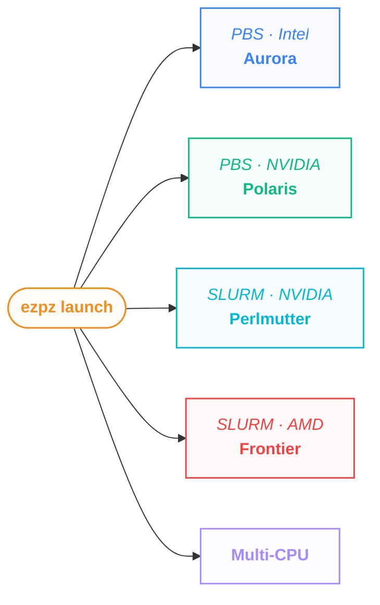
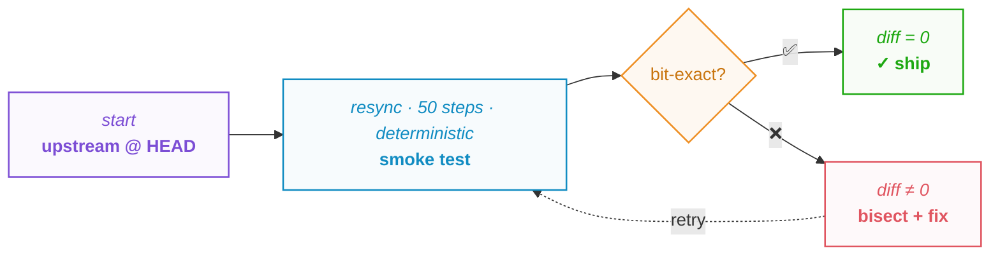
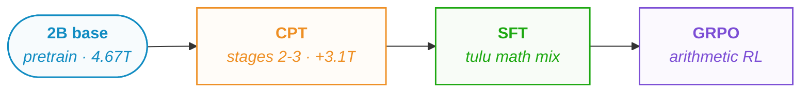
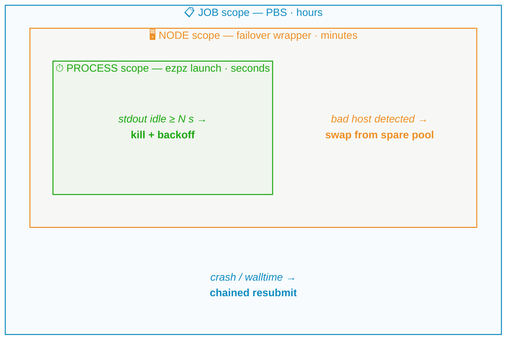
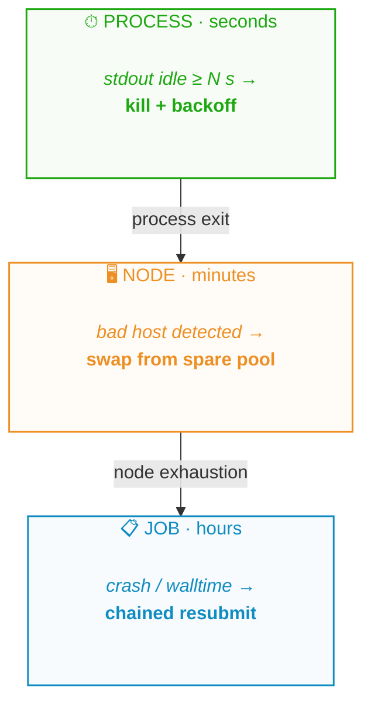
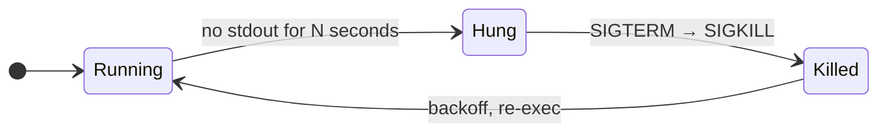
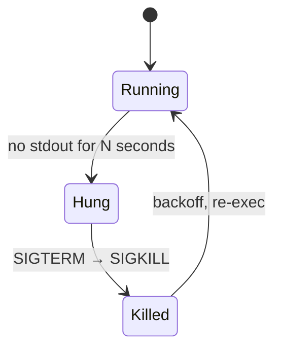

import Slide from '@/components/slides/Slide.astro'
import SpeakerNotes from '@/components/slides/SpeakerNotes.astro'
import Cols from '@/components/slides/Cols.astro'
import Col from '@/components/slides/Col.astro'

export const ASSETS = 'https://samforeman.me/assets'

{/*───────────────────────────────────────────────────────────────
1 — Title
───────────────────────────────────────────────────────────────*/}

<Slide id="title-slide">

<a class="title-slide-qr" href="https://samf.sh/talks/2026/07/14"
   aria-label="QR code linking to these slides">
  
  <span>samf.sh/talks/2026/07/14</span>
</a>

# <span style="color:var(--foreground0);">Training Models for Science on Aurora</span>

<p class="title-slide-thesis">Less a story of peak FLOP/s than of what works, what breaks, and how cheaply you recover.</p>

&nbsp;  
&nbsp;

<p class="author-list">
<strong>Sam&nbsp;Foreman</strong>[^anl], Nathan&nbsp;Nichols, Varuni&nbsp;Sastry, Samuel&nbsp;Wheeler, Khalid&nbsp;Hossain, Huihuo&nbsp;Zheng, Murali&nbsp;Emani, Filippo&nbsp;Simini, Marieme&nbsp;Ngom, Ethan&nbsp;Wong, Venkat&nbsp;Vishwanath
</p>

_{new Date(frontmatter.date).toISOString().slice(0, 10)}_

<style>{`
  #title-slide .author-list {
    /* Cap the line length so the author list wraps at a comfortable
       width instead of stretching the full slide. NBSPs within each
       name keep "Filippo Simini" together when a wrap point lands
       between two authors. */
    max-width: 70ch;
    line-height: 1.6;
  }
  /* Thesis / tagline under the title: the one-sentence framing for the
     whole talk. Muted + italic so it reads as a subtitle, not a second
     heading. Capped well clear of the QR (top-right, ~11ch + 4ch offset)
     so the text never runs under it; the title + thesis share the QR's
     vertical band. */
  #title-slide .title-slide-thesis {
    max-width: 44ch;
    margin-block-start: 0.5lh;
    font-style: italic;
    color: var(--foreground1);
  }
  @media (max-width: 768px) {
    /* No QR on phones, so the thesis can use the full measure. */
    #title-slide .title-slide-thesis { max-width: 100%; }
  }
  /* QR code top-right of the title slide. Big enough to scan from
     the back of the hall (~8lh ≈ 11ch square), with the canonical
     URL underneath for anyone who'd rather type it. currentColor on
     the SVG paths makes it follow the active theme without needing
     a light/dark variant pair. */
  #title-slide .title-slide-qr {
    position: absolute;
    top: 2lh;
    right: 4ch;
    display: flex;
    flex-direction: column;
    align-items: center;
    gap: 0.25lh;
    text-decoration: none;
    color: var(--foreground0);
  }
  #title-slide .title-slide-qr img {
    width: 11ch;
    height: 11ch;
    display: block;
  }
  /* QR SVG ships with stroke="currentColor" but loaded as an  it
     resolves to canvastext (black). Invert the pixels on dark themes
     so the dark ink reads as white-on-dark. Applies to both QRs on
     this deck (title + thanks). */
  html[data-webtui-theme='custom-dark']
    :is(.title-slide-qr, .thanks-qr) img,
  html[data-webtui-theme='catppuccin']
    :is(.title-slide-qr, .thanks-qr) img {
    filter: invert(1);
  }
  #title-slide .title-slide-qr span {
    font-size: 0.75em;
    color: var(--foreground1);
    white-space: nowrap;
  }
  /* On phones the QR would crowd the title; hide it there — the
     deck URL is already in the bottom status bar on mobile. */
  @media (max-width: 768px) {
    #title-slide .title-slide-qr { display: none; }
  }
`}</style>


[^anl]: Argonne National Laboratory

</Slide>

{/*───────────────────────────────────────────────────────────────
2 — Outline / TOC
───────────────────────────────────────────────────────────────*/}

<Slide id="outline">

## Outline

<div class="outline-grid">

<div>

1. **The Good**:
    - AuroraGPT-2B: **4.67T tokens, done** ✓
      - 20B/512N now **beats 2B/256N** / token
      - [ `mano`](https://arxiv.org/abs/2601.23000): Muon quality @ AdamW speed
    - Software stack:
      - Using [ `ezpz`](https://github.com/saforem2/ezpz)
      - Moving to [ `torchtitan`](https://github.com/saforem2/torchtitan/blob/ezpz)[^mds]
    - Post-training now live: **CPT · SFT · GRPO**

</div>

<div>

2. **The Bad**:
    - Rapidly evolving software (_and hardware_!)
      - Fork tax (fast-moving upstream!)
    - At scale, *failure is the default*
    - 80B: **one bf16 cliff, three dead optimizers**
    - MoE on XPU: **4–11% MFU** (`compile` hurts!)

3. **The Restarts**:
    - Towards resilient training
    - 3 layers of recovery:
      - Job → Node → Process
    - Native [ `--auto-retry`](https://github.com/saforem2/ezpz/pull/144)

</div>

</div>

[^mds]: And *away* from [argonne-lcf/Megatron-DeepSpeed](https://github.com/argonne-lcf/Megatron-DeepSpeed)!

<style>{`
  /* Tighten heading -> content spacing for this slide only. */
  #outline > .slide-inner > h2 { margin-block-end: 0.25lh; }
  #outline .outline-grid {
      display: grid;
      grid-template-columns: 1fr 1fr;
      gap: 2ch;
      align-items: start;
  }
  /* Outer list margins were eating extra space at column tops. */
  #outline .outline-grid > div > ol:first-child { margin-block-start: 0; }
  /* Mobile (<=768px): stack columns vertically so the slide stays
     readable on narrow screens. */
  @media (max-width: 768px) {
      #outline .outline-grid {
          grid-template-columns: 1fr;
          gap: 0.5lh;
      }
  }
`}</style>

</Slide>

{/*───────────────────────────────────────────────────────────────
Since TPC'26: production status refresh (NEW)
───────────────────────────────────────────────────────────────*/}

<Slide id="since-tpc" size="sm">

## Since TPC'26: where production stands

<div class="tight-table">

| Run          | Nodes | Steps  | Tokens          | Loss | Status                    |
| ------------ | ----: | -----: | --------------- | ---: | ------------------------- |
| [**2B** base](https://github.com/saforem2/torchtitan/tree/ezpz/torchtitan/experiments/ezpz/docs/production/agpt/2b/n256/) |   256 | 92,859 | 4.674T (100%)   | 2.65 | ✅ **complete**            |
| [**2B** CPT](https://github.com/saforem2/torchtitan/tree/ezpz/torchtitan/experiments/ezpz/docs/production/cpt/) |   256 |  5,960 | ~300B pilot     | 2.49 | loss ↓ but evals ↓ (no winner) |
| [**20B**/512N](https://github.com/saforem2/torchtitan/tree/ezpz/torchtitan/experiments/ezpz/docs/production/agpt/20b/n512/) |   512 |  5,400 | 543.6B (11.6%)  | 2.47 | advancing (auto-retry)    |
| [**20B**/256N](https://github.com/saforem2/torchtitan/tree/ezpz/torchtitan/experiments/ezpz/docs/production/agpt/20b/n256/) |   256 |  3,100 | 156.0B (3.3%)   | 2.68 | advancing                 |
| [**80B**](https://github.com/saforem2/torchtitan/tree/ezpz/torchtitan/experiments/ezpz/docs/production/agpt/80b/n512/) |   512 |     14 | (NaN'd)         | NaN  | ❌ optimizer cliff         |

</div>

- **20B/512N beats the 2B/256N baseline on every eval, per token**
  (HellaSwag-norm **0.635 vs 0.555**)
- The wins and the wall are both new since June. This talk: what
  changed.

<style>{`
  /* Pin every column (incl. Status) so the table sizes to its content and
     table-layout:fixed can honor the exact ch widths — otherwise the auto
     Status column expands to eat the leftover slide width. */
  #since-tpc table { table-layout: fixed; width: max-content; max-width: 100%; }
  /* nowrap on the header + numeric cells so a tight column can't wrap the
     label ("Nodes" -> "Nod es"); widths sized to the longest cell. */
  #since-tpc table th, #since-tpc table td { white-space: nowrap; }
  #since-tpc table th:nth-child(1), #since-tpc table td:nth-child(1) { width: 10ch; } /* Run */
  #since-tpc table th:nth-child(2), #since-tpc table td:nth-child(2) { width: 8ch; }  /* Nodes */
  #since-tpc table th:nth-child(3), #since-tpc table td:nth-child(3) { width: 8ch; }  /* Steps */
  #since-tpc table th:nth-child(4), #since-tpc table td:nth-child(4) { width: 16ch; } /* Tokens */
  #since-tpc table th:nth-child(5), #since-tpc table td:nth-child(5) { width: 6ch; }  /* Loss */
  #since-tpc table th:nth-child(6), #since-tpc table td:nth-child(6) { width: 31ch; white-space: normal; } /* Status */
  #since-tpc pre, #since-tpc table { font-size: 0.95em; }
`}</style>

</Slide>

<Slide id="notes">

## Motivation

- How to do _production training_ on a _rapidly evolving_ software
  stack?
    - across \{Intel, NVIDIA, AMD, ...\} hardware?
    - **while also mitigating failures** ?
      - \{hardware, system, network, lustre, ...\} 

- Tension between:
    - long running pre-training jobs
    - typical facility scheduling policies
      - INCITE (>= 20% of machine, 2k nodes on Aurora)  
        -\> _very_ large batches  
        -\> bad model, unstable training[^openai18][^zhang25][^zhou25]

  [^openai18]: [An Empirical Model of Large-Batch Training](https://arxiv.org/abs/1812.06162)
  [^zhang25]: [How Does Critical Batch Size Scale in Pre-training?](https://arxiv.org/abs/2410.21676v4)
  [^zhou25]: [How to Set the Batch Size for Large-Scale Pre-training?](https://arxiv.org/abs/2601.05034v1)

</Slide>

{/*───────────────────────────────────────────────────────────────
3 — Stack diagram
───────────────────────────────────────────────────────────────*/}

<Slide id="stack">

## The stack

<div class="stack-grid">

<div class="stack-left">

**Current stack:**

- 🍋 [saforem2/`ezpz`](https://github.com/saforem2/ezpz) (\+ [ezpz.cool](https://ezpz.cool))
- 🧠 [saforem2/`torchtitan@ezpz`](https://github.com/saforem2/torchtitan/tree/ezpz)
- 📚 [zhenghh04/`blendcorpus`](https://github.com/zhenghh04/blendcorpus)[^blendcorpus]

[^ezpz.cool]: https://ezpz.cool

[^blendcorpus]: Weighted blending across datasets.

**Old stack (reference):**

- 🪦 [argonne-lcf/`Megatron-DeepSpeed`](https://github.com/argonne-lcf/Megatron-DeepSpeed):
  - AuroraGPT-2B reference (~7.77T tokens)
  - **pre**-`torchtitan`

</div>

<div class="stack-right">

<div class="repo-card repo-card-tip">
    <div class="repo-card-title">Hardware agnostic</div>
    Same code, every vendor; no `cuda` in user code !
</div>

</div>

</div>

<style>{`
  #stack .stack-grid {
    display: grid;
    grid-template-columns: 1.7fr 1fr;
    gap: 3ch;
    align-items: center;
    width: 100%;
  }
  #stack .stack-left { min-width: 0; }
  #stack .stack-right { min-width: 0; }
`}</style>

</Slide>

<Slide id="ezpz">

<div class="ezpz-grid">

<div class="ezpz-text">

## 🍋 `ezpz`: write once, run anywhere

```python
# train.py

import ezpz
# auto device + backend selection
rank = ezpz.setup_torch()
print(rank)
```

```bash
ezpz launch python3 train.py
```

**Same code, every site.** No per-cluster `mpiexec` / `srun`, CPU bindings, or tile-compact wrappers. → [ezpz.cool](https://ezpz.cool)

</div>

<div class="ezpz-diagram">



</div>

</div>

<style>{`
  #ezpz .ezpz-grid {
    display: grid;
    grid-template-columns: 1fr 1fr;
    gap: 3ch;
    align-items: center;
    flex: 1;
    min-height: 0;
    width: 100%;
  }
  #ezpz .ezpz-text { min-width: 0; display: flex; flex-direction: column; justify-content: center; }
  #ezpz .ezpz-text > h2 { margin-block-start: 0; }
  #ezpz .ezpz-text pre.astro-code { width: 100%; }
  #ezpz .ezpz-diagram { min-width: 0; display: flex; flex-direction: column; justify-content: center; }
  #ezpz .ezpz-diagram .mermaid svg { width: 100%; max-width: 100%; }
  @media (max-width: 768px) {
    #ezpz .ezpz-grid {
      grid-template-columns: 1fr;
      gap: 1lh;
    }
  }

  /* ---- Chip-badge styling (mirrors fork-tax + restart-cascade) ----
     Each node's italic top line is the descriptor (e.g. "PBS · Intel"),
     bold bottom line is the action / name. Force the classDef hue onto
     the inline foreignObject span/p so the chip text matches the
     stroke color (mermaid paints span text black by default). */
  #ezpz .mermaid g.node.hub        .nodeLabel,
  #ezpz .mermaid g.node.hub        span,
  #ezpz .mermaid g.node.hub        p { color: #ee8f24 !important; }
  #ezpz .mermaid g.node.aurora     .nodeLabel,
  #ezpz .mermaid g.node.aurora     span,
  #ezpz .mermaid g.node.aurora     p { color: #3b82f6 !important; }
  #ezpz .mermaid g.node.polaris    .nodeLabel,
  #ezpz .mermaid g.node.polaris    span,
  #ezpz .mermaid g.node.polaris    p { color: #10b981 !important; }
  #ezpz .mermaid g.node.perlmutter .nodeLabel,
  #ezpz .mermaid g.node.perlmutter span,
  #ezpz .mermaid g.node.perlmutter p { color: #06b6d4 !important; }
  #ezpz .mermaid g.node.frontier   .nodeLabel,
  #ezpz .mermaid g.node.frontier   span,
  #ezpz .mermaid g.node.frontier   p { color: #ef4444 !important; }
  #ezpz .mermaid g.node.mac        .nodeLabel,
  #ezpz .mermaid g.node.mac        span,
  #ezpz .mermaid g.node.mac        p { color: #a78bfa !important; }

  /* Descender clip + tight line-height fix — same as restart-cascade. */
  #ezpz .mermaid g.node foreignObject { overflow: visible; }
  #ezpz .mermaid g.node p {
    line-height: 1.35;
    padding-bottom: 0.1em;
  }
  /* Slide-distance legible. */
  #ezpz .mermaid g.node span,
  #ezpz .mermaid g.node p {
    font-size: 1.2em;
  }
  /* Accent-tinted drop shadow on each box. The hub is a stadium
     (rounded ellipse, <rect> with rx). The five target nodes are
     <rect>s. */
  #ezpz .mermaid g.node.hub        > rect { filter: drop-shadow(0 2px 5px #ee8f2430); }
  #ezpz .mermaid g.node.aurora     > rect { filter: drop-shadow(0 2px 5px #3b82f630); }
  #ezpz .mermaid g.node.polaris    > rect { filter: drop-shadow(0 2px 5px #10b98130); }
  #ezpz .mermaid g.node.perlmutter > rect { filter: drop-shadow(0 2px 5px #06b6d430); }
  #ezpz .mermaid g.node.frontier   > rect { filter: drop-shadow(0 2px 5px #ef444430); }
  #ezpz .mermaid g.node.mac        > rect { filter: drop-shadow(0 2px 5px #a78bfa30); }
`}</style>

</Slide>

{/*───────────────────────────────────────────────────────────────
AuroraGPT-2B (Megatron-DeepSpeed reference baseline)
───────────────────────────────────────────────────────────────*/}

<Slide id="agpt-2b">

## AuroraGPT-2B: the reference run on Aurora

<div class="tight-table">

| Spec            | Value                                                       |
| --------------- | ----------------------------------------------------------- |
| Architecture    | 1.986B params, 12 layers, GQA (16h / 4 kv)                  |
| Hardware        | **256 Aurora nodes × 12 Intel Max GPUs = 3,072 GPUs**, BF16 |
| Framework       | Megatron-DeepSpeed (ZeRO Stage 0)                           |
| Optimizer       | SophiaG[^sophiag] (β=0.9/0.95, ρ=0.01, wd=0.1, LR=2.28e-5)  |
| Training Config | **50M tok/batch** (8192 ctx · LBS=2)                        |
| Tokenizer       | SentencePiece, vocab=256K                                   |
| Stages          | 3 (pretrain · continued-pretrain · math+code)               |
| Tokens          | **~7.77T total**                                            |

[^sophiag]: [Sophia: A Scalable Stochastic Second-order Optimizer for Language Model Pre-training](https://arxiv.org/abs/2305.14342)

</div>

This is the **pre-`torchtitan` reference**. Everything that follows is
the migration story: same scale, same data, what changed and what
broke when we cut over.

<style>{`
  /* Shrink to content: label column sized to its longest label (nowrap so
     "Training Config" stays one line), Value column to its natural width.
     Overrides the global :has() 22%-label rule that otherwise stretches
     this to full slide width. */
  #agpt-2b table { table-layout: auto; width: max-content; max-width: 100%; }
  #agpt-2b table th:first-child, #agpt-2b table td:first-child {
    width: auto; white-space: nowrap;
  }
`}</style>

</Slide>

{/*───────────────────────────────────────────────────────────────
Why MDS in the first place — the pre-torchtitan landscape
───────────────────────────────────────────────────────────────*/}

<Slide id="mds-context">

## Why MDS (Megatron-DeepSpeed) first: the only option at the time

When AuroraGPT kicked off, MDS was the **only** LLM pre-training framework
that ran at scale and supported:

- [x] Intel XPU
- [x] Model, pipeline parallelism
- [x] DeepSpeed ZeRO Offloading

Supporting context:

- PyTorch FSDP1 had Intel XPU gaps (collectives, AC patterns, optimizer-state sharding)
- `torchtitan` existed as a research project (not tested)  
- MDS was the pragmatic choice

By early 2026, the calculus changed: `torchtitan` + DTensor + FSDP2 closed the gap
and the MDS fork's maintenance cost crossed over.

<SpeakerNotes>

MDS = our fork of NVIDIA's Megatron-LM + Microsoft's DeepSpeed,
patched for Intel XPU.

</SpeakerNotes>

</Slide>

{/*───────────────────────────────────────────────────────────────
Why SophiaG — large-batch optimizer comparison
───────────────────────────────────────────────────────────────*/}

<Slide id="optimizer-comparison">

## Why SophiaG: large-batch stability at 50M tok/batch (256N)

[W\&B Report: AuroraGPT-2B Pre-Training](https://api.wandb.ai/links/aurora_gpt/giy3swff)[^all-runs]

[^all-runs]: See the 📊 All Runs section.


<figure>
    <picture>
        <source
            media="(max-width: 768px)"
            srcset="/talks/2026-06-03/figures/optimizer-comparison-mobile.svg"
        />
        
    </picture>
    <figcaption>
        **SophiaG** is the only one that stays in the low-loss band with
        bounded grad norms. 
    </figcaption>
</figure>

<SpeakerNotes>

"Why 256 nodes for a 2B model?" — facility scheduling, not model
need. Aurora's queue policy + node-class allotment makes 256N
(2,048 XPU) the sweet spot for back-to-back debug-then-scale sweeps:
short enough to land in a single 8–12h block, big enough to surface
collective + dataloader behaviour we'll hit at 512N / 1024N. We
re-tune at the target node count before the actual production run.

</SpeakerNotes>

</Slide>

{/*───────────────────────────────────────────────────────────────
How we picked the LR for SophiaG (and every other optimizer): the
LR-finder sweep. Lives between "we picked the optimizer" and
"here's the loss curve" so the audience sees both halves of the
hyperparameter decision before the production-run plots.
───────────────────────────────────────────────────────────────*/}

<Slide id="lr-finder">

## LR-finder — exponential sweep, blow-up / 10

Classic exponential LR sweep[^smith-2015][^gugger-2017]; pick the steepest
descent (blow-up / 10 as a safe default). See also our cross-optimizer LR
scaling work[^gupta-2026].

[^smith-2015]: [Cyclical Learning Rates for Training Neural Networks](https://arxiv.org/abs/1506.01186) (Smith 2015)

[^gugger-2017]: [How do you find a good learning rate](https://sgugger.github.io/how-do-you-find-a-good-learning-rate.html) (Gugger 2017)

[^gupta-2026]: [Extending µP: Spectral Conditions for Feature Learning Across Optimizers](https://arxiv.org/abs/2602.20937) (Gupta et al. 2026)

<figure>
    <picture>
        <source media="(max-width: 768px)"
                srcset="/talks/2026-06-03/figures/lr-finder-aurora-mobile.svg" />
        
    </picture>
    <figcaption>
        Cross-optimizer sweep on Aurora. Full report:
        [`docs/experiments/lr-finder/README.md`](https://github.com/saforem2/torchtitan/blob/ezpz/torchtitan/experiments/ezpz/docs/experiments/lr-finder/README.md)
    </figcaption>
</figure>

</Slide>

{/*───────────────────────────────────────────────────────────────
mano: manifold-normalized optimizer (NEW: the 2B-scale win)
───────────────────────────────────────────────────────────────*/}

<Slide id="mano" size="sm">

## `mano`: Muon quality at AdamW speed

[`mano`](https://arxiv.org/abs/2601.23000)[^mano] normalizes updates on a
rotating **Oblique manifold** with $O(\text{dim})$ vector-norm ops
(no Newton-Schulz iterations). So it matches Muon's loss without Muon's
throughput tax.

<div class="mano-grid">

<div class="mano-left">

<div class="tight-table">

| Optimizer   |  Loss |   TPS |
| ----------- | ----: | ----: |
| Muon        | 3.557 | 4,556 |
| **`mano`**  | **3.631** | **7,048** |
| AdamW       | 3.801 | 7,245 |
| SophiaG     | 4.719 | 7,208 |

</div>

- **Muon and `mano` tie on loss (~3.6); `mano` runs at AdamW speed**
  (~7,000 vs ~4,600 TPS) → **wins on wall-clock**.
- Caveat: at **large batch** (GBS=384) AdamW still wins (2.71 vs 2.88);
  `mano`'s LR was tuned at GBS=48 and needs re-tuning.

</div>

<div class="mano-right">

<figure>
    
</figure>

</div>

</div>

[^mano]: [`mano`: manifold-normalized optimization](https://arxiv.org/abs/2601.23000) (2026). Implemented in our fork alongside SPAM ([2501.06842](https://arxiv.org/abs/2501.06842)).

<style>{`
  #mano .mano-grid {
    display: grid;
    grid-template-columns: 34ch 1fr;
    gap: 3ch;
    align-items: start;
    width: 100%;
  }
  #mano .mano-left { min-width: 0; }
  #mano .mano-right { min-width: 0; display: flex; justify-content: center; }
  #mano .mano-right figure { margin: 0; width: 100%; }
  #mano .mano-right img { width: 100%; height: auto; max-height: 13lh; }
  /* Tight fixed-width table: pin the numeric columns so the header row
     can't wrap and the table only claims the width it needs, leaving the
     rest of the row for the figure. */
  #mano table { table-layout: fixed; width: 100%; max-width: none; }
  #mano table th:nth-child(1), #mano table td:nth-child(1) { width: 13ch; }
  #mano table th:nth-child(2), #mano table td:nth-child(2),
  #mano table th:nth-child(3), #mano table td:nth-child(3) {
    width: auto; text-align: right; white-space: nowrap;
  }
  @media (max-width: 768px) {
    #mano .mano-grid { grid-template-columns: 1fr; gap: 1lh; }
  }
`}</style>

</Slide>

{/*───────────────────────────────────────────────────────────────
Why move off MDS — and what broke
───────────────────────────────────────────────────────────────*/}

<Slide id="why-titan">

## Why we moved to `torchtitan`

|                                          | MDS | TT  |
| :--------------------------------------- | :-: | :-: |
| Actively maintained                      | ❌️  | ✅  |
| Declarative parallelism (DTensor, FSDP2) | ❌️  | ✅  |
| FSDP+TP / EP / CP without plumbing       | ❌️  | ✅  |
| MoE support                              | ❌️  | ✅  |
| Easy to extend, debug, maintain          | ❌️  | ✅  |

**The trade-off we accepted:** living on a fast-moving upstream
  [pytorch/torchtitan@main](https://github.com/pytorch/torchtitan); the "fork tax"

<style>{`
  #why-titan table { table-layout: fixed; width: max-content; max-width: 100%; }
  #why-titan table th:nth-child(1), #why-titan table td:nth-child(1) { width: auto; }
  #why-titan table th:nth-child(2), #why-titan table td:nth-child(2),
  #why-titan table th:nth-child(3), #why-titan table td:nth-child(3) {
    width: 6ch; text-align: center;
  }
`}</style>

</Slide>


{/*───────────────────────────────────────────────────────────────
2B reference + TT overlay — MDS 3-stage chart with TT v2 256N drawn on top
───────────────────────────────────────────────────────────────*/}

<Slide id="agpt-2b-loss-with-tt">

## All production runs: training loss

<figure>
    
    <figcaption>
        Every current production run on one axis. **2B v2 256N**: the full
        **4.674T-token** run (step-92,859), final loss **2.65**. **20B v2
        512N** (sync): step-5,400 / **543.6B tok** (11.6%), loss **2.47** and
        still descending. Data:
        [`docs/production`](https://github.com/saforem2/torchtitan/tree/ezpz/torchtitan/experiments/ezpz/docs/production)
    </figcaption>
</figure>

</Slide>

{/*───────────────────────────────────────────────────────────────
2B eval comparison — MDS vs TT v2
───────────────────────────────────────────────────────────────*/}

<Slide id="agpt-eval">

## Evals: 2B + 20B vs MDS, per token

<figure>
    
    <figcaption>
        **2B** (4.67T tok): HellaSwag 0.561 · ARC-Easy 0.651, plateaus
        ~2T. **20B/512N is the most token-efficient run**: at 442.9B tok
        already ARC-Easy **0.693** · HellaSwag **0.634**, beating both 2B
        chains per token (~8×). Data:
        [`docs/evals`](https://github.com/saforem2/torchtitan/tree/ezpz/torchtitan/experiments/ezpz/docs/evals)
    </figcaption>
</figure>

</Slide>

{/*───────────────────────────────────────────────────────────────
The fork tax
───────────────────────────────────────────────────────────────*/}

<Slide id="fork-tax">

<div class="fork-tax-grid">

<div class="fork-tax-text">

## The fork tax: upstream-sync as a workflow

- [67 Upstream Syncs in 13 Weeks](https://github.com/saforem2/torchtitan/blob/ezpz/torchtitan/experiments/ezpz/docs/upstream-sync.md)
- Smoke test: bit-exact loss + grad-norm + peak memory
  - Verify changes from upstream haven't broken anything

</div>

<div class="fork-tax-diagram">



</div>

</div>

<style>{`
  /* Full-bleed grid: left col holds the H2 + bullets (top-aligned),
     right col holds the mermaid diagram and spans the full slide
     height. Grid itself claims flex: 1 from the slide-inner so it
     reaches the bottom; min-height: 0 lets the mermaid SVG shrink
     to its column. */
  #fork-tax .fork-tax-grid {
    display: grid;
    grid-template-columns: 1fr 1fr;
    gap: 3ch;
    align-items: stretch;
    flex: 1;
    min-height: 0;
    width: 100%;
  }
  @media (max-width: 768px) {
    #fork-tax .fork-tax-grid {
      grid-template-columns: 1fr;
      gap: 1lh;
    }
  }
  #fork-tax .fork-tax-text {
    min-width: 0;
    display: flex;
    flex-direction: column;
    justify-content: center;
  }
  #fork-tax .fork-tax-text > h2 { margin-block-start: 0; }
  #fork-tax .fork-tax-diagram {
    min-width: 0;
    display: flex;
    flex-direction: column;
    justify-content: center;
  }
  #fork-tax .fork-tax-diagram .mermaid svg,
  #fork-tax .fork-tax-diagram pre.astro-code {
    width: 100%;
    max-width: 100%;
  }

  /* ---- Chip-badge styling for nodes (mirrors restart-cascade) ----
     Each node's italic top line acts as the descriptor and the bold
     bottom line as the action; the node fill gets a light tint of
     its classDef color so the boxes read as colored chips instead
     of plain outlines. Color overrides force the classDef hue onto
     the foreignObject span/p that mermaid otherwise paints black. */
  #fork-tax .mermaid g.node.source .nodeLabel,
  #fork-tax .mermaid g.node.source span,
  #fork-tax .mermaid g.node.source p {
    color: #7c4ed5 !important;
  }
  #fork-tax .mermaid g.node.stage .nodeLabel,
  #fork-tax .mermaid g.node.stage span,
  #fork-tax .mermaid g.node.stage p {
    color: #118cc2 !important;
  }
  #fork-tax .mermaid g.node.ship .nodeLabel,
  #fork-tax .mermaid g.node.ship span,
  #fork-tax .mermaid g.node.ship p {
    color: #1da811 !important;
  }
  /* Gate (bit-exact diamond) — #838383 is the crossover mid-gray
     that reads on both light and dark themes (same trick used in
     the matplotlib chart text); pure #444 disappears against the
     dark/catppuccin backgrounds. */
  #fork-tax .mermaid g.node.gate .nodeLabel,
  #fork-tax .mermaid g.node.gate span,
  #fork-tax .mermaid g.node.gate p {
    color: #838383 !important;
  }
  #fork-tax .mermaid g.node.bad .nodeLabel,
  #fork-tax .mermaid g.node.bad span,
  #fork-tax .mermaid g.node.bad p {
    color: #e05560 !important;
  }
  /* Descender clip + tight line-height fix — same workaround as the
     restart-cascade diagram so descenders (g, p, y, q) and the second
     line of the two-line labels render fully. */
  #fork-tax .mermaid g.node foreignObject { overflow: visible; }
  #fork-tax .mermaid g.node p {
    line-height: 1.35;
    padding-bottom: 0.1em;
  }
  /* Slide-distance legible. Mermaid sets text via inline foreignObject
     span/p, so override both at once. Bumped to 1.6em now the diagram is
     landscape (flowchart LR): it fills the column width and no longer
     scales down to fit a tall portrait layout into the column height. */
  #fork-tax .mermaid g.node span,
  #fork-tax .mermaid g.node p {
    font-size: 1.6em;
  }
  /* Subtle accent drop-shadow on each box so the colored chips lift
     off the slide background — matches the depth-cue treatment on the
     restart-cascade clusters (just lighter, since these aren't nested
     and don't need to read as "depth"). */
  #fork-tax .mermaid g.node.source > rect {
    filter: drop-shadow(0 2px 5px #7c4ed530);
  }
  #fork-tax .mermaid g.node.stage > rect {
    filter: drop-shadow(0 2px 5px #118cc230);
  }
  #fork-tax .mermaid g.node.ship > rect {
    filter: drop-shadow(0 2px 5px #1da81130);
  }
  #fork-tax .mermaid g.node.bad > rect {
    filter: drop-shadow(0 2px 5px #e0556030);
  }
  /* Gate (the diamond) — mermaid emits a <polygon> not a <rect>. */
  #fork-tax .mermaid g.node.gate > polygon {
    filter: drop-shadow(0 2px 5px #88888830);
  }
  /* Bump arrowhead size — mermaid's defaults are sized for in-doc
     diagrams, not slide-distance viewing. Scale up the arrowhead
     marker SVGs ~1.8x via transform on the marker children, and
     thicken the edge paths so the connector strokes match the
     bigger heads. */
  #fork-tax .mermaid marker {
    markerWidth: 16;
    markerHeight: 16;
  }
  #fork-tax .mermaid .marker {
    fill: var(--foreground2, #888) !important;
    stroke: var(--foreground2, #888) !important;
    stroke-width: 1.5 !important;
  }
  #fork-tax .mermaid g.edgePaths .path,
  #fork-tax .mermaid g.edgePaths path {
    stroke-width: 2 !important;
  }
`}</style>

</Slide>

{/*───────────────────────────────────────────────────────────────
80B optimizer cliff (NEW: one bf16 corner, three dead optimizers)
───────────────────────────────────────────────────────────────*/}

<Slide id="optimizer-cliff" size="sm">

## 80B: one bf16 cliff, three dead optimizers

At 80B (`dim=9216`), **every** constant-finder LR NaN-ed in the first
~dozen steps: `grad_norm → inf` one step before the loss, while loss
was still flat (~12.9):

<div class="tight-table">

| Optimizer | Died at | Signature                        |
| --------- | ------: | -------------------------------- |
| `mano`    |  step 5 | grad NaN (diverged **first**)    |
| AdamW     |  step 9 | grad NaN                         |
| SophiaG   | step 14 | Hessian-term overflow, ~6,100 node-h |

</div>

<style>{`
  /* Pin the two short columns so Signature gets the room and stops
     wrapping (fixed-layout table otherwise splits width evenly). */
  #optimizer-cliff table { table-layout: fixed; width: max-content; max-width: 100%; }
  #optimizer-cliff table th:nth-child(1), #optimizer-cliff table td:nth-child(1) { width: 11ch; } /* Optimizer */
  #optimizer-cliff table th:nth-child(2), #optimizer-cliff table td:nth-child(2) { width: 9ch; }  /* Died at */
  #optimizer-cliff table th:nth-child(3), #optimizer-cliff table td:nth-child(3) { width: 36ch; } /* Signature */
`}</style>

- **`mano` (our 2B speed win) died first** (step 5), despite its 80B
  LR-finder band looking the *safest* of the three. **Early-step ranking
  does not predict sustained stability.**
- Shared failure across 3 optimizers ⇒ a **corner-level instability
  (bf16 at dim=9216)**, not tuning. Two grad-path triggers: `LBS>1`
  and large `dp_degree`.
- **Fix in flight:** long warmup (≥200 steps) + grad clipping,
  possibly an fp32 grad path. Stable corner today: **TP=4 · LBS=1 ·
  GBS=372**, validated 100/100 steps NaN-free (loss 12.93 → 7.72) at
  ~9.8% MFU.

</Slide>

{/*───────────────────────────────────────────────────────────────
MoE on Intel XPU (NEW: audience-relevant for a MoE workshop)
───────────────────────────────────────────────────────────────*/}

<Slide id="moe-xpu" size="sm">

## MoE on Intel XPU: where we are (honestly)

DeepSeek-style MLA + MoE, `500M → 10B`. FSDP-only today (TP=1,
no-compile, `AC=none`, `seq_len=4096`).

<div class="tight-table">

| Reality                            | Detail                                   |
| ---------------------------------- | ---------------------------------------- |
| MFU                                | **4–11%** (best ~7.4%); scaling degrades past 8N |
| `torch.compile`                    | **hurts** MoE (**−35%** on 500M)         |
| Activation checkpointing (7B+)     | `CheckpointError` (routing non-determinism) |
| Expert parallelism (`EP`)          | `--parallelism.expert_parallel_degree`   |

</div>

**Open knobs we're sweeping:** EP {1,2,4,12} · TP {1,2,4} ·
context-parallel · per-block compile · DeepEP / HybridEP backends ·
Float8. This is exactly where **cross-vendor MoE experience would
help** (see the ask).

<style>{`
  #moe-xpu table { table-layout: fixed; width: max-content; max-width: 100%; }
  #moe-xpu table th:nth-child(1), #moe-xpu table td:nth-child(1) { width: 22ch; }
  #moe-xpu table th:nth-child(2), #moe-xpu table td:nth-child(2) { width: 44ch; }
`}</style>

</Slide>

{/*───────────────────────────────────────────────────────────────
POST-TRAINING (NEW section): CPT -> SFT -> GRPO
───────────────────────────────────────────────────────────────*/}

<Slide id="posttrain-intro">

## Beyond pretraining: CPT · SFT · RL

The base run is done, so the pipeline now extends past pretraining:



- **CPT**: stages 2-3 of the SophiaG reference (dolmino, then math+code) → 7.77T tokens
- **SFT**: `checkpoint-729-hf` (on that CPT'd base) is now a first-class production asset
- **GRPO**: on-policy RL (TRL + vLLM-XPU) on the SFT checkpoint, verified multi-node

<style>{`
  #posttrain-intro .mermaid svg { width: 100%; max-width: 100%; }
  #posttrain-intro .mermaid g.node span, #posttrain-intro .mermaid g.node p { font-size: 1.15em; }
  #posttrain-intro .mermaid g.node foreignObject { overflow: visible; }
  #posttrain-intro .mermaid g.node p { line-height: 1.35; padding-bottom: 0.1em; }
`}</style>

</Slide>

<Slide id="cpt" size="sm">

## CPT: lower loss ≠ better model

Two ~300B-token pilots (256N, GBS=6,144) vs the olmo-100 base plateau:

<div class="cpt-grid">

<figure>
    
    <figcaption>
        `dolmino-100` hit the **lowest val loss 2.492** (−0.31 vs base
        ~2.80); `olmo50-dolmino50` 2.601.
    </figcaption>
</figure>

<div class="repo-card repo-card-warning">
    <div class="repo-card-title">⚠ but downstream evals reversed it</div>
    ARC-Easy: base <strong>0.651</strong> → dolmino-100 <strong>0.547</strong>
    (−10.4pp) vs olmo50-dolmino50 <strong>0.610</strong> (holds). HellaSwag
    fell for both. <strong>No mixing ratio declared a winner</strong>.
    Hypothesis: re-warm to peak LR caused forgetting; gentle-LR retry pending.
</div>

</div>

<style>{`
  /* Figure + warning callout side-by-side: the figure takes ~62% and the
     callout rides alongside instead of pushing off the bottom. Both align
     to the top so the chart and the callout title start on the same line. */
  #cpt .cpt-grid {
    display: grid;
    grid-template-columns: 1.6fr 1fr;
    gap: 3ch;
    align-items: start;
    width: 100%;
    flex: 1;
    min-height: 0;
  }
  #cpt .cpt-grid > figure { margin: 0; min-width: 0; }
  #cpt .cpt-grid > figure img { width: 100%; height: auto; max-height: 15lh; }
  /* Top-align the callout with the chart (not centered against the taller
     figure+caption block, which floated it down opposite the chart's
     lower half). */
  #cpt .cpt-grid > .repo-card { min-width: 0; align-self: start; }
  @media (max-width: 768px) {
    #cpt .cpt-grid { grid-template-columns: 1fr; gap: 1lh; }
  }
`}</style>

</Slide>

<Slide id="sft" size="sm">

## SFT: `tulu_math_uc_mix` on the CPT'd 2B

<figure>
    
    <figcaption>
        Run 1 **complete: final loss 0.77** over 4.5B tokens (3 epochs,
        32N, GBS=6,144).
    </figcaption>
</figure>

- `checkpoint-729-hf` is a **first-class production asset**: it feeds
  every downstream GRPO experiment.
- Survived **3 SIGABRTs across 4 mpiexec auto-retry attempts**.
- Run 3 in progress on the full **~54B-token** mix (~93.1M rows); the
  v2-base variant is blocked by a scale-only oneCCL fault at 32N.

</Slide>

<Slide id="grpo" size="sm">

## GRPO: arithmetic RL on Intel XPU

On-policy RL via **TRL `GRPOTrainer` + vLLM-XPU**, on the SFT'd 2B
(`sum_digits` task, 1,000 steps, 8N × 12 = 96 ranks, LR 1e-6):

<figure>
    
    <figcaption>
        Accuracy reward climbs **~0.4 → ~0.9** (from ~0 cold-start).
    </figcaption>
</figure>

- **Multi-node GRPO now works** (2026-07-06): the apparent "desync" was
  two ordinary bugs (a oneCCL MPI-transport SIGSEGV + an AVG→SUM
  reduction), not an XPU pathology.
- Still **experimental** (verified on XPU, not production-ready).

</Slide>

{/*───────────────────────────────────────────────────────────────
"The Restarts" — motivation: at scale, failure is the default
───────────────────────────────────────────────────────────────*/}

<Slide id="restarts-motivation">

## The Restarts: At Scale, Failure is the Default

- **Llama 3 405B** — 16K H100s · 54 days · **419** failures (≈ **1 every 3h**); 99% recovered via automation[^llama3]
- **OPT-175B** — 35 manual restarts + 100+ cycled hosts in 2 mo on ~1K A100s[^opt]
- **BLOOM-176B** — frequent loss spikes; embedding-norm + checkpoint cadence on 384 A100s × 3.5 mo[^bloom]
- **GLM-130B** — loss spikes "increasingly frequent"; some recover, others go to NaN[^glm]

[^llama3]: [Llama 3 herd of models](https://arxiv.org/abs/2407.21783) (Meta AI, 2024), §3.3.2 (Training reliability)

[^opt]: [OPT-175B chronicles + dev log](https://github.com/facebookresearch/metaseq/blob/main/projects/OPT/chronicles/OPT175B_Logbook.pdf) (Zhang et al., 2022)

[^bloom]: [BLOOM: A 176B-Parameter Open-Access Multilingual Language Model](https://arxiv.org/abs/2211.05100) (BigScience, 2022)

[^glm]: [GLM-130B: An Open Bilingual Pre-Trained Model](https://arxiv.org/abs/2210.02414) (Zeng et al., ICLR 2023)

</Slide>

{/*───────────────────────────────────────────────────────────────
"The Restarts" — three layers of recovery at different scopes
───────────────────────────────────────────────────────────────*/}

<Slide id="restart-cascade">

## "The Restarts": three layers of recovery

Bad-node failover, hang-watchdog, and PBS resubmit each operate at a
different scope.

<div class="cascade-desktop">



</div>

<div class="cascade-mobile">



</div>

**Inner loops catch most failures; outer loops catch the rest.**

<style>{`
  /* Russian-doll cluster titles rendered as colored chip-badges
     (like the sidebar [t]alks / [p]osts / [w]ork chips). Mermaid
     emits each cluster as <g class="cluster {classDef-name}">;
     inside that lives a <g class="cluster-label"> > <foreignObject>
     > <div> > <span class="nodeLabel">. Style the span as the chip:
     square corners, no border, light tinted bg, dark text — matching
     sidebar chip aesthetic (default foreground color, not the
     accent, so the text reads cleanly on the tinted bg). */
  #restart-cascade .mermaid .cluster .cluster-label foreignObject {
      overflow: visible;
  }
  #restart-cascade .mermaid .cluster .cluster-label span {
      display: inline-block;
      padding: 0 1ch;
      color: var(--foreground0, #222) !important;
      font-weight: 600;
  }
  #restart-cascade .mermaid .cluster.jobC .cluster-label span {
      background: #118cc218;
  }
  #restart-cascade .mermaid .cluster.nodeC .cluster-label span {
      background: #ee8f2418;
  }
  #restart-cascade .mermaid .cluster.procC .cluster-label span {
      background: #1da81118;
  }
  /* Body text inside each cluster — match the cluster's accent color.
     Mermaid's default node style applies a black fill via the inline
     foreignObject span color, so classDef color is overridden. Force
     it via CSS scoped to the classDef class on the node group. */
  #restart-cascade .mermaid g.node.jobTxt .nodeLabel,
  #restart-cascade .mermaid g.node.jobTxt span,
  #restart-cascade .mermaid g.node.jobTxt p {
      color: #118cc2 !important;
  }
  #restart-cascade .mermaid g.node.nodeTxt .nodeLabel,
  #restart-cascade .mermaid g.node.nodeTxt span,
  #restart-cascade .mermaid g.node.nodeTxt p {
      color: #ee8f24 !important;
  }
  #restart-cascade .mermaid g.node.procTxt .nodeLabel,
  #restart-cascade .mermaid g.node.procTxt span,
  #restart-cascade .mermaid g.node.procTxt p {
      color: #1da811 !important;
  }
  /* Descender clip fix — mermaid's node foreignObject has overflow:
     hidden and the inner <p> has a tight line-height that cuts off
     descenders (g, p, y, q) on the bottom row of multi-line labels.
     Make the foreignObject visible and pad the p slightly so the
     descender on "pool" (and any future labels with descenders) is
     fully rendered. NB: the modal popout (.mermaid-modal) clones the
     SVG outside this #restart-cascade scope — see slides.css for
     the global rule that catches the modal case too. */
  #restart-cascade .mermaid g.node foreignObject {
      overflow: visible;
  }
  #restart-cascade .mermaid g.node p {
      line-height: 1.35;
      padding-bottom: 0.1em;
  }
  /* Depth-of-field on the russian-doll clusters. Each scope gets a
     progressively softer + larger drop-shadow so inner = closer to
     viewer (more shadow above it, smaller blur), outer = further
     away (broader, softer shadow). The colors are tinted to each
     box's accent so the depth cue carries the same blue/orange/
     green semantics as the borders and badges — not just neutral
     gray. drop-shadow works on SVG elements (vs box-shadow which
     doesn't) and respects the rect's actual outline. */
  #restart-cascade .mermaid g.cluster.jobC > rect {
      filter: drop-shadow(0 4px 12px #118cc230);
  }
  #restart-cascade .mermaid g.cluster.nodeC > rect {
      filter: drop-shadow(0 3px 8px #ee8f2438);
  }
  #restart-cascade .mermaid g.cluster.procC > rect {
      filter: drop-shadow(0 2px 5px #1da81140);
  }
  /* Bump font size on the russian-doll diagram so labels are legible
     from the back of a room. Mermaid sets text via inline foreignObject
     <span> / <p> children — override the computed font-size on both. */
  #restart-cascade .mermaid .cluster .cluster-label span,
  #restart-cascade .mermaid g.node span,
  #restart-cascade .mermaid g.node p {
      font-size: 1.25em;
  }
  /* Keep mermaid labels on one line — the slide-global
     word-break: break-word rule (applied to tables) was bleeding
     into mermaid foreignObject text and breaking node labels mid-word
     (e.g. stdout idle would split across multiple lines). Reset to
     default + force nowrap on the inner elements so mermaid sizes
     the box to the text instead of the text wrapping inside a
     fixed box. */
  #restart-cascade .mermaid g.node foreignObject,
  #restart-cascade .mermaid g.node foreignObject *,
  #restart-cascade .mermaid .cluster .cluster-label *,
  #restart-cascade .mermaid g.node span,
  #restart-cascade .mermaid g.node p {
      white-space: nowrap !important;
      word-break: normal !important;
      overflow-wrap: normal !important;
  }
  /* On narrow viewports let the nested mermaid fill the slide width;
     the russian-doll nesting reads cleanly even on phones (mermaid
     stacks children top-down when there's no horizontal room).
     A separate mobile-only variant broke the interactive controls
     (mermaid-render.ts processes every .mermaid block once and the
     duplicated render path was tearing down the viewport wrapper). */
  /* Desktop/mobile variant swap. Default: nested russian-doll on
     desktop. On narrow viewports: hide the nested version, show the
     tall sibling-stack version. Both render via the same mermaid
     pipeline; only one is visible at a time so interactive controls
     attach to the visible block. */
  #restart-cascade .cascade-mobile { display: none; }
  @media (max-width: 768px) {
      #restart-cascade .cascade-desktop { display: none; }
      #restart-cascade .cascade-mobile { display: block; }
      #restart-cascade .mermaid svg {
          width: 100%;
          max-width: 100%;
          height: auto;
      }
  }
`}</style>

</Slide>

{/*───────────────────────────────────────────────────────────────
Native auto-retry + the async-checkpoint gotcha (NEW)
───────────────────────────────────────────────────────────────*/}

<Slide id="auto-retry-native">

## Restarts, since TPC'26: native `--auto-retry`

The failover cascade moved **out of bash and into `ezpz`**:

```bash
ezpz launch --auto-retry --np 512 -- python -m torchtitan.train …
```

- Classifies each attempt → `success` / `walltime` / `bad-node` /
  `stuck-pre-training`; swaps a spare, re-execs. Ships in
  [`saforem2/ezpz#144`](https://github.com/saforem2/ezpz/pull/144).
- **Broke the 20B/512N stall**: the sync chain sat walltime-blocked
  for weeks (a PBS mid-save kill left a stale `step-4500/` placeholder);
  auto-retry relaunch drove **4,400 → 5,400** cleanly.

<div class="repo-card repo-card-warning">
    <div class="repo-card-title">⚠ async checkpointing kills the cluster</div>
    At <strong>20B / 512N+</strong>, <code>--checkpoint.async-mode=async</code>
    (a 244&nbsp;GB background write) takes the job down. Workaround today:
    <code>CHECKPOINT_ASYNC_MODE=disabled</code>.
</div>

</Slide>

{/*───────────────────────────────────────────────────────────────
What generalizes / open questions / fin
───────────────────────────────────────────────────────────────*/}

<Slide id="generalizes">

## What generalizes, what doesn't

**Generalizes across vendors / sites / models**

- Bit-exact deterministic smoke gate after every upstream sync
- lm-eval as the ground truth for "is it actually learning?"
- Spare-node failover wrapper — same idea on Slurm
- Launcher / env autodetect — push every vendor-shaped assumption _out_ of training code

**Doesn't generalize** _(needs per-(config, hardware, version) tuning)_

- `torch.compile` decisions (and it _hurts_ MoE on XPU)
- AC boundaries (MoE + AC + compile = grief)
- EP↔FSDP frontier
- Collective tuning (XCCL vs gloo fallbacks, NCCL env)
- **Optimizer stability at the bf16 corner** (LR-finder ranking ≠
  sustained stability)

</Slide>

<Slide id="thanks">

<a class="thanks-qr" href="https://samf.sh/talks/2026/07/14"
   aria-label="QR code linking to these slides">
  
  <span>samf.sh/talks/2026/07/14</span>
</a>

## Thanks

**AuroraGPT team**: Venkat Vishwanath, the AI/ML Group at ALCF,
collaborators across ANL.

**Argonne Leadership Computing Facility**: Aurora time, Sunspot
staging.

**Intel**: Intel Max 1550 XPU + oneAPI / XCCL / IPEX support
throughout.

**Code & docs**

- `ezpz`: [github.com/saforem2/ezpz](https://github.com/saforem2/ezpz)
- `torchtitan` fork (experiments/ezpz):
  [github.com/saforem2/torchtitan](https://github.com/saforem2/torchtitan/tree/ezpz/torchtitan/experiments/ezpz)
- These slides: [samf.sh/talks/2026/07/14](https://samf.sh/talks/2026/07/14)

> This research used resources of the Argonne Leadership Computing
> Facility, which is a DOE Office of Science User Facility supported
> under Contract DE-AC02-06CH11357.

Questions?

<style>{`
  /* Same QR pattern as the title slide so the audience can scan
     the deck during Q&A. Mirrors the title-slide-qr block but
     scoped to #thanks. */
  #thanks .thanks-qr {
    position: absolute;
    top: 2lh;
    right: 4ch;
    display: flex;
    flex-direction: column;
    align-items: center;
    gap: 0.25lh;
    text-decoration: none;
    color: var(--foreground0);
  }
  #thanks .thanks-qr img {
    width: 11ch;
    height: 11ch;
    display: block;
  }
  #thanks .thanks-qr span {
    font-size: 0.75em;
    color: var(--foreground1);
    white-space: nowrap;
  }
  /* Reserve horizontal space so the QR (top-right, position: absolute,
     ~11ch wide + 4ch right offset) never overlaps the text that sits
     at the same vertical range. Only the heading + the three thanks
     paragraphs share QR rows; bullets and blockquote start below. */
  #thanks .slide-inner > h2,
  #thanks .slide-inner > h2 + p,
  #thanks .slide-inner > h2 + p + p,
  #thanks .slide-inner > h2 + p + p + p {
    padding-inline-end: 18ch;
  }
  @media (max-width: 768px) {
    #thanks .thanks-qr { display: none; }
    #thanks .slide-inner > h2,
    #thanks .slide-inner > h2 + p,
    #thanks .slide-inner > h2 + p + p,
    #thanks .slide-inner > h2 + p + p + p {
      padding-inline-end: 0;
    }
  }
`}</style>

</Slide>

{/*───────────────────────────────────────────────────────────────
APPENDIX — silent-correctness bugs (deep-dive backup slides)
───────────────────────────────────────────────────────────────*/}

<Slide id="appendix">

## Appendix: backup slides

Material that didn't make the main path but is here for Q&A.

- Open questions
- Silent-correctness bugs (bf16 RMSNorm freeze · TP loss reporting)
- 80B optimizer cliff (details) + 80B LR-finder
- Post-training: CPT · SFT · GRPO
- Failover engineering deep-dive
- LR-finder
- `yeet-env` tarball broadcast scaling

</Slide>


{/*───────────────────────────────────────────────────────────────
Appendix: Operational reality — failover wrapper
───────────────────────────────────────────────────────────────*/}

<Slide id="ask">

  ### Open questions: the ask

- A **portable bit-exact regression suite** across vendors — does
  anyone have one?
- **`torch.compile` at 1T scale** — defensible decision tree?
- **Async-checkpoint Pareto frontier**: recovery time × frequency ×
  storage cost in production
- **Optimizer failure at 80B+**: SophiaG (Hessian-diagonal estimate
  saturates) + Muon (Newton-Schulz iterations overflow bf16) both
  diverge — algorithmic limit or fp-precision artifact?
- **MoE EP↔FSDP** scaling boundaries at 16B / 64B / 100B
- **Make `xccl` honor `train_timeout_seconds`** so we don't have to
  rely on an stdout-idle watchdog as the hang-detection ground truth

</Slide>


<Slide id="restarts">

### Operational reality — bad-node failover

**5+ production jobs killed by bad-node failures in 2 weeks.** Pattern:
PBS gives us 256 / 512 nodes, one is bad, training crashes or hangs
after N hours, walltime gone.

<div class="tight-table">

| Job     | Trajectory  | Failure                                           |
| ------- | ----------- | ------------------------------------------------- |
| 8459818 | 2B 256N v2  | `shepherd died from signal 9` after step 2070     |
| 8470102 | 20B 256N v2 | gloo TCP `Connection closed by peer` after ~3h    |
| 8479579 | 20B 512N v2 | **silent hang** at step 803 (heartbeat continued) |

</div>

**Failover wrapper:** request `select=N+spare` (~2%, min 4). Split
into active + spare pool. On crash, scrape bad nodes from log, swap a
spare in, retry.

```bash
qsub -q prod -l select=522 -v NHOSTS_TRAIN=512 \
    submit_agpt_2b_aurora_venv_failover.sh
```

Handles 6 recurring crash modes. **Does not handle silent hangs** —
those still need a heartbeat watchdog.

<style>{`
  /* Pin the Job + Trajectory columns to just the width they need;
     let Failure (the long, prose-y cell) take the rest. */
  #restarts table { table-layout: fixed; width: max-content; max-width: 100%; }
  #restarts table th:nth-child(1), #restarts table td:nth-child(1) { width: 10ch; }
  #restarts table th:nth-child(2), #restarts table td:nth-child(2) { width: 14ch; }
  #restarts table th:nth-child(3), #restarts table td:nth-child(3) { width: 40ch; white-space: normal; }
  /* Codeblock: span full slide width so the short qsub command has
     visual presence instead of shrinking to its tiny max-content box. */
  #restarts pre.astro-code { width: 100%; }
`}</style>

</Slide>

{/*───────────────────────────────────────────────────────────────
Appendix: failover engineering deep-dive
(watchdog → state machine → auto-retry → in-production catch)
───────────────────────────────────────────────────────────────*/}

<Slide id="watchdog">

### Silent-hang detection: `ezpz launch --timeout / --retries`

**The problem.** `xccl` on XPU silently ignores
`train_timeout_seconds`, so a torchtitan job stuck in a hung
collective sits consuming the full PBS walltime instead of aborting.
Every collective hang quiets stdout (every rank blocks in the same
call, nothing reaches the log) — that's the signal we can act on.

```bash
ezpz launch --timeout 600 --retries 3 \
    python -m torchtitan.train --config-file ./config.toml
```

- **`--timeout SECONDS`** — kill the launched process if its stdout
  goes **idle** (not walltime) for this many consecutive seconds.
  Returns exit code 124 (matches GNU `timeout(1)`).
- **`--retries N`** — re-execute on any non-zero exit (including
  the watchdog's 124) up to N times. Exponential backoff:
  5s → 10s → 20s → 40s → 60s (capped).

**Scope caveat.** Watches only the process `ezpz launch` spawns
directly. If `qsub` runs a wrapper script that internally invokes
`python train.py`, the watchdog needs to live inside that script (or
you wrap the inner call with `ezpz launch` too).

</Slide>

<Slide id="watchdog-fsm">

### `ezpz launch --timeout`: one hang/recover cycle

<div class="watchdog-desktop">



</div>

<div class="watchdog-mobile">



</div>

Every collective hang shows up as **silence on stdout** — the process is "alive" by `kill -0` but nothing is happening. The watchdog fires on the _absence_ of progress, not on a heartbeat ping.

<style>{`
  /* Desktop/mobile mermaid variant swap, same pattern as restart-cascade. */
  #watchdog-fsm .watchdog-mobile { display: none; }
  @media (max-width: 768px) {
      #watchdog-fsm .watchdog-desktop { display: none; }
      #watchdog-fsm .watchdog-mobile { display: block; }
      #watchdog-fsm .mermaid svg {
          width: 100%;
          max-width: 100%;
          height: auto;
      }
  }
`}</style>

</Slide>

<Slide id="auto-retry">

### `--auto-retry`: bad-node failover, on tap

Allocate spares up front, swap them in on failure:

```bash
# 522 nodes allocated, train on 512, keep 10 as spares.
# Loop until success, walltime, or spare exhaustion.
ezpz launch --auto-retry --np 512 -- python -m torchtitan.train …
```

- Classifies each attempt's exit → `success` / `walltime` / `bad-node` / `stuck-pre-training`
- On bad-node: scrapes the failing host from the log, swaps in a spare, re-execs
- Guards against config bugs: 2 consecutive attempts with zero `step=` markers → stop (don't burn the whole spare pool on a broken run)

Ships in [`saforem2/ezpz#144`](https://github.com/saforem2/ezpz/pull/144). Same scraper as the bash-lib path; pure-Python loop on top.

</Slide>

<Slide id="failover-validation">

### Failover wrapper: caught a real silent hang in production

**Job `8505298`, 2026-05-23.** Attempt 1 trains cleanly steps 1→37, then
log goes **completely silent** at step 37. No traceback, no MPI error,
no rank dying. Just dead.

<div class="tight-table">

| Time (CT) | Event                                                       |
| --------- | ----------------------------------------------------------- |
| 21:06:41  | step 37 logged · `loss 11.80 · tps 3,919`                   |
| 21:36:41  | **30 min dead air** · `ezpz launch --timeout=1800` SIGTERMs |
| 21:36:43  | wrapper classifies exit 124 → silent-hang (not walltime)    |
| 21:36:43  | no traceback to scrape → **blind swap** of rank-0 host      |
| 21:36:45  | attempt 2 launches on swapped node set                      |
| 21:57:49  | walltime hit · step 296 · loss 5.68 · ckpts persisted       |

</div>

**Three new pieces had to fire in sequence on a real-world hang to
prove production-readiness:** `--timeout=1800` watchdog · `exit 124`
classification distinct from PBS `exit 143` · `failover_swap_one_blind()`
when no specific bad node can be identified. They did.

Full writeup: [`docs/experiments/agpt/aurora/20260523-failover-silent-hang-recovery-8505298.md`](https://github.com/saforem2/torchtitan/blob/ezpz/torchtitan/experiments/ezpz/docs/experiments/agpt/aurora/20260523-failover-silent-hang-recovery-8505298.md)

<style>{`
  #failover-validation table { table-layout: fixed; width: max-content; max-width: 100%; }
  #failover-validation table th:nth-child(1),
  #failover-validation table td:nth-child(1) { width: 12ch; white-space: nowrap; }
  #failover-validation table th:nth-child(2),
  #failover-validation table td:nth-child(2) { width: 52ch; }
`}</style>

</Slide>

{/*───────────────────────────────────────────────────────────────
Appendix: LR-finder 2B detail + optimal-LR bars
(lr-finder methodology slide moved to main path after
optimizer-comparison)
───────────────────────────────────────────────────────────────*/}

<Slide id="lr-finder-results">

### LR-finder — 2B sweep + optimal LR per config

<div class="lr-finder-grid">

<figure>
    
    <figcaption>2B sweep — flat / descent / blow-up signature.</figcaption>
</figure>

<figure>
    
    <figcaption>
        Optimal LR per config. AdamW most tolerant; SophiaG ~10× lower.
    </figcaption>
</figure>

</div>

**Findings:** AdamW most LR-tolerant; SophiaG needs ~10× lower LR;
SophiaG + Muon both break at 80B (bf16 overflow in Newton-Schulz /
Hessian estimate on 9216-dim matrices).

<style>{`
  #lr-finder-results .lr-finder-grid {
      display: grid;
      grid-template-columns: 1fr 1fr;
      gap: 2ch;
      align-items: start;
  }
  #lr-finder-results .lr-finder-grid figure {
      margin: 0;
  }
  @media (max-width: 768px) {
      #lr-finder-results .lr-finder-grid {
          grid-template-columns: 1fr;
      }
  }
`}</style>

</Slide>

{/*───────────────────────────────────────────────────────────────
Appendix: Silent killer #1 — bf16 RMSNorm freeze
───────────────────────────────────────────────────────────────*/}

<Slide id="bf16-freeze">

### Silent bug #1 — bf16 master ⇒ RMSNorm frozen

**Symptom.** Loss curves looked reasonable. lm-eval scores didn't
move — ARC-Easy stuck at **~0.27** (random baseline) for 17K+ steps.

**Cause.** `training.dtype=bfloat16` → bf16 master copy. RMSNorm
weights init at `1.0`; bf16 ULP at scale 1.0 is `~7.8e-3`. Per-step
optimizer update is `~1.6e-5` — **every update rounds to zero**. All
25 RMSNorm tensors stayed at exactly `1.0` from step 100 → 17,400.

**Why other params trained fine.** Linear layers init at `std≈0.02` →
bf16 ULP at scale `0.02` is `~3.8e-5`, same magnitude as the update.
RMSNorm's larger init scale = coarser ULP = updates lost in rounding.

**Fix.** Default `training.dtype=float32`, FSDP
`MixedPrecisionPolicy(param_dtype=bf16, reduce_dtype=fp32)`. Master is
fp32; forward/backward stay bf16. Extra ~1 GB master at 2B, ~10 GB at
20B — under budget.

</Slide>

<Slide id="bf16-freeze-evidence">

### Silent bug #1 — the smoking gun


<figcaption>
    **v1** (bf16 master, 256N): ARC-Easy `0.27` flat across 2,500 steps · **v2**
    (fp32 master, 512N): ARC-Easy `0.27 → 0.44` by step 800 · HellaSwag breaking
    out.
</figcaption>

> **Lesson:** loss looks like training. lm-eval is the only ground
> truth for "is the model actually learning?" Add a periodic eval gate.

</Slide>

{/*───────────────────────────────────────────────────────────────
Appendix: Silent killer #2 — TP loss reporting
───────────────────────────────────────────────────────────────*/}

<Slide id="tp-loss">

### Silent bug #2 — TP loss reported / `dp_world_size`

- **Symptom**: Step-1 loss for `agpt_*` (vocab=256128) should be `ln(256128) ≈
12.45` - On TP=1 we see `12.95` ✓ - On TP=2 after upstream commit `1786292d` (2026-04-27): - step-1 reported as `1.07` ✗ — exactly `12.84 / 12` where `dp_world_size = 12`

- **Cause**: `_dist_reduce()` short-circuits on DTensor with
  `full_tensor()`
    - But the loss is **Replicated on the TP mesh**, and the reduction was
      requested over `batch_mesh` (orthogonal)
    - The short-circuit silently drops the cross-batch sum

- **Why it survived review**: Gradients + optimizer steps are correct
    - Only the `loss:` field that lands in stdout / W&B is wrong
    - Loss curves look "reasonable" — just `1/12` of the true value
    - Filed as `pytorch/torchtitan#3204`; our workaround calls `loss.full_tensor()`
      before `dist_sum` in `ezpz/trainer.py:503-516`

- **Lesson**: Bit-exact smoke caught this immediately; the prior 2B TP=1
  baseline gave us a number to disagree with

</Slide>

{/*───────────────────────────────────────────────────────────────
Appendix: 80B optimizer-cliff deep dive (NEW)
───────────────────────────────────────────────────────────────*/}

<Slide id="optimizer-cliff-detail">

### 80B cliff: the GBS ladder + why LR-scaling backfires

The stable corner (**TP=4 · LBS=1 · bf16 · GBS=372**) held NaN-free
under batch ramp, until it didn't:

<div class="tight-table">

| Batch    | GBS   | Result                      |
| -------- | ----- | --------------------------- |
| 1×       | 372   | ✓ 100/100 steps (12.93→7.72) |
| 4×       | 1,488 | ✓ 46/46 steps               |
| 8×       | 2,976 | ✓ 34/34 steps               |
| 16×      | 5,952 | ❌ NaN at step 29            |
| 16× + LR-scaled | 5,952 | ❌ NaN at step **7** (worse!) |

</div>

- **Do not linearly scale LR with batch here**: it moves the cliff
  _earlier_.
- `dp_degree` bisect: `dp=192` and `dp=264` both ran 30 steps clean, so
  the old "`dp>186` unsafe" warning was over-conservative.
- 2048N (dp=6138) `SIGSEGV`ed in `set_determinism` (seed broadcast
  faulted at 24,864 ranks); 512N proven, 1024N is the missing measurement.

<figure>
    
    <figcaption>
        80B LR-finder (GBS=6,144, Sunspot): AdamW hits a **hard NaN
        cliff** (usable ~7.4e-7, no clean minimum); `mano` tolerates a
        wider band but still isn't production-safe as a constant LR.
        Data:
        [`docs/experiments/lr-finder/agpt/80b`](https://github.com/saforem2/torchtitan/tree/ezpz/torchtitan/experiments/ezpz/docs/experiments/lr-finder/agpt/80b)
    </figcaption>
</figure>

<style>{`
  #optimizer-cliff-detail table { table-layout: fixed; width: max-content; max-width: 100%; font-size: 0.9em; }
  #optimizer-cliff-detail table th:nth-child(1), #optimizer-cliff-detail table td:nth-child(1) { width: 16ch; }
  #optimizer-cliff-detail table th:nth-child(2), #optimizer-cliff-detail table td:nth-child(2) { width: 8ch; text-align: right; }
  #optimizer-cliff-detail table th:nth-child(3), #optimizer-cliff-detail table td:nth-child(3) { width: 30ch; }
`}</style>

</Slide>

{/*───────────────────────────────────────────────────────────────
Appendix: ezpz yeet — env broadcast scaling at 8–4096 nodes
───────────────────────────────────────────────────────────────*/}

<Slide id="yeet-env" size="sm">

### `ezpz yeet`: Efficiently Running 50k Python Processes

<div class="yeet-env-grid">

<div class="yeet-env-table tight-table">

| Nodes | yeet (s) | First-step (s) | Per-node (ms) |
| ----: | -------: | -------------: | ------------: |
|     8 |     69.7 |           29.3 |         8,712 |
|    16 |     89.7 |           31.6 |         5,606 |
|    32 |     89.2 |           20.9 |         2,788 |
|    64 |     91.2 |           34.6 |         1,425 |
|   128 |    110.4 |           30.5 |           862 |
|   256 |    132.9 |           37.6 |           519 |
|   512 |    174.5 |           44.5 |           341 |
|  1024 |    255.4 |           60.8 |           249 |
|  2048 |    421.4 |           94.8 |           206 |
|  4096 |    750.6 |          194.0 |           183 |

</div>

<div class="yeet-env-figures">

<figure>
    
</figure>

</div>

</div>

**Two regimes.** 8–64 nodes extract-bound (~70–91s flat, per-node cost
falls 8.7s → 1.4s); ≥128 nodes broadcast-bound, each 2× in nodes adds
~1.5–1.8× wall-clock.

Full write-up: [samf.sh/posts/2026/05/01](https://samf.sh/posts/2026/05/01/#scaling-on-aurora-8--4096-nodes)

<style>{`
  #yeet-env .yeet-env-grid {
      display: grid;
      grid-template-columns: minmax(0, 1fr) minmax(0, 1.2fr);
      gap: 2ch;
      align-items: start;
  }
  @media (max-width: 768px) {
      #yeet-env .yeet-env-grid {
          grid-template-columns: 1fr;
      }
  }
  #yeet-env .yeet-env-table table {
      font-size: 0.85em;
      width: 100%;
  }
  #yeet-env .yeet-env-figures {
      display: flex;
      flex-direction: column;
      gap: 1ch;
  }
  #yeet-env .yeet-env-figures figure { margin: 0; }
  #yeet-env .yeet-env-figures img { width: 100%; height: auto; }
`}</style>

</Slide>

{/*───────────────────────────────────────────────────────────────
Footnotes — a dedicated slide that mirrors all footnote definitions
in the deck. Populated at runtime from the GFM-generated <section
data-footnotes> (see Presentation.astro). Refs in slides jump here;
backrefs here jump back to the referencing slide.
───────────────────────────────────────────────────────────────*/}

<Slide id="footnotes">

## Footnotes

<div id="footnotes-target"></div>

<style>{`
  #footnotes ol { padding-inline-start: 3ch; }
  #footnotes li { margin-block: 0.3lh; }
  #footnotes li p { display: inline; margin: 0; }
  #footnotes a[data-footnote-backref] {
    text-decoration: none;
    margin-inline-start: 1ch;
    opacity: 0.6;
  }
  #footnotes a[data-footnote-backref]:hover { opacity: 1; }
`}</style>

</Slide>

[^stage1]: [allenai/olmo-mix-1124](https://hf.co/datasets/allenai/olmo-mix-1124) — 0 → 4.67T tokens

[^stage2]: [allenai/dolmino-mix-1124](https://hf.co/datasets/allenai/dolmino-mix-1124) — 4.67T → 7.06T tokens

[^stage3]: NVIDIA/\{[Nemotron-CC-Math-v1](https://hf.co/datasets/nvidia/Nemotron-CC-Math-v1), [Code-CC-v1](https://huggingface.co/datasets/nvidia/Code-CC-v1)\} — 7.06T → 7.77T tokens
