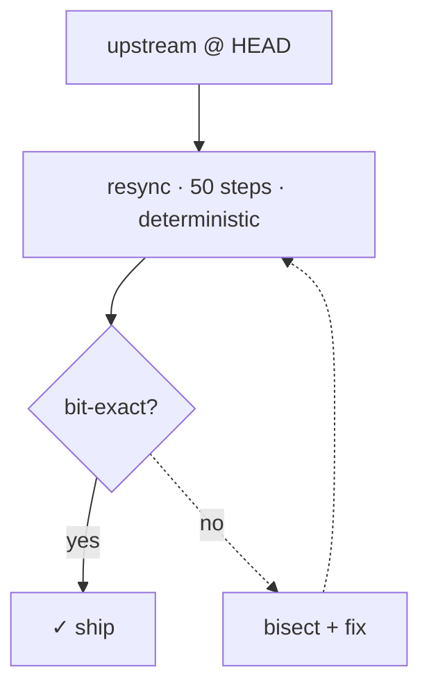
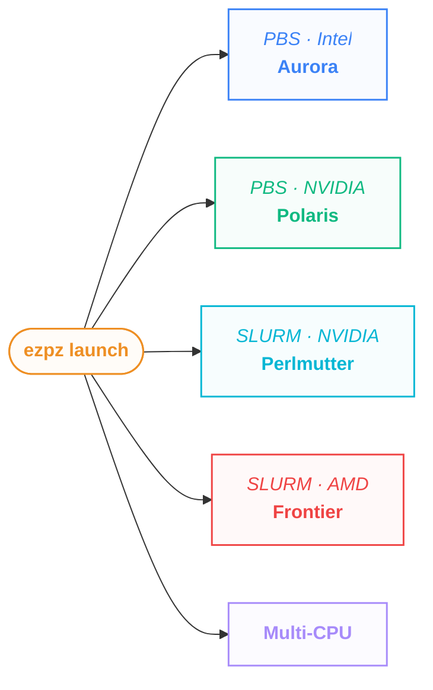

import Slide from '@/components/slides/Slide.astro'
import SpeakerNotes from '@/components/slides/SpeakerNotes.astro'
import Cols from '@/components/slides/Cols.astro'
import Col from '@/components/slides/Col.astro'

export const ASSETS = 'https://samforeman.me/assets'

{/*═══════════════════════════════════════════════════════════════════════════
  ATPESC 2026 — "Pre-Training LLMs on a Supercomputer"
  Two-part talk: Part 1 12:00-12:30 (~30m), Part 2 13:30-14:30 (~60m).
  Structure = PIPELINE ORDER (get a run off the ground -> keep it alive).
  Content assembled from prior decks (2026/07/14, 2026/06/03, 2025/10/15,
  2025/12/16, SIAM25, llms-on-polaris) + net-new (SOAP, shared-FS, async-ckpt
  how-to, framing). Figures copied into public/talks/2026-08-03/figures/.
  Open TODOs are marked {/* TODO / verify */} inline.
═══════════════════════════════════════════════════════════════════════════*/}

{/*───────────────────────────────────────────────────────────────
1 — Title
───────────────────────────────────────────────────────────────*/}

<Slide id="title-slide">

# <span style="color:var(--foreground0);">Pre-Training LLMs on a Supercomputer</span>

<p class="title-slide-thesis">
    What works, what breaks, and how cheaply you recover.
</p>

**Sam Foreman** — Argonne National Laboratory

_{new Date(frontmatter.date).toISOString().slice(0, 10)} · ATPESC 2026_

{/* TODO: generate + drop a qr-slides.svg into public/talks/2026-08-03/figures/
   and add the .title-slide-qr block from the 2026/07/14 title slide. */}

</Slide>

{/*───────────────────────────────────────────────────────────────
2 — Roadmap / two-part arc
───────────────────────────────────────────────────────────────*/}

<Slide id="roadmap">

## Roadmap

**Part 1: getting a run off the ground** _(now, ~30 min)_

- Data preparation
- Python environments + Lustre at scale
- Parallelism: enough to launch

**Part 2: keeping it alive to the end** _(after the break, ~60 min)_

- Critical batch size + second-order optimizers
- Failures, shared filesystems, checkpointing
- Fault-tolerant training + automatic restarts

<SpeakerNotes>
The break is a cliffhanger: Part 1 ends the moment the run launches; Part 2 is
everything that then tries to kill it.
</SpeakerNotes>

</Slide>

{/*───────────────────────────────────────────────────────────────
3 — Who this is for / framing
───────────────────────────────────────────────────────────────*/}

<Slide id="framing">

## Who this is for

- You know HPC. You may be new to training LLMs at scale.
- This is **lessons-learned**, not a survey: do-this-not-that from real runs on
  Aurora / Polaris.
- Complementary to **Shilpika**'s talk: she covered {/* TODO(user): her topic(s) */},
  so we focus on the rest of the pipeline.

</Slide>

{/*═══════════════════════════════════════════════════════════════════════════
  PART 1 — GETTING A RUN OFF THE GROUND  (12:00-12:30)
═══════════════════════════════════════════════════════════════════════════*/}

{/* source: net-new — framing built on 2025/12/16:294-311 "Training" 3-step data recipe */}
<Slide id="data-why">

## Data prep is the first wall

At laptop scale, "data prep" means `load_dataset(...)`. At supercomputer scale it
is a distributed-systems problem you hit _before_ a single GPU does useful work.

- You are not downloading a dataset, you are **curating, blending, and sharding
  2T+ tokens** from many corpora (ArXiv, GitHub, Wikipedia, Reddit,
  StackExchange, ...).
- It has to be **reproducible across thousands of ranks**: every rank must agree
  on which token comes next, run after run.
- The pipeline has to survive the same things training does: flaky filesystems,
  node failures, and _other users_ on the machine.

> [!NOTE] The order these bite you
> Tokenize (raw text to shards) then blend (weighted sampling) then keep it
> reproducible (pin everything). Skip a step and you debug it at 512 nodes
> instead of on your laptop.

<SpeakerNotes>
Reset expectations. HPC folks are comfortable with big files and MPI, but the
"which token is next on rank 4712" determinism problem is new. Everything
downstream (loss curves, evals, being able to reproduce a run) rides on getting
this boring plumbing right.
</SpeakerNotes>

</Slide>

{/* source: reuse — 2025/12/16:294-342 & AuroraGPT-SIAM25:333-381 "Blending Data, Efficiently" */}
<Slide id="data-blending">

## Blending data, efficiently

Training on trillions of tokens means sampling _each batch_ from many corpora at
a **fixed target mixture**, not reading files end to end.

<Cols widths="3 4">
<Col>

**Why not just concatenate?**

- Naive `cat *.bin` trains on ArXiv for a week, then Wikipedia for a day: the
  model forgets, and order becomes a hyperparameter.
- You want **domain weights** (e.g. 60% web, 15% code, ...) honored _within
  every batch_, deterministically.

The recipe ([BlendCorpus](https://github.com/zhenghh04/blendcorpus)):

1. **Aggregate** many corpora
2. **Sample** each batch to a fixed distribution
3. **Build indices** mapping batches to files

</Col>
<Col>


- 🐢 **Original**: serial, single device, **~1 hr** / 2T tokens
- 🐇 **BlendCorpus**: distributed + async, **~2 min** / 2T tokens (**30x**)

The old serial indexer was the bottleneck every time we touched the data
pipeline at scale.

</Col>
</Cols>

<SpeakerNotes>
Domain weights are a real modeling decision, not a knob to leave at default. The
30x is not vanity: index-building is on the critical path for every config
change, so a 1 hr step means you iterate a handful of times a day. At 2 min you
iterate freely.
</SpeakerNotes>

</Slide>

{/* source: reuse — 2026/07/14:278-327 & 2026/06/03:205-228 "The stack" */}
<Slide id="stack">

## The stack

Three repos, one job each. Nothing here is `cuda`-specific: the same code runs on
every vendor.

- 🍋 [saforem2/`ezpz`](https://github.com/saforem2/ezpz): orchestration + launch.
  Auto device/backend, no per-site `mpiexec` / `srun` / CPU-bind wrappers
  ([ezpz.cool](https://ezpz.cool))
- 🧠 [saforem2/`torchtitan@ezpz`](https://github.com/saforem2/torchtitan/tree/ezpz):
  training. Our fork of TorchTitan patched for Intel XPU (FSDP · TP · PP · EP · MoE)
- 📚 [zhenghh04/`blendcorpus`](https://github.com/zhenghh04/blendcorpus): data.
  Weighted blending + sharding across corpora

> [!TIP] Hardware agnostic
> Same code, every vendor. No `cuda` in user code. Write it once on Aurora's
> XPUs, run it anywhere.

_Old stack (reference):_ 🪦
[argonne-lcf/`Megatron-DeepSpeed`](https://github.com/argonne-lcf/Megatron-DeepSpeed),
the AuroraGPT-2B reference run (~7.77T tokens), pre-`torchtitan`.

<SpeakerNotes>
The one line that matters: data / training / launch are three separable
concerns, kept as three repos so each moves at its own pace. The
Megatron-DeepSpeed fork is our reference run, but its maintenance cost is why we
moved to TorchTitan (see the fork-tax slide).
</SpeakerNotes>

</Slide>

{/* source: reuse — 2026/06/03:710-748 "The fork tax" + mermaid smoke-test loop */}
<Slide id="data-repro">

## Reproducibility and the fork tax

Determinism is the whole game: same seed + same shards + same blend weights must
give the same batch on every rank, every run. Two things constantly threaten it.

<Cols widths="3 4">
<Col>

**Upstream churn.** We live on a fork of TorchTitan, and upstream moves fast:
**46 upstream syncs in 7 weeks**. Any one can silently shift dataloader or RNG
behavior.

**Data churn.** Corpora get re-scraped and re-shuffled. If the shards move under
you, "reproducible" is a lie.

**So we pin everything:** exact repo SHAs, tokenizer version, shard file lists,
and blend weights, all committed with the run.

</Col>
<Col>

Every upstream sync runs a **deterministic smoke test** before we ship:



Bit-exact means **loss + grad-norm + peak memory** match the pinned baseline.
Anything off, we bisect before it reaches a production run.

</Col>
</Cols>

<SpeakerNotes>
The war story: an upstream commit that "just refactored the dataloader" changed
shuffle order and quietly changed the loss curve. Bit-exact loss + grad-norm +
peak-memory on 50 deterministic steps is cheap insurance. The "fork tax":
forking buys you XPU support, and the bill comes due as continuous upstream-sync
work.
</SpeakerNotes>

</Slide>

{/* source: net-new — grounded in posts/2025/09/12 (sptoken/SentencePiece, vocab 32000, file lists) */}
<Slide id="data-tokenize">

## From raw corpus to tokens

The step the other decks skip. Before any blending, raw text has to become
**tokenized, sharded binaries** the blender can index.

- **Pick the tokenizer first, and pin it.** AuroraGPT used a SentencePiece model
  (`sptoken`, vocab 32000, borrowed from Gemma / Llama-2). Change it later and
  every shard is stale.
- **Tokenize in parallel, write shards.** Text is embarrassingly parallel: fan
  out across ranks/nodes, append an EOD token per document, emit fixed-size
  `.bin` shards + a **file list** the blender consumes.
  {/* verify: exact shard size / .bin+.idx format for the ATPESC run */}
- **Append EOD, decide on doc packing.** Document boundaries and whether you
  pack to `seq_len` affect the loss: bake the choice into the shards, do not
  leave it to the dataloader.
- **Where it is slow at scale:** not the tokenizer, the **filesystem**. Millions
  of small reads + many-writer output hammer a shared Lustre / DAOS mount. Read
  in large chunks, write few large shards, stage to node-local storage where you
  can.

> [!WARNING] Tokenize once, reuse forever
> Re-tokenizing 2T tokens because you nudged a setting is a multi-hour,
> whole-allocation tax. Get the tokenizer + EOD + shard format right _before_
> you scale out.

<SpeakerNotes>
Honest, do-this-not-that slide. Confident on: SentencePiece backend, vocab
32000, per-doc EOD, file-list-driven blender (all from the Sept 2025 BlendCorpus
run log). Shard-size / exact .bin+.idx layout marked verify since it depends on
the specific config. The real lesson: tokenization is I/O-bound, not
compute-bound, so the win is in how you touch the filesystem.
</SpeakerNotes>

</Slide>

{/* source: llms-on-polaris:215-297 (conda/venv/clone-base + module load) */}
<Slide id="env-setup">

## A Python environment that works

The most common way to lose your first hour on a supercomputer is a broken env.
Start from the site's prebuilt module, then layer on top. Do not fight it.

<Cols widths="2 5">
<Col>

> [!TIP] The rule
> Never `pip install` into the base env. It is read-only, and you will want it
> back.

</Col>
<Col>

**1. Load the site frameworks module** (PyTorch, MPI bindings, GPU support
already built for you):

```bash
module load frameworks     # Aurora / generic
# or on Polaris:
module use /soft/modulefiles
module load conda; conda activate base
```

**2. Build a `venv` on top of base** (fast, cheap, shares system packages):

```bash
python3 -m venv --system-site-packages \
    "venvs/$(basename $CONDA_PREFIX)"
source "venvs/$(basename $CONDA_PREFIX)/bin/activate"
python3 -m pip install -e "git+https://github.com/saforem2/ezpz"
```

**3. Clone base only if you truly need it** (a package that _requires_ conda):

```bash
conda create --clone base --prefix=/path/to/base-clone
```

Cloning copies the entire base env. It is slow, huge, and gets out of hand fast.
`venv` first, clone last.

</Col>
</Cols>

<SpeakerNotes>
Naming the venv after `$CONDA_PREFIX` keeps one venv per frameworks release, so a
module bump does not silently mix ABIs. `--system-site-packages` is what lets the
venv see the module's prebuilt torch instead of pulling a fresh CPU-only wheel.
</SpeakerNotes>

</Slide>

{/* source: posts/2025/05/03 (numpy>2 breaks frameworks module; USE_TORCH=1 fix) */}
<Slide id="env-numpy">

## War story: `numpy > 2` vs the frameworks module

The frameworks module's TensorFlow was built against `numpy==1.26.4`. Then you
install one innocent package:

```bash
python3 -m pip install --upgrade transformers
```

`transformers` pulls in `numpy > 2`, and now a totally unrelated job dies on
`import`:

```text
A module that was compiled using NumPy 1.x cannot be run in
NumPy 2.2.5 as it may crash.
...
AttributeError: _ARRAY_API not found
```

The kicker: this crashes an app that only touches PyTorch. The stack trace runs
through `intel_extension_for_pytorch` then `transformers` then
`import tensorflow as tf`, all triggered transitively.

<Cols widths="3 4">
<Col>

> [!WARNING] It is not just TF
> `jax`, `jaxlib`, `ml-dtypes`, `opt-einsum`, `scipy` were all built with
> `numpy < 2` and break the same way.

</Col>
<Col>

**Fix 1** (the quick one): skip the TF import path entirely. Faster, too
(10.8s to 7.5s to `import ezpz`):

```bash
export USE_TORCH=1
```

**Fix 2** (rebuild what broke against numpy 2):

```bash
python3 -m pip install --upgrade \
    numpy jax jaxlib ml-dtypes opt-einsum scipy transformers
```

</Col>
</Cols>

<SpeakerNotes>
Lesson: on a shared, pre-built module, a dependency upgrade is a blast radius,
not a local change. Pin numpy, or set USE_TORCH=1 and never look back. This cost
real debugging time because the failing import had nothing to do with the package
that was installed.
</SpeakerNotes>

</Slide>

{/* source: posts/2026/05/01 (metadata I/O storm, per-file rsync projected 1-2h) */}
<Slide id="lustre">

## Why `import` melts Lustre at scale

A single `import torch` is not one file read. It is thousands of `stat()`,
`open()`, and `read()` calls walking `site-packages` looking for modules, `.pyc`
caches, and shared objects.

Now run that on **50,000 ranks at once**, all pointed at the same shared
filesystem.

<Cols widths="2 5">
<Col>

> [!NOTE] The bottleneck is not bandwidth
> Lustre has plenty of throughput. It is the **metadata server** that chokes:
> millions of tiny concurrent `stat()`s, not big sequential reads.

</Col>
<Col>

- Every rank independently discovers the same tree of files.
- Metadata operations serialize on a small number of metadata servers.
- Startup that takes seconds on your laptop takes **minutes** before the first
  training step, paid every single job.
- Per-file `rsync` of an env to all nodes was projected at **1 to 2 hours** past
  256 nodes: the per-file metadata cost dominates, not the data.

The small tax every `import` pays becomes dead time multiplied by the whole
machine. At full scale, launch overhead can dwarf the science.

</Col>
</Cols>

<SpeakerNotes>
The intuition HPC folks already have for I/O is "avoid small files." Python is
pathologically small-file. The fix is not a faster filesystem, it is not hitting
the shared filesystem from every rank in the first place. That sets up the next
slide.
</SpeakerNotes>

</Slide>

{/* source: posts/2026/05/01 + yeet-env slide 2026/07/14:2056; figure from 2026-06-03/figures/yeet-env-seconds.svg */}
<Slide id="yeet" size="sm">

## `ezpz yeet`: broadcast the environment

Instead of 50k ranks each clawing at Lustre, copy the env **once** to node-local
`/tmp/` and fan it out node-to-node. Imports then hit local SSD.

<Cols widths="3 4">
<Col>

```bash
# inside an allocation
ezpz yeet --compress   # first copy: 1 tarball, minimal Lustre I/O

# then switch to the local copy and launch
deactivate 2>/dev/null
source /tmp/.venv/bin/activate
cd /path/to/project    # keep data/outputs on shared FS
ezpz launch python3 -m your_app.train
```

- `--compress`: `tar.gz` then copy one file then extract locally (least metadata I/O).
- `--copy`: `cp -a` for a fast initial copy.
- _(default)_ `rsync`: only sends diffs after a `pip install`.

Remote fan-out is a **greedy tree**: each node that finishes becomes a source for
up to 8 more, so wall-clock stays near `O(log N)` until bandwidth contention
kicks in.

</Col>
<Col>

<figure>
    
</figure>

**8 to 4096 nodes on Aurora.** Two regimes: 8-64 nodes are extract-bound
(~70-91s flat), ≥128 nodes are broadcast-bound (each 2x adds ~1.5-1.8x). Per-node
cost falls **8.7s to 0.18s**, a 48x efficiency gain. Even at full-Aurora scale,
pre-launch overhead stays under 13 minutes.

</Col>
</Cols>

<SpeakerNotes>
The one-tarball trick is why this scales: it turns the Lustre side into a single
sequential read regardless of node count, so only the broadcast scales with N
(the log-tree part). The old per-file rsync mode was the 1-2 hour disaster from
the previous slide.
</SpeakerNotes>

</Slide>

{/* source: 2025/10/15:135-159 (DP/MP), 533-554 (TP/PP/SP); EP net-new for MoE */}
<Slide id="parallelism-menu">

## The parallelism menu

Five axes. You mix and match them ("4D parallelism" is just several of these
stacked). The only question is _what each one splits_.

| Strategy | Abbr. | What it splits | You reach for it when... |
| --- | :---: | --- | --- |
| **Data Parallel** | `DP` | the _batch_: every GPU holds a full model copy, sees different data | the model fits on one GPU |
| **Tensor Parallel** | `TP` | individual _weight matrices_ across GPUs (within a layer) | a single layer is too big; needs fast interconnect |
| **Pipeline Parallel** | `PP` | the model _by layer_ (stages), streaming micro-batches through | the model is deep and will not fit vertically |
| **Sequence / Context** | `SP` | the _sequence dimension_ (long context) across GPUs | context length blows up activation memory |
| **Expert Parallel** | `EP` | _experts_ of an MoE layer across GPUs | you are training a Mixture-of-Experts |

> [!TIP] Read it as a hierarchy of cost
> `DP` is nearly free (no model changes). `TP` is chatty (all-reduce inside every
> layer, keep it on-node). `PP` needs careful micro-batch scheduling. Add them in
> that order of pain.

<SpeakerNotes>
A map, not a tutorial. The one thing to leave with: DP is the default and costs
almost nothing; everything else is a response to a specific "will not fit"
problem. TP wants NVLink / on-node; PP spans nodes fine. EP only matters if you
chose MoE.
</SpeakerNotes>

</Slide>

{/* source: 2025/10/15:505-531 (ZeRO stages 1/2/3, FSDP) */}
<Slide id="zero-fsdp">

## ZeRO / FSDP: the memory vs comms trade

Plain data parallelism replicates _everything_ on every GPU: params, gradients,
and optimizer states. For an Adam-trained model that is the same tensor stored
dozens of times over. ZeRO (DeepSpeed) and FSDP (PyTorch) ask: why?

The idea: **shard** those replicated tensors across the DP group, and gather each
piece back only when a GPU actually needs it.

<Cols widths="3 3">
<Col>

**The stages** (each shards more, saves more memory):

1. **Stage 1**: shard _optimizer states_
2. **Stage 2**: shard _optimizer states + gradients_
3. **Stage 3**: shard _params + gradients + optimizer states_ (this is what FSDP
   does by default)

Optimizer states are the biggest win first: with Adam they are ~2x the size of
the params themselves.

</Col>
<Col>

> [!NOTE] The trade
> You buy memory with **communication**. Every forward/backward now does an
> all-gather to reconstruct the shard, then re-shards. More stages = less memory,
> more comms.

**When it is worth it:** the model _almost_ fits, or you want a bigger batch. You
stay in a pure-DP mental model (no model surgery) but pay a comms tax instead of
buying more GPUs.

**When it is not:** if a single _layer_ does not fit, sharding a replica will not
save you. That is a `TP` / `PP` problem, not a ZeRO one.

</Col>
</Cols>

<SpeakerNotes>
Framing for the room: ZeRO/FSDP is still data parallelism. You do not rewrite the
model, you change how the DP group stores state. That is why it is the first
thing to try when you are memory-bound but the architecture still fits
layer-wise. Stage 3 = FSDP full shard.
</SpeakerNotes>

</Slide>

{/* source: ezpz hub-and-spoke mermaid verbatim from 2026/07/14:356-377; heuristic net-new */}
<Slide id="what-to-pick">

## What you'll actually pick

Most of the time the answer is boring, and that is good. Start at the cheapest
strategy that fits, and only climb the ladder when memory forces you.

<Cols widths="4 3">
<Col>

> [!TIP] A decision heuristic
>
> - **Model fits on one GPU?** Pure **`DP`**. Scale batch, done. (Most models
>   under a few B params.)
> - **Fits, but optimizer states are tight** (or you want a bigger batch)?
>   **`FSDP` / `ZeRO`**. Same DP code, trade comms for memory. Try stage 1, then 3.
> - **A single layer will not fit** (tens of B+ params)? Now split the model:
>   **`TP`** within a node (fast interconnect), **`PP`** across nodes.
> - **Long context** blowing up activations? Add **`SP`**.
> - **MoE?** Add **`EP`**.
>
> Rule of thumb: add axes in order `DP → FSDP/ZeRO → TP → PP`. Each is more code
> and more comms than the last.

And whatever you pick, `ezpz launch` runs the same training script on every
machine: no per-cluster `mpiexec` / `srun`, no CPU-binding wrappers.

</Col>
<Col>



</Col>
</Cols>

<SpeakerNotes>
The heuristic is the net-new bit. Anchor it in memory, not vibes: DP until a
replica is too big, FSDP/ZeRO until a layer is too big, then TP/PP. The mermaid
is the hub-and-spoke from the July deck: you decide the parallelism, ezpz handles
the scheduler/vendor differences.
</SpeakerNotes>

</Slide>

{/*───────────────────────────────────────────────────────────────
16 — Part 1 close / cliffhanger
───────────────────────────────────────────────────────────────*/}

<Slide id="part1-close">

## You've launched. Now everything tries to kill it.

_See you after the break._

</Slide>

{/*═══════════════════════════════════════════════════════════════════════════
  PART 2 — KEEPING IT ALIVE TO THE END  (13:30-14:30)
  [placeholders below — filled in the Part 2 pass]
═══════════════════════════════════════════════════════════════════════════*/}

<Slide id="part2-rehook">

## Where we left off

{/* TODO(part2): re-hook — the run is training, now keep it alive. */}

</Slide>

<Slide id="critical-batch-size">

## Critical batch size

{/* TODO(part2) */}

</Slide>

<Slide id="large-batches">

## Training with large batches

{/* TODO(part2) */}

</Slide>

<Slide id="optimizer-landscape">

## Second-order optimizers: the landscape

{/* TODO(part2) */}

</Slide>

<Slide id="soap">

## SOAP

{/* TODO(part2) — net-new */}

</Slide>

<Slide id="mano">

## `mano`: Muon quality at AdamW speed

{/* TODO(part2) */}

</Slide>

<Slide id="optimizer-cliff">

## The 80B bf16 optimizer cliff

{/* TODO(part2) */}

</Slide>

<Slide id="failure-default">

## Failure is the default

{/* TODO(part2) */}

</Slide>

<Slide id="failure-taxonomy">

## Taxonomy: HW / SW / network / system

{/* TODO(part2) */}

</Slide>

<Slide id="network-flaps">

## Network flaps

{/* TODO(part2) */}

</Slide>

<Slide id="silent-rmsnorm">

## Silent corruption #1: bf16 RMSNorm freeze

{/* TODO(part2) */}

</Slide>

<Slide id="silent-tp">

## Silent corruption #2: TP loss-scaling bug

{/* TODO(part2) */}

</Slide>

<Slide id="shared-fs">

## Working on a shared filesystem

{/* TODO(part2) — net-new */}

</Slide>

<Slide id="checkpoint-basics">

## Checkpointing: what / when / how big

{/* TODO(part2) */}

</Slide>

<Slide id="async-checkpoint">

## Asynchronous checkpointing done right

{/* TODO(part2) — net-new how-to */}

</Slide>

<Slide id="fast-restart">

## Restarting quickly

{/* TODO(part2) */}

</Slide>

<Slide id="restart-cascade">

## The three-layer recovery cascade

{/* TODO(part2) */}

</Slide>

<Slide id="auto-retry">

## `ezpz launch --auto-retry`

{/* TODO(part2) */}

</Slide>

<Slide id="watchdog">

## The hang watchdog

{/* TODO(part2) */}

</Slide>

<Slide id="failover-validation">

## It caught a real silent hang

{/* TODO(part2) */}

</Slide>

<Slide id="capstone">

## The full resilient launch

{/* TODO(part2) — net-new capstone */}

</Slide>

<Slide id="recap">

## Start here

{/* TODO */}

</Slide>

<Slide id="thanks">

## Thanks

{/* TODO */}

</Slide>

<Slide id="footnotes">

## Footnotes

<div id="footnotes-target"></div>

</Slide>

<Slide id="appendix">

## Appendix

{/* TODO: eval charts, CPT/SFT/GRPO, MoE-on-XPU, AERIS — for Q&A. */}

</Slide>
