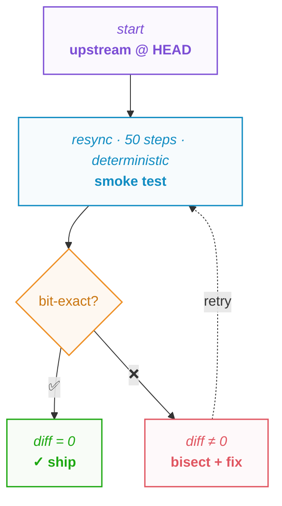
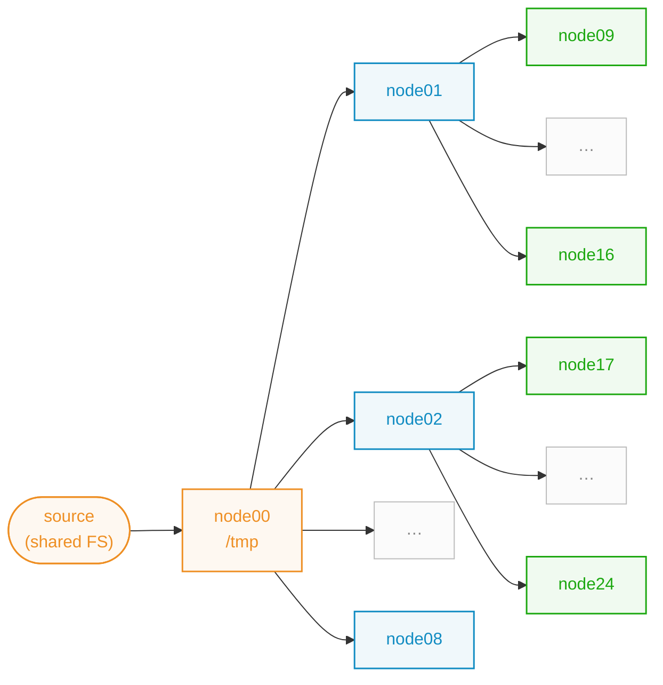
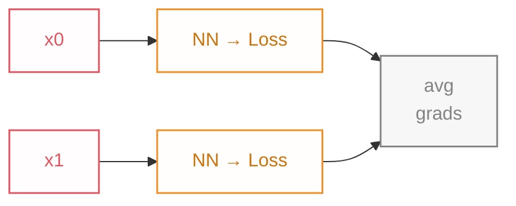
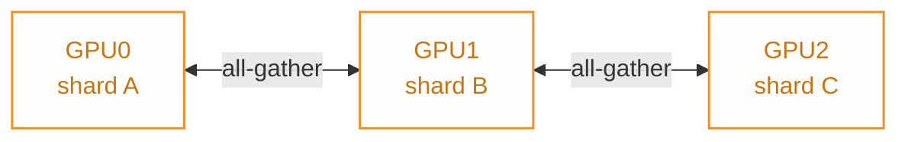
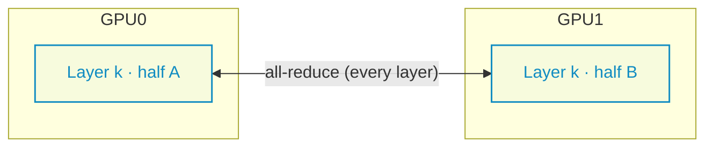
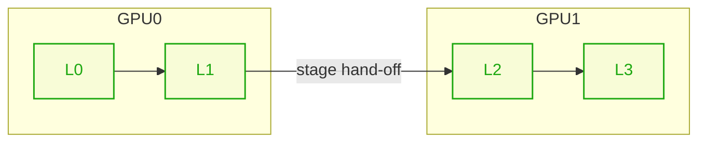
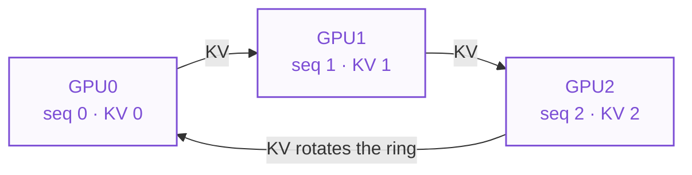
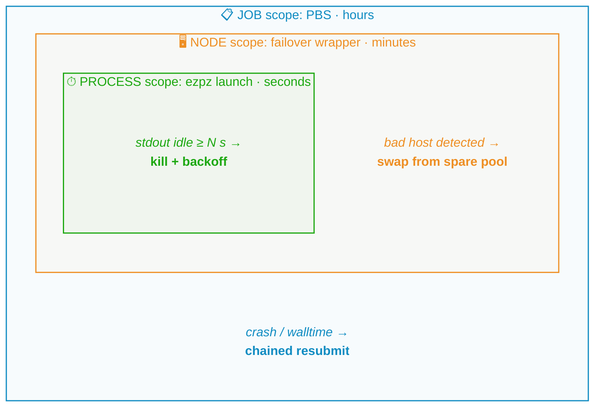
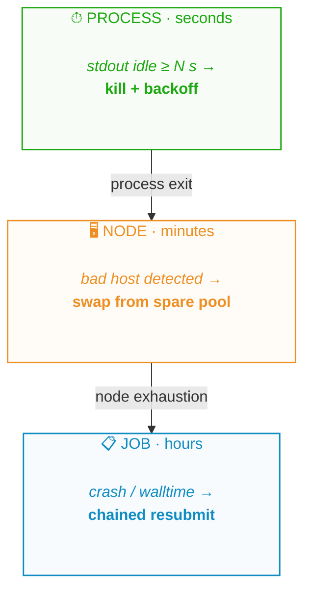
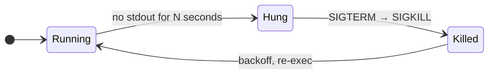

import Slide from '@/components/slides/Slide.astro'
import SpeakerNotes from '@/components/slides/SpeakerNotes.astro'
import Cols from '@/components/slides/Cols.astro'
import Col from '@/components/slides/Col.astro'

export const ASSETS = 'https://samforeman.me/assets'

{/*═══════════════════════════════════════════════════════════════════════════
  ATPESC 2026 · "Pre-Training LLMs on a Supercomputer"
  Two-part talk: Part 1 12:00-12:30 (~30m), Part 2 13:30-14:30 (~60m).
  Structure = PIPELINE ORDER (get a run off the ground -> keep it alive).
  Content assembled from prior decks (2026/07/14, 2026/06/03, 2025/10/15,
  2025/12/16, SIAM25, llms-on-polaris) + net-new (SOAP, shared-FS, async-ckpt
  how-to, framing). Figures copied into public/talks/2026-08-03/figures/.
  Open TODOs are marked with TODO / verify tags inline.
═══════════════════════════════════════════════════════════════════════════*/}

{/*───────────────────────────────────────────────────────────────
1 · Title
───────────────────────────────────────────────────────────────*/}

<Slide id="title-slide">

<a
    class="title-slide-qr"
    href="https://samf.sh/talks/2026/08/03"
    aria-label="QR code linking to these slides">
    
    <span>samf.sh/talks/2026/08/03</span>
</a>

# <span style="color:var(--foreground0);">Pre-Training LLMs on a Supercomputer</span>

<p class="title-slide-thesis">
    The most model per GPU-hour: what works, what breaks, and what it costs.
</p>

**Sam Foreman**, Argonne National Laboratory

_{new Date(frontmatter.date).toISOString().slice(0, 10)} · ATPESC 2026_

<style>{`
  /* Thesis / tagline under the title: muted italic so it reads as a
     subtitle, not a second heading. Capped clear of the top-right QR. */
  #title-slide .title-slide-thesis {
    max-width: 44ch;
    margin-block-start: 0.5lh;
    font-style: italic;
    color: var(--foreground1);
  }
  /* QR top-right, big enough to scan from the back, URL underneath. */
  #title-slide .title-slide-qr {
    position: absolute;
    top: 2lh;
    right: 4ch;
    display: flex;
    flex-direction: column;
    align-items: center;
    gap: 0.25lh;
    text-decoration: none;
    color: var(--foreground0);
  }
  #title-slide .title-slide-qr img { width: 11ch; height: 11ch; display: block; }
  #title-slide .title-slide-qr span { font-size: 0.75em; color: var(--foreground1); white-space: nowrap; }
  /* QR SVG ships stroke=currentColor but as an  resolves to black;
     invert on dark themes so both QRs (title + thanks) read white-on-dark. */
  html[data-webtui-theme='custom-dark'] :is(.title-slide-qr, .thanks-qr) img,
  html[data-webtui-theme='catppuccin'] :is(.title-slide-qr, .thanks-qr) img,
  html[data-webtui-theme='nvim-dark'] :is(.title-slide-qr, .thanks-qr) img {
    filter: invert(1);
  }
  @media (max-width: 768px) {
    #title-slide .title-slide-thesis { max-width: 100%; }
    #title-slide .title-slide-qr { display: none; }
  }
`}</style>

</Slide>

{/*───────────────────────────────────────────────────────────────
2 · Roadmap / two-part arc
───────────────────────────────────────────────────────────────*/}

<Slide id="roadmap">

## Roadmap

One goal, two halves: **get the most model per GPU-hour.** Part 1 spends the
compute well; Part 2 keeps a crash from wasting it.

**Part 1: getting a run off the ground** _(now, ~30 min)_

- Data preparation
- Python environments + Lustre at scale
- Parallelism: enough to launch

**Part 2: keeping it alive to the end** _(after the break, ~60 min)_

- Critical batch size + second-order optimizers
- Failures, shared filesystems, checkpointing
- Fault-tolerant training + automatic restarts

<SpeakerNotes>
The break is a cliffhanger: Part 1 ends the moment the run launches; Part 2 is
everything that then tries to kill it.
</SpeakerNotes>

</Slide>

{/*───────────────────────────────────────────────────────────────
3 · Who this is for / framing
───────────────────────────────────────────────────────────────*/}

<Slide id="framing">

## Who this is for

One goal runs through all of it: **the best model you can get per GPU-hour.**
Every choice ahead trades compute for model quality; the job is to spend it well.

- You know HPC. You may be new to training LLMs at scale.
- This is **lessons-learned**, not a survey: do-this-not-that from real runs on
  Aurora / Polaris.
- Builds on today's earlier talks: **Jane** just did LLM basics (tokenization,
  training objectives); **Bethany** covered the parallelisms; **Nathan**, profiling.
  We assume those and focus on **making it survive at full-machine scale.**

<SpeakerNotes>
The through-line for the whole talk: you are trying to get the best model you can
for a fixed compute budget. That is the lens for every decision that follows.
Data blending decides whether your tokens are worth spending. The parallelism and
batch-size choices decide whether the FLOPs you pour in actually buy speedup.
Second-order optimizers try to reach the same loss in fewer steps. yeet and the
Lustre work keep you from burning node-hours on startup. And the entire Part 2,
failure recovery, exists so a crash does not throw away the compute you already
spent. Keep asking, of every slide: how does this get more model per GPU-hour?

Placement in the day: this comes right after Jane's Intro to LLM (tokenization,
LM objectives, pre to post-training) and later in the day than Bethany's
Distributed Deep Learning, which already covered the parallelism taxonomy (DP,
FSDP/ZeRO, TP, PP, sequence/context/expert, hybrid) and Nathan's profiling talk.
So our parallelism section is deliberately a fast recap framed as "which one to
reach for and when," not a re-teach. Lean on "Bethany covered the how; here is
the how-to-choose plus what breaks at scale." Shilpika only gives the morning
welcome, so there is no technical overlap to dodge there.
</SpeakerNotes>

</Slide>

{/*═══════════════════════════════════════════════════════════════════════════
  PART 1 · GETTING A RUN OFF THE GROUND  (12:00-12:30)
═══════════════════════════════════════════════════════════════════════════*/}

{/* source: reuse · 2026/07/14:278-327 & 2026/06/03:205-228 "The stack" */}
<Slide id="stack">

## The stack

Three repos, one job each. No `cuda` in user code.

- 🍋 [saforem2/`ezpz`](https://github.com/saforem2/ezpz) · launch, anywhere
- 🧠 [saforem2/`torchtitan@ezpz`](https://github.com/saforem2/torchtitan/tree/ezpz) · train (XPU fork: FSDP · TP · PP · EP · MoE)
- 📚 [zhenghh04/`blendcorpus`](https://github.com/zhenghh04/blendcorpus) · data (weighted blend + shard)

> [!TIP]+ Hardware agnostic
> Write it once on Aurora's XPUs, run it anywhere.

<SpeakerNotes>
The map for the whole talk before we dive in: three repos, one job each, and
nothing here is cuda-specific, the same code runs on every vendor. ezpz is
orchestration + launch (auto device/backend, no per-site mpiexec / srun / CPU-bind
wrappers, ezpz.cool). torchtitan@ezpz is training: our fork of TorchTitan patched
for Intel XPU. blendcorpus is data: weighted blending and sharding across corpora.

Data / training / launch are three separable concerns, kept as three repos so each
moves at its own pace. Keep these three names in mind: the data section uses
blendcorpus, and forking torchtitan is what creates the "fork tax" a few slides on.
The old stack, argonne-lcf's Megatron-DeepSpeed fork, was the AuroraGPT-2B
reference run (~7.77T tokens); its maintenance cost is why we moved to TorchTitan.
</SpeakerNotes>

</Slide>

{/* source: net-new · framing built on 2025/12/16:294-311 "Training" 3-step data recipe */}
<Slide id="data-why">

## Data prep is the first wall

Not a download. A distributed-systems problem, before the first GPU step.

- **Curate · blend · shard** 2T+ tokens, many corpora
- **Reproducible** every rank, every run
- **Survivable** flaky FS · node failures · noisy neighbors

> [!NOTE]+ The three steps, in order
> **tokenize** (text → shards) → **blend** (weighted mix) → **pin** (make it
> reproducible)

<SpeakerNotes>
At laptop scale "data prep" means `load_dataset(...)`. At supercomputer scale it
is a distributed-systems problem you hit before a single GPU does useful work:
you are not downloading a dataset, you are curating, blending, and sharding 2T+
tokens from many corpora (ArXiv, GitHub, Wikipedia, Reddit, StackExchange).

Reset expectations. HPC folks are comfortable with big files and MPI, but the
"which token is next on rank 4712" determinism problem is new, and it has to
survive the same things training does: flaky filesystems, node failures, other
users on the machine. Everything downstream (loss curves, evals, reproducing a
run) rides on getting this boring plumbing right. The order the next slides go
in is the order it bites you: tokenize (raw text to shards), then blend (weighted
sampling), then keep it reproducible (pin everything). Skip a step and you debug
it at 512 nodes instead of on your laptop.
</SpeakerNotes>

</Slide>

{/* source: net-new · grounded in posts/2025/09/12 (sptoken/SentencePiece, vocab 32000, file lists) */}
<Slide id="data-tokenize">

## From raw corpus to tokens

Raw text → **tokenized, sharded binaries** before you can blend.

- **Pin the tokenizer** (SentencePiece, vocab 32k) → or every shard is stale
- **Tokenize in parallel** → EOD per doc, fixed-size `.bin` shards + file list
- **Decide doc packing** up front → it changes the loss
- **Bottleneck is the filesystem**, not the tokenizer

> [!WARNING]+ Tokenize once, reuse forever
> Re-tokenizing 2T tokens is a whole-allocation tax.

<SpeakerNotes>
The step the other decks skip: before any blending, raw text has to become
tokenized, sharded binaries the blender can index. Pick the tokenizer first and
pin it: AuroraGPT used a SentencePiece model (sptoken, vocab 32000, borrowed from
Gemma / Llama-2); change it later and every shard is stale. Tokenize in parallel:
text is embarrassingly parallel, so fan out across ranks/nodes, append an EOD
token per document, and emit fixed-size .bin shards plus a file list the blender
consumes. Document boundaries and whether you pack to seq_len affect the loss, so
bake that choice into the shards, do not leave it to the dataloader.

Where it is slow at scale: not the tokenizer, the filesystem. Millions of small
reads plus many-writer output hammer a shared Lustre / DAOS mount. Read in large
chunks, write few large shards, stage to node-local storage where you can. The
real lesson: tokenization is I/O-bound, not compute-bound, so the win is in how
you touch the filesystem. And tokenize once: re-tokenizing 2T tokens because you
nudged a setting is a multi-hour, whole-allocation tax.
{/* verify: exact shard size / .bin+.idx format for the ATPESC run */}
</SpeakerNotes>

</Slide>

{/* source: reuse · 2025/12/16:294-342 & AuroraGPT-SIAM25:333-381 "Blending Data, Efficiently" */}
<Slide id="data-blending">

## Blending data, efficiently

Sample **every batch** to a fixed mixture. Do not concatenate.

<Cols>
<Col width={3}>

- **Concatenation forgets:** order becomes a hyperparameter
- **Domain weights** honored per batch, deterministically
- [BlendCorpus](https://github.com/zhenghh04/blendcorpus): aggregate → sample → index

</Col>
<Col width={4}>

<figure>
    
    <figcaption>Index-build time for 2T tokens: serial ~1 hr vs distributed ~2 min (**30x**).</figcaption>
</figure>

</Col>
</Cols>

<SpeakerNotes>
Training on trillions of tokens means sampling each batch from many corpora at a
fixed target mixture, not reading files end to end. Why not just concatenate? A
naive `cat *.bin` trains on ArXiv for a week then Wikipedia for a day: the model
forgets, and order becomes a hyperparameter. You want domain weights (say 60%
web, 15% code) honored within every batch, deterministically. The BlendCorpus
recipe: aggregate many corpora, sample each batch to a fixed distribution, build
indices mapping batches to files.

Domain weights are a real modeling decision, not a knob to leave at default. The
30x is not vanity: index-building is on the critical path for every config
change, so a 1 hr step means you iterate a handful of times a day. At 2 min you
iterate freely.
</SpeakerNotes>

<style>{`
  #data-blending figure { margin: 0; }
  #data-blending img { width: 100%; height: auto; max-height: 20lh; }
  #data-blending figcaption { font-size: 0.8em; color: var(--foreground2, #838383); margin-block-start: 0.4lh; line-height: 1.35; }
`}</style>

</Slide>

{/* source: reuse · 2026/06/03:710-748 "The fork tax" + mermaid smoke-test loop */}
<Slide id="data-repro">

## Reproducibility and the fork tax

Same seed + shards + weights → same batch, every rank, every run.

<Cols>
<Col width={3}>

**Universal:**

- **data churn:** re-scraped shards break determinism
- **pin everything:** SHAs · tokenizer · shard lists · weights

**If you fork upstream** (we fork `torchtitan` for XPU):

- **upstream churn:** 46 syncs in 7 weeks, any can shift RNG

</Col>
<Col width={4}>

Every **fork sync** runs a deterministic smoke test first:



Bit-exact = **loss + grad-norm + peak memory** match baseline.

</Col>
</Cols>

<style>{`
  /* Chip-badge styling for the smoke-test flowchart nodes (mirrors the
     fork-tax diagram in the 2026/07/14 deck): each node's italic top line
     is the descriptor, the bold bottom line the action, and the fill gets a
     light tint of its classDef color. Color overrides force the classDef hue
     onto the foreignObject span/p that mermaid otherwise paints black. */
  #data-repro .mermaid g.node.source .nodeLabel,
  #data-repro .mermaid g.node.source span,
  #data-repro .mermaid g.node.source p { color: #7c4ed5 !important; }
  #data-repro .mermaid g.node.stage .nodeLabel,
  #data-repro .mermaid g.node.stage span,
  #data-repro .mermaid g.node.stage p { color: #118cc2 !important; }
  #data-repro .mermaid g.node.ship .nodeLabel,
  #data-repro .mermaid g.node.ship span,
  #data-repro .mermaid g.node.ship p { color: #1da811 !important; }
  #data-repro .mermaid g.node.gate .nodeLabel,
  #data-repro .mermaid g.node.gate span,
  #data-repro .mermaid g.node.gate p { color: #838383 !important; }
  #data-repro .mermaid g.node.bad .nodeLabel,
  #data-repro .mermaid g.node.bad span,
  #data-repro .mermaid g.node.bad p { color: #e05560 !important; }
  #data-repro .mermaid g.node foreignObject { overflow: visible; }
  #data-repro .mermaid g.node p { line-height: 1.35; padding-bottom: 0.1em; }
`}</style>

<SpeakerNotes>
Determinism is the whole game: same seed + same shards + same blend weights must
give the same batch on every rank, every run. Two things threaten it. Upstream
churn: we live on a fork of TorchTitan and upstream moves fast (46 syncs in 7
weeks), any one of which can silently shift dataloader or RNG behavior. Data
churn: corpora get re-scraped and re-shuffled, and if the shards move under you
"reproducible" is a lie. So we pin everything: exact repo SHAs, tokenizer version,
shard file lists, blend weights, all committed with the run.

The war story: an upstream commit that "just refactored the dataloader" changed
shuffle order and quietly changed the loss curve. Bit-exact loss + grad-norm +
peak-memory on 50 deterministic steps is cheap insurance. The "fork tax": forking
buys you XPU support, and the bill comes due as continuous upstream-sync work.
</SpeakerNotes>

</Slide>

{/* source: llms-on-polaris:215-297 (conda/venv/clone-base + module load) */}
<Slide id="env-setup">

## A Python environment that works

Don't build from scratch. **Layer on the site module:** it already has torch, MPI,
and the GPU stack built for this machine.

```bash
# 1. the site's prebuilt module (torch / MPI / GPU)
module load frameworks

# 2. a venv on top -- your packages, inheriting the module's torch
uv venv --system-site-packages --python python3 .venv
source .venv/bin/activate
uv pip install "git+https://github.com/saforem2/ezpz"   # resolves in seconds
```

> [!TIP]+ The rule: `venv` first, clone last
> - `--system-site-packages` is what lets the venv **see the module's torch**
>   (skip it and you pull a fresh CPU-only wheel)
> - never `pip install` into base; clone conda `base` **only** if a package hard-requires conda (slow, huge)

<SpeakerNotes>
The most common way to lose your first hour on a supercomputer is a broken env.
Start from the site's prebuilt frameworks module (on Polaris that is
`module use /soft/modulefiles; module load conda; conda activate base`), then
back. Build the venv with `--system-site-packages` so it sees the module's
prebuilt torch instead of pulling a fresh CPU-only wheel. I use plain `.venv`
here for clarity, but in practice name it after `$CONDA_PREFIX`
(`venvs/$(basename $CONDA_PREFIX)`) so you get one venv per frameworks release and
a module bump does not silently mix ABIs. One `uv venv` gotcha: it defaults to a uv-managed CPython
download, which would build the venv against the wrong interpreter and inherit the
wrong site-packages, so pin it to the module's python with `--python python3`
(uv resolves it on PATH). Then `uv pip install` (not plain pip) resolves and
installs in seconds, a real difference on a shared login node, and honors the
`--system-site-packages` venv so it still picks up the module's prebuilt torch.
Clone base only if some package truly requires conda: cloning copies the entire
env, it is slow and huge and gets out of hand fast. venv first, clone last.
</SpeakerNotes>

</Slide>

{/* source: posts/2026/05/01 (metadata I/O storm, per-file rsync projected 1-2h) */}
<Slide id="lustre">

## Why `import` melts Lustre at scale

One `import torch` = thousands of `stat()` / `open()`. Now × 50,000 ranks.

- **Metadata server chokes**, not bandwidth
- Laptop-seconds → **cluster-minutes** before step 1
- Per-file `rsync` past 256 nodes: **1-2 hours**

> [!NOTE]+ Python is pathologically small-file
> The fix is not a faster FS. It is not hitting the FS from every rank.

Deep dive: [Running 50k Python processes on Aurora with `ezpz yeet`](https://samf.sh/posts/2026/05/01/)

<SpeakerNotes>
A single `import torch` is not one file read: it is thousands of stat(), open(),
and read() calls walking site-packages for modules, .pyc caches, and shared
objects. Run that on 50,000 ranks at once, all pointed at the same shared
filesystem, and the bottleneck is not bandwidth: Lustre has plenty of throughput,
but the metadata server chokes on millions of tiny concurrent stat()s.

Every rank independently discovers the same tree; metadata ops serialize on a
small number of servers; startup that takes seconds on your laptop takes minutes
before the first training step, paid every job. A per-file rsync of an env to all
nodes was projected at 1 to 2 hours past 256 nodes, because the per-file metadata
cost dominates, not the data. The HPC intuition already applies: avoid small
files. Python is pathologically small-file. The fix is not a faster filesystem,
it is not hitting the shared filesystem from every rank, which sets up yeet next.
</SpeakerNotes>

</Slide>

{/* source: posts/2026/05/01 + yeet-env slide 2026/07/14:2056; figure from 2026-06-03/figures/yeet-env-seconds.svg */}
<Slide id="yeet" size="sm">

## `ezpz yeet`: broadcast the environment

Copy the env **once** to node-local `/tmp`, fan out node-to-node. Imports hit
local SSD.

<Cols>
<Col width={3}>

```bash
ezpz yeet --compress          # 1 tarball off Lustre
source /tmp/.venv/bin/activate
ezpz launch python3 -m your_app.train
```

- Greedy `O(log N)` fan-out tree, not a star
- Per-node cost **8.7s → 0.18s** (48x)
- Full Aurora: pre-launch **under 13 min**

</Col>
<Col width={4}>

<figure>
    
</figure>

</Col>
</Cols>

<SpeakerNotes>
Instead of 50k ranks each clawing at Lustre, copy the env once to node-local /tmp
and fan it out node-to-node; imports then hit local SSD. Modes: `--compress`
(tar.gz, copy one file, extract locally, least metadata I/O), `--copy` (cp -a for
a fast initial copy), and the default rsync (only sends diffs after a pip
install). After yeet, activate `/tmp/.venv` and `cd` back to your project so
data/outputs stay on the shared FS.

Measured 8 to 4096 nodes on Aurora, two regimes: 8-64 nodes extract-bound
(~70-91s flat), ≥128 broadcast-bound (each 2x adds ~1.5-1.8x). The one-tarball
trick is why it scales: it turns the Lustre side into a single sequential read
regardless of node count, so only the broadcast scales with N. The old per-file
rsync mode was the 1-2 hour disaster from the previous slide. The next slide
shows *why* it stays O(log N): the greedy fan-out tree.
</SpeakerNotes>

</Slide>

{/* source: net-new · greedy fan-out tree from the yeet write-up (2026/05/01#greedy-fan-out) */}
<Slide id="yeet-fanout">

## Why it stays `O(log N)`: greedy fan-out

A single source saturates its NIC at ~8 outbound copies. So **each node that
finishes becomes a source** for the next batch: the tree grows recursively.



- Cap **8 outbound / source**; a thread pool load-balances to the least-busy one
- Faster nodes don't wait: finish early → serve early
- Result: **~O(log N)** wall-clock, not the O(N) of a single-source star

<SpeakerNotes>
This is the mechanism behind the O(log N) curve on the previous slide, straight
from the yeet write-up. A single source can only push to about 8 nodes before its
NIC saturates, so yeet uses a greedy streaming fan-out: a single thread pool
manages all rsyncs, each source capped at MAX_PER_SOURCE=8 concurrent outbound
transfers. As each rsync completes, that node is registered as a new source, and
new transfers go to whichever source has the fewest active ones (load-balanced).
The tree grows recursively: source to node00, node00 to gen-1 (node01..08), each
of those to gen-2, and so on. Faster nodes don't wait for slower ones: if node01
finishes in 15s but node08 takes 30s, node01 is already serving new targets. That
is why the wall-clock is approximately O(log N) at moderate scale rather than the
O(N) you'd get pushing from one source.
</SpeakerNotes>

<style>{`
  #yeet-fanout .mermaid svg { width: 100%; max-width: 100%; height: auto; max-height: 17lh; }
  #yeet-fanout .mermaid { margin: 0.5lh 0; }
`}</style>

</Slide>

{/* source: 2025/10/15:135-159 (DP/MP), 533-554 (TP/PP/SP); EP net-new for MoE */}
<Slide id="parallelism-menu">

## The parallelism menu

Bethany covered these in depth. Fast recap as a **decision menu**: five axes, mix
and match ("4D parallelism" = several stacked). The only question: _what each splits_.

| Strategy | Abbr. | What it splits | You reach for it when... |
| --- | :---: | --- | --- |
| **Data Parallel** | `DP` | the _batch_: every GPU holds a full model copy, sees different data | the model fits on one GPU |
| **Tensor Parallel** | `TP` | individual _weight matrices_ across GPUs (within a layer) | a single layer is too big; needs fast interconnect |
| **Pipeline Parallel** | `PP` | the model _by layer_ (stages), streaming micro-batches through | the model is deep and will not fit vertically |
| **Sequence / Context** | `SP` | the _sequence dimension_ (long context) across GPUs | context length blows up activation memory |
| **Expert Parallel** | `EP` | _experts_ of an MoE layer across GPUs | you are training a Mixture-of-Experts |

> [!TIP]+ Read it as a hierarchy of cost
> `DP` is nearly free (no model changes). `TP` is chatty (all-reduce inside every
> layer, keep it on-node). `PP` needs careful micro-batch scheduling. Add them in
> that order of pain.

<SpeakerNotes>
A map, not a tutorial. The one thing to leave with: DP is the default and costs
almost nothing; everything else is a response to a specific "will not fit"
problem. TP wants NVLink / on-node; PP spans nodes fine. EP only matters if you
chose MoE.
</SpeakerNotes>

<style>{`
  #parallelism-menu table { table-layout: fixed; width: 100%; }
  #parallelism-menu table th:nth-child(1), #parallelism-menu table td:nth-child(1) { width: 16ch; }
  #parallelism-menu table th:nth-child(2), #parallelism-menu table td:nth-child(2) { width: 7ch; white-space: nowrap; }
  #parallelism-menu table th:nth-child(3), #parallelism-menu table td:nth-child(3) { width: auto; }
  #parallelism-menu table th:nth-child(4), #parallelism-menu table td:nth-child(4) { width: 28ch; }
`}</style>

</Slide>

{/* source: net-new · mermaid reproduction of the paper's parallelism cartoon (figures/parallelism-*.pdf), part 1: DP / FSDP / TP */}
<Slide id="parallelism-cartoon-1" size="sm">

## In pictures (1/2): replicate, shard, split a layer

<div class="pcart-grid">

<figure>
<figcaption>**Data Parallel** — model replicated, batch sliced, grads averaged</figcaption>



</figure>

<figure>
<figcaption>**FSDP / ZeRO** — params sharded, all-gathered just-in-time per layer</figcaption>



</figure>

<figure class="pcart-wide">
<figcaption>**Tensor Parallel** — each layer's matmul sliced; all-reduce every layer</figcaption>



</figure>

</div>

- **DP** is the default (nothing changes). **FSDP** trades comms for memory.
  **TP** is chatty (all-reduce every layer): keep it **on-node**.

<SpeakerNotes>
The five strategies from the table, now as pictures (the cartoon from our
pretraining paper, redrawn), split over two slides. This first slide is the three
that either replicate or shard the model itself. Data parallel: the model is
replicated on every GPU, the batch is sliced (x0/x1/...), and gradients are
all-reduced and averaged each step; it is the default and costs almost nothing.
FSDP/ZeRO: parameters, gradients, and optimizer state are sharded across GPUs and
all-gathered just-in-time as each layer runs forward, trading communication for
memory. Tensor parallel: each layer's matmul is split across GPUs with an
all-reduce of activations every single layer, so it is chatty, keep it on-node
where the interconnect is fast. Next slide: the two that split along the compute /
sequence axis (pipeline and sequence/context).
</SpeakerNotes>

<style>{`
  #parallelism-cartoon-1 .pcart-grid {
    display: grid;
    grid-template-columns: 1fr 1fr;
    gap: 0.6lh 3ch;
    align-items: start;
  }
  #parallelism-cartoon-1 .pcart-wide { grid-column: 1 / -1; }
  #parallelism-cartoon-1 figure { margin: 0; }
  #parallelism-cartoon-1 figcaption {
    font-size: 0.82em; color: var(--foreground2, #838383);
    line-height: 1.3; margin-block-end: 0.3lh;
  }
  #parallelism-cartoon-1 .mermaid svg { width: 100%; max-width: 100%; height: auto; max-height: 15lh; }
  @media (max-width: 768px) {
    #parallelism-cartoon-1 .pcart-grid { grid-template-columns: 1fr; }
  }
`}</style>

</Slide>

{/* source: net-new · parallelism cartoon part 2: PP / SP-CP */}
<Slide id="parallelism-cartoon-2" size="sm">

## In pictures (2/2): split the depth, split the sequence

<div class="pcart-grid">

<figure>
<figcaption>**Pipeline Parallel** — layer stack split into stages; micro-batches pipelined</figcaption>



</figure>

<figure>
<figcaption>**Sequence / Context** — sequence sliced per rank; ring-attention rotates KV</figcaption>



</figure>

</div>

- **PP** splits the layer stack into stages across nodes; **SP/CP** splits the
  **sequence** for long context (ring-attention over KV). **EP** (not shown) splits
  MoE experts.

<SpeakerNotes>
The two axis-splitting strategies. Pipeline parallel: the layer stack is split
into stages on different GPUs (L0/L1 on GPU0, L2/L3 on GPU1) with a hand-off
between stages; micro-batches are pipelined so every stage stays busy instead of
idling. It spans nodes fine, unlike TP. Sequence/context parallel: each GPU holds
a slice of the sequence and its KV blocks, and the KV rotates around a ring
(ring-attention), which is how you fit very long context. Expert parallel is the
fifth axis from the table, not drawn here since it only matters if you chose MoE:
it splits the experts of an MoE layer across GPUs. The takeaway across both slides
is the table's: DP is the default, and everything else answers a specific
will-not-fit problem, so climb only when memory forces you.
</SpeakerNotes>

<style>{`
  #parallelism-cartoon-2 .pcart-grid {
    display: grid;
    grid-template-columns: 1fr 1fr;
    gap: 0.6lh 3ch;
    align-items: start;
  }
  #parallelism-cartoon-2 figure { margin: 0; }
  #parallelism-cartoon-2 figcaption {
    font-size: 0.82em; color: var(--foreground2, #838383);
    line-height: 1.3; margin-block-end: 0.3lh;
  }
  #parallelism-cartoon-2 .mermaid svg { width: 100%; max-width: 100%; height: auto; max-height: 16lh; }
  @media (max-width: 768px) {
    #parallelism-cartoon-2 .pcart-grid { grid-template-columns: 1fr; }
  }
`}</style>

</Slide>

{/* source: 2025/10/15:505-531 (ZeRO stages 1/2/3, FSDP) */}
<Slide id="zero-fsdp">

## ZeRO / FSDP: the memory vs comms trade

Still data parallel: shard the replicated state, gather on demand. Each stage
shards one more thing, so per-GPU memory drops.[^zero]

<Cols>
<Col width={7}>

<figure>
    <picture>
        <source
            media="(max-width: 768px)"
            srcset="/talks/2026-08-03/figures/zero-memory-mobile.svg"
        />
        
    </picture>
    <figcaption>Each stage shards one more component into a 1/N per-GPU slice; the greyed track is memory freed on that GPU.</figcaption>
</figure>

</Col>
<Col width={5}>

> [!NOTE]+ The trade
> Buy memory with **comms**: an all-gather per step. More stages = less memory,
> more comms.

- ✅ model almost fits, or you want a bigger batch
- ❌ a single _layer_ won't fit → that's `TP` / `PP`

</Col>
</Cols>

[^zero]: [ZeRO: Memory Optimizations Toward Training Trillion Parameter Models](https://arxiv.org/abs/1910.02054) (Rajbhandari et al. 2020), Fig. 7. Per-param Adam mixed-precision budget: 2 (fp16 params) + 2 (fp16 grads) + 12 (fp32 master + momentum + variance) = 16 bytes; sharding across `N` ranks drives the sharded piece toward `16/N`.

<SpeakerNotes>
Plain data parallelism replicates everything on every GPU: params, gradients,
optimizer states. For an Adam-trained model that is the same tensor stored dozens
of times over. ZeRO (DeepSpeed) and FSDP (PyTorch) shard those replicated tensors
across the DP group and gather each piece back only when a GPU needs it. Stage 1
shards optimizer states (the biggest first win: Adam states are ~2x the params),
stage 2 adds gradients, stage 3 adds params (that is FSDP's default full shard).

The trade: you buy memory with communication, an all-gather to reconstruct the
shard each forward/backward, then a re-shard. Worth it when the model almost fits
or you want a bigger batch: you stay in a pure-DP mental model, no model surgery,
and pay a comms tax instead of buying more GPUs. Not worth it when a single layer
does not fit: sharding a replica will not save you, that is a TP/PP problem. The
framing for the room: ZeRO/FSDP is still data parallelism, you just change how
the DP group stores state, which is why it is the first thing to try when you are
memory-bound but the architecture still fits layer-wise.
</SpeakerNotes>

<style>{`
  #zero-fsdp figure { margin: 0; }
  #zero-fsdp img { width: 100%; height: auto; max-height: 30lh; }
  #zero-fsdp figcaption { font-size: 0.8em; color: var(--foreground2, #838383); margin-block-start: 0.4lh; line-height: 1.35; }
`}</style>

</Slide>

{/* source: ezpz hub-and-spoke mermaid verbatim from 2026/07/14:356-377; heuristic net-new */}
<Slide id="what-to-pick">

## What you'll actually pick

Climb only when memory forces you: **`DP → FSDP/ZeRO → TP → PP`**.

<Cols>
<Col width={4}>

- **Fits on one GPU** → `DP`, scale batch
- **Almost fits** → `FSDP`/`ZeRO` (stage 1, then 3)
- **A layer won't fit** → `TP` on-node, `PP` across
- **Long context** → `SP` · **MoE** → `EP`

> [!TIP]+ `ezpz launch`
> Same script, every machine. No `mpiexec` / `srun` / bind wrappers.

</Col>
<Col width={3}>


</Col>
</Cols>

<SpeakerNotes>
The heuristic is the net-new bit. Anchor it in memory, not vibes: DP until a
replica is too big, FSDP/ZeRO until a layer is too big, then TP/PP. The mermaid
is the hub-and-spoke from the July deck: you decide the parallelism, ezpz handles
the scheduler/vendor differences.
</SpeakerNotes>

<style>{`
  #what-to-pick .mermaid svg { width: 100%; max-width: 100%; height: auto; }
`}</style>

</Slide>

{/* source: net-new · LR-finder method (concept curve); pays off in Part 2 optimizer-cliff */}
<Slide id="lr-finder" size="sm">

## Before you commit: find the learning rate

The last knob before a full-machine run. Sweep the LR on a **short** run and read
the curve, don't guess a number and burn 2k nodes finding out it was wrong.

<Cols>
<Col width={4}>

- **flat/high** at small LR: trains, just slowly
- **basin**: loss drops into the usable band
- **cliff**: one step too big → grads to `inf` → `NaN`
- **pick just below the cliff**: the fastest rate that
  still has safety margin as the run heats up

> [!TIP]+ Cheap insurance
> A few hundred steps to sweep saves a full-scale run that NaNs at step 7.

</Col>
<Col width={5}>

<figure>
    <picture>
        <source
            media="(max-width: 768px)"
            srcset="/talks/2026-08-03/figures/lr-finder-concept-mobile.svg"
        />
        
    </picture>
</figure>

</Col>
</Cols>

<SpeakerNotes>
The last thing to settle before you spend real machine time. An LR-finder is a
short run where you ramp the learning rate across a log-spaced sweep and watch the
loss. Three regions: at small LR the loss is flat and high because each step barely
moves the weights; there is a basin where it actually trains; and past a cliff the
step is too large, the gradient norm blows to inf one step before the loss, and you
NaN. Pick a rate just below the cliff, not exactly at the minimum, because the
minimum has no headroom once the run warms up, the batch grows, or numerics drift.
Do this cheaply at small scale: a few hundred steps of sweep is nothing against a
2k-node run that dies at step 7. This is the setup for the Part 2 story, where at
80B every optimizer we tried cliffed to NaN in the first dozen steps.
</SpeakerNotes>

<style>{`
  #lr-finder figure { margin: 0; }
  #lr-finder img { width: 100%; height: auto; max-height: 26lh; }
`}</style>

</Slide>

{/*───────────────────────────────────────────────────────────────
17 · Part 1 close / cliffhanger
───────────────────────────────────────────────────────────────*/}

<Slide id="part1-close">

## You've launched. Now everything tries to kill it.

Part 1 spent the compute well. Part 2 is about not **wasting** what you've spent.

_See you after the break._

</Slide>

{/*═══════════════════════════════════════════════════════════════════════════
  PART 2 · KEEPING IT ALIVE TO THE END  (13:30-14:30)
  [placeholders below · filled in the Part 2 pass]
═══════════════════════════════════════════════════════════════════════════*/}

{/* source: net-new · re-hook after the break */}
<Slide id="part2-rehook">

## Part 2: now keep it alive

Part 1 got a run **started**. That was the easy part.

- Not a program you start: one you **babysit for weeks**
- Every crash you don't recover is **compute you already paid for, thrown away**
- So the question becomes: **how cheaply do you recover when (not if) it breaks?**

> [!NOTE]+ The rest of this talk
> Good news: the loss curve. Bad news: everything that can interrupt it.

<SpeakerNotes>
Before the break we got a run started: data blended, stack ported, launch
portable across vendors. The loss is going down. Good, and that was the easy part.

Re-hook line: "everyone can start a run; the trick at this scale is finishing
one." A training run is not a program you start, it is a program you babysit for
weeks. At full-machine scale the interesting question stops being how fast a step
is; it becomes how cheaply you recover when (not if) something breaks. The
emotional core is next: fabric flaps, silent corruption, hangs, and the machinery
we built to survive them. The restarts are how you survive the bad news.
</SpeakerNotes>

</Slide>

{/* source: copy of results-2b, shown up front as the Part 2 payoff-preview ("the loss curve") */}
<Slide id="results-2b-preview">

## Where we're headed: AuroraGPT-2B to 7.77T tokens

One continuous run, **154K steps**, three data-mix stages. Everything in Part 2
is what it takes to keep _this curve_ going.

<figure>
    <picture>
        <source
            media="(max-width: 768px)"
            srcset="/talks/2026-08-03/figures/mds-loss-mobile.svg"
        />
        
    </picture>
    <figcaption>Each data-mix transition (dashed) steps the loss down; train and val stay locked together to a final 2.03.</figcaption>
</figure>

<SpeakerNotes>
A preview of the payoff, shown here at the top of Part 2 so the failure stories
that follow have stakes: this is the flagship AuroraGPT-2B run, one continuous
154,000-step pretraining to about 7.77T tokens, loss ending near 2.03, train and
val locked together. It only exists because it survived weeks of the machinery we
are about to cover: async checkpointing, layered auto-restart, silent-hang
recovery. We come back to this curve, and the 20B, in full at the end.
</SpeakerNotes>

<style>{`
  #results-2b-preview figure { margin: 0.4lh 0 0; }
  #results-2b-preview img { width: 100%; height: auto; max-height: 26lh; }
  #results-2b-preview figcaption { font-size: 0.8em; color: var(--foreground2, #838383); margin-block-start: 0.4lh; line-height: 1.35; }
`}</style>

</Slide>

{/* source: copy of results-all, shown up front as the Part 2 payoff-preview */}
<Slide id="results-all-preview">

## And the full picture: every run, one axis

Every canonical AuroraGPT pretraining run, loss vs tokens. Bigger models fall
**faster per token**; the 2B reference rides three data-mix stages the furthest.

<figure>
    <picture>
        <source
            media="(max-width: 768px)"
            srcset="/talks/2026-08-03/figures/all-production-loss-mobile.svg"
        />
        
    </picture>
    <figcaption>The 20B chains (green, orange) drop fastest per token; the 2B-MDS reference (blue) goes furthest, stepping down at each data-mix transition to 2.03.</figcaption>
</figure>

<SpeakerNotes>
The whole production program on one loss-vs-tokens axis, previewed here so the
scale is clear before the failure section: five chains, the 2B-MDS reference
(blue dashed) carried furthest to 7.77T / loss 2.03, the two 2B torchtitan chains,
and the two 20B chains dropping steeply per token to about 2.44. Every one of
these is a run that had to survive at full-machine scale. We return to this and
the throughput/eval views at the end; right now, the point is just how much is
riding on the recovery machinery.
</SpeakerNotes>

<style>{`
  #results-all-preview figure { margin: 0.4lh 0 0; }
  #results-all-preview img { width: 100%; height: auto; max-height: 25lh; }
  #results-all-preview figcaption { font-size: 0.8em; color: var(--foreground2, #838383); margin-block-start: 0.4lh; line-height: 1.35; }
`}</style>

</Slide>

{/* source: merge · was critical-batch-size + large-batches; 2026/07/14:218-226 + 2026/06/03:191-197 + large-batch caveats */}
<Slide id="critical-batch-size" size="sm">

## Batch size: the ceiling, and the knobs

$B_{\text{crit}}$: the largest batch where more data-parallel workers still buy
near-linear speedup.[^cbs-openai]

<Cols>
<Col width={3}>

<figure class="cbs-fig">
    <picture>
        <source
            media="(max-width: 768px)"
            srcset="/talks/2026-08-03/figures/critical-batch-mobile.svg"
        />
        
    </picture>
</figure>

</Col>
<Col width={4}>

**The ceiling**

- below: 2x batch ≈ **half the steps**, more nodes nearly free
- above: speedup **saturates**, training gets **unstable**[^cbs-zhang][^cbs-zhou]
- HPC hits it first: INCITE jobs want **~2k nodes**, past $B_{\text{crit}}$
- fix is **TP/PP/EP + a batch you _chose_**, not "more DP"

**The knobs (and where they break)**

- **LR scaling** (linear / $\sqrt{B}$)[^cbs-openai] + **longer warmup** + grad clip
- **linear LR backfires:** 80B NaN'd _earlier_ (step 7 vs 29)
- **LRs don't transfer:** `mano`@48 loses to AdamW@384 (unless you use **μP**[^cbs-mup])

</Col>
</Cols>

> [!TIP]+
> Scheduling (grab the machine) and the math (stay under $B_{\text{crit}}$) pull
> opposite ways. **Re-tune at the target batch and node count**, don't extrapolate
> a small-batch LR up a 100x jump and hope.

<SpeakerNotes>
The critical batch size is the largest batch where adding data-parallel workers
still buys near-linear speedup. Below it, doubling the global batch roughly halves
the steps to a target loss, so more nodes means less wall-clock, nearly free.
Above it, speedup saturates: you burn more tokens and compute for the same loss,
sample efficiency drops, and training gets unstable.

Why HPC folks hit this wall first: INCITE-scale jobs want at least 20% of the
machine, about 2k nodes on Aurora. Pure data-parallel at that node count means a
very large global batch, straight past B_crit. The fix is not "more DP", it is
TP/PP/EP plus a batch you actually chose. B_crit grows with model and data scale
but sub-linearly, so it is a moving target you measure, not assume.

The knobs for actually running a large batch: raise the LR with the batch (linear
or sqrt-B) so each step still moves the weights meaningfully; use longer warmup as
the batch grows to survive the noisy early steps; and lean on stability aids like
grad clipping, a large-batch-tuned optimizer such as LAMB, and a decent epsilon.
Where they break: past B_crit sample efficiency degrades. Linear LR scaling
backfires at the extreme; at 80B, LR-scaling the 16x batch moved the NaN earlier,
step 7 vs step 29. And LRs do not transfer across batch: mano tuned at GBS=48 loses
to AdamW at GBS=384 (2.88 vs 2.71) until re-tuned. Practical rule: re-tune at the
target batch and node count, or sidestep the re-tuning entirely with muP (maximal-
update parametrization): parametrize so the optimal LR is width-invariant, tune on
a small proxy model, and transfer the hyperparameters to the full-scale run.
</SpeakerNotes>

[^cbs-openai]: [An Empirical Model of Large-Batch Training](https://arxiv.org/abs/1812.06162) (McCandlish et al. 2018): LR and warmup both need to grow with batch, and the payoff flattens at the critical batch size.

[^cbs-zhang]: [How Does Critical Batch Size Scale in Pre-training?](https://arxiv.org/abs/2410.21676) (Zhang et al. 2025).

[^cbs-zhou]: [How to Set the Batch Size for Large-Scale Pre-training?](https://arxiv.org/abs/2601.05034) (Zhou et al. 2025).

[^cbs-mup]: **μP** (maximal-update parametrization): [Tensor Programs V](https://arxiv.org/abs/2203.03466) (Yang et al. 2022). Reparametrize so the optimal LR is invariant to width, tune on a small proxy, then transfer to the full model ("μTransfer").

<style>{`
  /* B_crit schematic in the left column, ceiling+knobs stacked right, tip full
     width below — uses the horizontal space instead of leaving a dead gap. */
  #critical-batch-size .cbs-fig { margin: 0; }
  #critical-batch-size .cbs-fig img { width: 100%; height: auto; max-height: 20lh; }
  @media (max-width: 768px) {
    #critical-batch-size .cbs-fig img { max-height: 16lh; }
  }
`}</style>

</Slide>

{/* source: reuse · 2026/07/14:938-1016 mano slide (table + figure + claims verbatim) */}
<Slide id="mano" size="sm">

## `mano`: Muon quality at AdamW speed

[`mano`](https://arxiv.org/abs/2601.23000)[^mano] normalizes updates on a
rotating **Oblique manifold** with $O(\text{dim})$ vector-norm ops (no
Newton-Schulz iterations). So it matches Muon's loss without Muon's throughput
tax.

<div class="mano-grid">

<div class="mano-left">

<div class="tight-table">

| Optimizer | Loss | TPS |
| --- | ---: | ---: |
| Muon | 3.557 | 4,556 |
| **`mano`** | **3.631** | **7,048** |
| AdamW | 3.801 | 7,245 |
| SophiaG | 4.719 | 7,208 |

</div>

- **Muon and `mano` tie on loss (~3.6); `mano` runs at AdamW speed** (~7,000 vs
  ~4,600 TPS), so it **wins on wall-clock**.
- Caveat: at **large batch** (GBS=384) AdamW still wins (2.71 vs 2.88); `mano`'s
  LR was tuned at GBS=48 and needs re-tuning.

</div>

<div class="mano-right">

<figure>
    <picture>
        <source
            media="(max-width: 768px)"
            srcset="/talks/2026-08-03/figures/optimizer-loss-mobile.svg"
        />
        
    </picture>
</figure>

</div>

</div>

[^mano]: [`mano`: manifold-normalized optimization](https://arxiv.org/abs/2601.23000) (2026). Implemented in our fork alongside SPAM ([2501.06842](https://arxiv.org/abs/2501.06842)).

<style>{`
  #mano .mano-grid {
    display: grid;
    grid-template-columns: 34ch 1fr;
    gap: 3ch;
    align-items: start;
    width: 100%;
  }
  #mano .mano-left { min-width: 0; }
  #mano .mano-right { min-width: 0; display: flex; justify-content: center; }
  #mano .mano-right figure { margin: 0; width: 100%; }
  #mano .mano-right img { width: 100%; height: auto; max-height: 24lh; }
  #mano table { table-layout: fixed; width: 100%; max-width: none; }
  #mano table th:nth-child(1), #mano table td:nth-child(1) { width: 13ch; }
  #mano table th:nth-child(2), #mano table td:nth-child(2),
  #mano table th:nth-child(3), #mano table td:nth-child(3) {
    width: auto; text-align: right; white-space: nowrap;
  }
  @media (max-width: 768px) {
    #mano .mano-grid { grid-template-columns: 1fr; gap: 1lh; }
  }
`}</style>

</Slide>

{/* source: refresh · SIAM25:399-405 optimizer roadmap list into an organized table */}
<Slide id="optimizer-landscape" size="sm">

## Second-order optimizers: the landscape

AdamW is the baseline. Everything else buys **curvature** at some compute price.

<Cols>
<Col width={3}>

<div class="tight-table">

| Optimizer | Core idea |
| --- | --- |
| **AdamW**[^ol-adamw] | diagonal 2nd moment + decoupled weight decay |
| **SophiaG**[^ol-sophia] | clipped Hessian-diagonal: light curvature, cheap |
| **Shampoo**[^ol-shampoo] | Kronecker-factored preconditioner per layer |
| **SOAP**[^ol-soap] | Adam in Shampoo's eigenbasis: stabler, fewer knobs |
| **Muon**[^ol-muon] | Newton-Schulz orthogonalize: a cheap Shampoo-like step |

</div>

**Shampoo → SOAP → Muon** is one family: same second-moment structure, cheaper
each step. **SophiaG** takes the other cheap route: a clipped diagonal Hessian.[^ol-others]

</Col>
<Col width={4}>

<figure class="opt-cmp-fig">
    <picture>
        <source
            media="(max-width: 768px)"
            srcset="/talks/2026-08-03/figures/optimizer-comparison-mobile.svg"
        />
        
    </picture>
    <figcaption>Real 2B runs at GBS 6,144: <strong>SophiaG</strong> reaches the lowest loss with bounded grad norm; <strong>Muon</strong> diverges at ~1.1T tokens.</figcaption>
</figure>

</Col>
</Cols>

<SpeakerNotes>
AdamW is the baseline; everything else buys curvature, a better preconditioner, at
some compute price. I keep the on-slide table to the four that carry the story:
AdamW, then the Shampoo/SOAP/Muon family. Three others live in the footnote: LAMB
(Adam plus a layer-wise trust ratio on the LR, unlocks huge batches), Adopt (drops
the current grad from the second moment so it converges for any beta_2), and Sophia
(a cheap clipped Hessian-diagonal preconditioner, light curvature).

Zoom in on the family since it is the cleanest to explain. Shampoo is preconditioned
gradient descent: for each weight matrix it keeps a Kronecker-factored second-moment
estimate (left factor from GG^T, right factor from G^T G) and steps along the
preconditioned gradient. Powerful, but the eigendecompositions and extra knobs
(grafting, epsilon, preconditioning power and frequency) make it expensive and
fiddly at scale. SOAP's trick: Shampoo's preconditioner defines a rotated
coordinate frame, its eigenbasis, so run plain Adam inside that frame and refresh
the basis only every k steps because it drifts slowly, which amortizes the costly
eigendecomposition. The paper's hook is that 1/2-power Shampoo equals
Adafactor-in-the-eigenbasis, so SOAP is the natural generalization: full Adam in
that basis. Result is fewer hyperparameters (essentially AdamW plus the refresh
frequency), more stability, the preconditioning win at close to Adam's per-step
cost. Their reported numbers are roughly 40% fewer steps and 35% less wall-clock vs
AdamW, but those are the authors' runs so I keep them off the slide. Muon is the
cheaper cousin: it approximates the same spectral update with Newton-Schulz
orthogonalization instead of an explicit eigendecomposition, skipping the basis
machinery entirely. mano, next, chases the same quality-per-flop from the opposite
direction: manifold normalization instead of eigenbases.
</SpeakerNotes>

[^ol-adamw]: [Decoupled Weight Decay Regularization](https://arxiv.org/abs/1711.05101) (Loshchilov & Hutter 2019).

[^ol-shampoo]: [Shampoo: Preconditioned Stochastic Tensor Optimization](https://arxiv.org/abs/1802.09568) (Gupta et al. 2018). Kronecker factors of $GG^\top$.

[^ol-soap]: [SOAP: Improving and Stabilizing Shampoo using Adam](https://arxiv.org/abs/2409.11321) (Vyas et al. 2024). Runs Adam in Shampoo's eigenbasis, refreshed every $k$ steps.

[^ol-muon]: [Muon: MomentUm Orthogonalized by Newton-Schulz](https://arxiv.org/abs/2502.16982) (Jordan et al. 2024/2025).

[^ol-sophia]: [Sophia: A Scalable Stochastic Second-order Optimizer](https://arxiv.org/abs/2305.14342) (Liu et al. 2023). A clipped diagonal-Hessian preconditioner; SophiaG estimates the diagonal with the Gauss-Newton-Bartlett trick.

[^ol-others]: Also common: **LAMB** ([You et al. 2020](https://arxiv.org/abs/1904.00962)), layer-wise trust ratio for huge batches; **Adopt** ([Taniguchi et al. 2024](https://arxiv.org/abs/2411.02853)), converges for any $\beta_2$; **Sophia** ([Liu et al. 2023](https://arxiv.org/abs/2305.14342)), clipped Hessian-diagonal.

<style>{`
  #optimizer-landscape table { table-layout: auto; width: max-content; max-width: 100%; }
  #optimizer-landscape table th, #optimizer-landscape table td { white-space: nowrap; }
  #optimizer-landscape table th:nth-child(2), #optimizer-landscape table td:nth-child(2) { white-space: normal; }
  #optimizer-landscape .opt-cmp-fig { margin: 0; }
  #optimizer-landscape .opt-cmp-fig img { width: 100%; height: auto; max-height: 20lh; }
  #optimizer-landscape .opt-cmp-fig figcaption { font-size: 0.78em; color: var(--foreground2, #838383); margin-block-start: 0.3lh; line-height: 1.3; }
`}</style>

</Slide>

{/* source: reuse · 2026/07/14 cliff (~1022 table + ~1100 lr-finder-80b figure), merged */}
<Slide id="optimizer-cliff" size="sm">

## 80B: one bf16 cliff, three dead optimizers

At 80B (`dim=9216`), **every** constant-finder LR NaN-ed in the first ~dozen
steps: `grad_norm` went to `inf` one step before the loss, while loss was still
flat (~12.9).

<div class="cliff-grid">

<div class="cliff-left">

<div class="tight-table">

| Optimizer | Died at | Signature |
| --- | ---: | --- |
| `mano` | step 5 | grad NaN (diverged **first**) |
| AdamW | step 9 | grad NaN |
| SophiaG | step 14 | Hessian-term overflow, ~6,100 node-h |

</div>

- **`mano` died first** (step 5), despite the _safest_-looking LR band
- shared failure across 3 → a **bf16-at-dim=9216 corner**, not tuning
- **fix:** long warmup + grad clip; stable at **TP=4 · LBS=1**

</div>

<div class="cliff-right">

<figure>
    <picture>
        <source
            media="(max-width: 768px)"
            srcset="/talks/2026-08-03/figures/lr-finder-80b-mobile.svg"
        />
        
    </picture>
    <figcaption>
        80B LR-finder (GBS=6,144): **AdamW and muon cliff straight to NaN**; `mano`
        and SophiaG reach a minimum first, then blow up past it.
    </figcaption>
</figure>

</div>

</div>

<SpeakerNotes>
At 80B (dim=9216), every constant-LR finder NaN'd in the first dozen steps:
grad_norm went to inf one step before the loss, while the loss was still flat
around 12.9. The table: mano died at step 5, AdamW at step 9, SophiaG at step 14
(a Hessian-term overflow that burned about 6,100 node-hours before it went).

The lesson: mano, our 2B speed win, died first despite sitting in the
safest-looking LR band, so early-step ranking does not predict sustained
stability. And because all three failed, this is a corner-level instability, bf16
at dim=9216, not an optimizer-tuning problem; the grad-path triggers are LBS>1 and
a large dp_degree. Fix in flight: long warmup (at least 200 steps) plus grad
clipping, possibly an fp32 grad path. The stable corner today is TP=4, LBS=1,
GBS=372, which ran 100/100 steps NaN-free (loss 12.93 down to 7.72) at about 9.8%
MFU. The figure is the LR-finder at the production batch: AdamW and muon cliff
straight to NaN with no usable minimum (x marks the diverged LRs), while mano and
SophiaG reach a real minimum around 11.9 and 11.8 before SophiaG blows up.
</SpeakerNotes>

<style>{`
  #optimizer-cliff .cliff-grid {
    display: grid;
    grid-template-columns: minmax(0, 1fr) minmax(0, 1.05fr);
    gap: 3ch;
    align-items: center;
    width: 100%;
  }
  #optimizer-cliff .cliff-left { min-width: 0; }
  #optimizer-cliff .cliff-right { min-width: 0; display: flex; justify-content: center; }
  #optimizer-cliff .cliff-right figure { margin: 0; width: 100%; }
  #optimizer-cliff .cliff-right img { width: 100%; height: auto; max-height: 22lh; }
  #optimizer-cliff table { table-layout: fixed; width: max-content; max-width: 100%; }
  #optimizer-cliff table th:nth-child(1), #optimizer-cliff table td:nth-child(1) { width: 13ch; white-space: nowrap; }
  #optimizer-cliff table th:nth-child(2), #optimizer-cliff table td:nth-child(2) { width: 11ch; white-space: nowrap; }
  #optimizer-cliff table th:nth-child(3), #optimizer-cliff table td:nth-child(3) { width: 34ch; }
  @media (max-width: 768px) {
    #optimizer-cliff .cliff-grid { grid-template-columns: 1fr; gap: 1lh; }
  }
`}</style>

</Slide>

{/* source: reuse · restarts-motivation 2026/06/03:885, refreshed with MTBF/EV framing + external run refs */}
<Slide id="failure-default">

## At scale, failure is the default

You are running one job across thousands of nodes in lockstep. The job dies when
**any** node dies, so cluster MTBF is roughly single-node MTBF divided by N.

- one node fails **~once a year**; put **16,000** in one job → **~44 failures/day**

| Run | Scale | Failures |
| --- | --- | --- |
| **Llama 3 405B**[^llama3] | 16K H100s · 54 d | **419** (1 every 3h); 99% auto-recovered |
| **OPT-175B**[^opt] | ~1K A100s · 2 mo | 35 manual restarts + 100+ hosts cycled |
| **BLOOM-176B**[^bloom] | 384 A100s · 3.5 mo | frequent loss spikes |
| **GLM-130B**[^glm] | 768 A100s · 2 mo | spikes worsen; some NaN |

**Plan for the failure, not for the happy path.**

<SpeakerNotes>
You are running one job across thousands of nodes in lockstep. The job dies when
any node dies, so cluster MTBF is roughly single-node MTBF divided by N. Say each
node is healthy and fails on average once a year; put 16,000 of them in one job and
that is about 44 failures a day, purely from expected value. The math is
unforgiving and everyone who has done it confirms it.

Llama 3 405B: 16K H100s over 54 days saw 419 interruptions, about one every three
hours, 99% auto-recovered. OPT-175B: roughly 1K A100s over two months needed 35
manual restarts and cycled 100-plus hosts. BLOOM-176B: 384 A100s over 3.5 months,
frequent loss spikes handled with embedding-norm and checkpoint cadence. GLM-130B:
768 A100s over two months, spikes that got increasingly frequent, some recovered,
some went NaN. The takeaway: plan for the failure, not the happy path.
</SpeakerNotes>

[^llama3]: [Llama 3 herd of models](https://arxiv.org/abs/2407.21783) (Meta AI, 2024), §3.3.2 (Training reliability).

[^opt]: [OPT-175B chronicles + dev log](https://github.com/facebookresearch/metaseq/blob/main/projects/OPT/chronicles/OPT175B_Logbook.pdf) (Zhang et al., 2022).

[^bloom]: [BLOOM: A 176B-Parameter Open-Access Multilingual Language Model](https://arxiv.org/abs/2211.05100) (BigScience, 2022).

[^glm]: [GLM-130B: An Open Bilingual Pre-Trained Model](https://arxiv.org/abs/2210.02414) (Zeng et al., ICLR 2023).

</Slide>

{/* source: bf16-freeze root cause (docs/guides/training-dtype-bf16-norm-freeze.md); v2 ARC-Easy curve from docs/evals/agpt/20b/README.md via gen-eval-arc-easy.mjs */}
<Slide id="silent-rmsnorm">

## Silent killer #1: bf16 master froze RMSNorm

- **Symptom:** loss looked fine, but **lm-eval never moved** (ARC-Easy at random)
- **Cause:** bf16 master + RMSNorm init `1.0` → ULP `7.8e-3` ≫ update `1.6e-5`, so
  **every update rounds to zero**
- **Why only RMSNorm:** linear layers init `std≈0.02` → finer ULP, update registers
- **Fix:** fp32 master + `MixedPrecisionPolicy(param=bf16, reduce=fp32)`; ~10 GB at 20B

<figure>
    <picture>
        <source
            media="(max-width: 768px)"
            srcset="/talks/2026-08-03/figures/eval-20b-v2-arc-easy-mobile.svg"
        />
        
    </picture>
    <figcaption>With the fix (fp32 master), the eval gate moves: 20B ARC-Easy climbs from random to ~0.69.</figcaption>
</figure>

> [!WARNING]+ The lesson
> Loss looks like training. lm-eval is the only ground truth. Add a periodic eval
> gate, or you can burn thousands of steps teaching a model nothing.

<SpeakerNotes>
Symptom: loss curves looked reasonable, but lm-eval scores never moved, ARC-Easy
sat at the random baseline while the loss kept dropping. That gap is the whole
point of the slide.

Cause: training.dtype=bfloat16 gave us a bf16 master copy. RMSNorm weights init at
1.0, and bf16 ULP at scale 1.0 is about 7.8e-3. The per-step optimizer update is
about 1.6e-5, so every update rounds to zero. All 25 RMSNorm tensors sat frozen at
exactly 1.0. Everything else trained fine because linear layers init at std about
0.02, where bf16 ULP is about 3.8e-5, the same magnitude as the update, so it
registers. RMSNorm's larger init scale means coarser ULP and the update vanishes
in rounding.

Fix: default training.dtype=float32 with FSDP MixedPrecisionPolicy(param_dtype=bf16,
reduce_dtype=fp32). Master is fp32, forward/backward stay bf16. Costs about 1 GB
extra master at 2B, about 10 GB at 20B, both under budget. The chart is the fixed
(v2, fp32-master) 20B run: once RMSNorm can actually update, ARC-Easy climbs off
the random baseline to about 0.69 over roughly 600B tokens. Data from the 20B eval
table in the ezpz docs.
</SpeakerNotes>

<style>{`
  #silent-rmsnorm figure { margin: 0.4lh 0 0; }
  #silent-rmsnorm img { width: 100%; height: auto; max-height: 15lh; }
  #silent-rmsnorm figcaption { font-size: 0.78em; color: var(--foreground2, #838383); margin-block-start: 0.3lh; line-height: 1.35; }
`}</style>

</Slide>

{/* source: reuse · tp-loss bug 2026/06/03:1540 */}
<Slide id="silent-tp">

## Silent killer #2: TP reported loss / `dp_world_size`

- **Symptom:** step-1 loss should be `ln(256128) ≈ 12.45`
  - TP=1 → `12.95` ✓, TP=2 → **`1.07`** ✗ (exactly `12.84 / 12`, `dp_world_size=12`)
- **Cause:** `_dist_reduce()` short-circuits DTensor; loss is Replicated on the TP
  mesh but reduced over `batch_mesh` → cross-batch sum silently dropped
- **Survived review:** grads/steps **correct**, only the logged `loss:` is `1/12` off
- Filed `torchtitan#3204`; workaround `loss.full_tensor()` before `dist_sum`

> [!TIP]+ Lesson
> A **bit-exact smoke gate** caught this. The 2B TP=1 baseline gave a number to
> disagree with. Without a reference, a wrong-but-plausible loss is invisible.

<SpeakerNotes>
Symptom: step-1 loss for agpt_* (vocab 256,128) should be ln(256128), about 12.45.
On TP=1 we saw 12.95, good. On TP=2, after upstream commit 1786292d on 2026-04-27,
step 1 reported as 1.07. That is exactly 12.84 divided by 12, where dp_world_size
is 12: the loss was being divided by the wrong world size.

Cause: _dist_reduce() short-circuits on DTensor via full_tensor(). But the loss is
Replicated on the TP mesh, and the reduction was requested over batch_mesh, which
is orthogonal, so the short-circuit silently drops the cross-batch sum. It
survived review because gradients and optimizer steps are correct; only the loss
field that lands in stdout and W&B is wrong, the curves look reasonable, just
one-twelfth of the true value. Filed as pytorch/torchtitan#3204; our workaround
calls loss.full_tensor() before dist_sum in ezpz/trainer.py:503-516. The lesson: a
bit-exact smoke gate caught this immediately because the prior 2B TP=1 baseline
gave us a number to disagree with.
</SpeakerNotes>

</Slide>

{/* source: net-new · assembled from the Lustre/yeet post (posts/2026/05/01) */}
<Slide id="shared-fs">

## The Lustre tax comes back, now on the write path

In Part 1 the shared-FS tax hit **reads**: staging the env off Lustre with
`ezpz yeet`. Checkpointing hits the **same wall from the other side**.

- **reads** (Part 1): every rank `stat()`s the same env → stage node-local
- **writes** (now): every rank flushes a **232 GB** checkpoint to the **same MDS**
- same fix, same fan-out: **coordinate the writes**, don't stampede

> [!NOTE]+ Why it's worse for checkpoints
> A stale env costs you a slow startup. A checkpoint write that contends with
> training collectives can take the **whole job** down (next slide).

<SpeakerNotes>
Deliberate callback, not a re-teach. In Part 1 the shared-filesystem tax showed up
on the read path: every rank stat()ing the same tens-of-thousands-of-files venv,
which is why we stage node-local with ezpz yeet. The same wall is now in front of
us from the other side, on the write path. When you checkpoint, every rank flushes
its shard of a 232 GB checkpoint to the same metadata server and the same fabric.

The reason to re-raise it here rather than assume it: writes are more dangerous
than reads. A slow env stage costs you minutes of startup. A checkpoint write that
lands unbounded on the shared fabric contends with the training collectives and can
stall or crash the whole job, which is exactly the async-checkpoint meltdown on the
next slide. Same discipline as Part 1: coordinate and bound the fan-out instead of
letting every rank hammer the MDS at once.
</SpeakerNotes>

</Slide>

{/* source: refresh · 20B ckpt = 232 GB + save/restart timings from ezpz.cool/guides/checkpoint-restart */}
<Slide id="checkpoint-basics">

## Checkpointing: what, when, how big

Your only insurance policy. Resume from the last one, everything since is wasted.

<Cols>
<Col>

**What goes in**

- model weights (fp32 master)
- optimizer state (~2x the model)
- LR sched, step, RNG, dataloader pos

**How big (measured)**

- **20B → 232 GB.** Sync save stalls training **~23.6 s**; reload is **~55-63 s**
  (dominated by `dcp.load`).

</Col>
<Col>

**When: the cadence tradeoff**

- **too frequent:** write overhead eats throughput
- **too rare:** a crash throws away hours

EV rule: interval where **wasted work on a crash** ≈ **write overhead**. At a
failure every few hours, and a **~24 s** blocking save, that lands in the
tens-of-minutes range.

</Col>
</Cols>

The **~24 s** stall is why you push it off the critical path → **async**, next.

<SpeakerNotes>
A checkpoint is your only insurance policy: if the job dies you resume from the
last one, so everything since then is wasted work. What goes in: model weights as
the fp32 master, optimizer state (the big one, Adam-family is about 2x the model),
and the LR scheduler, step count, RNG, dataloader position.

How big, measured on our runs and written up in the ezpz checkpoint-restart guide:
the 20B checkpoint is 232 GB. A synchronous save blocks the training thread for
about 23.6 seconds, and a reload runs about 55 to 63 seconds, dominated by the
232 GB dcp.load. For scale, restart time grows with the model: roughly 10 seconds
for a debug model, 40 seconds at 2B (a 23 GB checkpoint), 60 seconds at 20B.

When: two costs pull against each other. Too frequent and the write overhead eats
throughput; too rare and a crash throws away hours of compute. Expected-value rule
of thumb: pick an interval where the expected wasted work on a crash, about half an
interval times your failure rate, is comparable to the write overhead you are
paying. With a 24-second blocking save and a failure every few hours, that lands in
the tens-of-minutes range. The write cost is exactly why you want it off the
critical path, which is asynchronous checkpointing.
</SpeakerNotes>

</Slide>

{/* source: net-new how-to + reuse cautionary tale (2026/07/14:1596 async meltdown + stale placeholder) */}
<Slide id="async-checkpoint">

## Asynchronous checkpointing, and how it melted the cluster

**Done right**, async hides the 232 GB write behind the next few hundred steps:
snapshot to host memory, flush on a background thread, bound the fan-out.

<Cols>
<Col width={7}>

<figure>
    <picture>
        <source
            media="(max-width: 768px)"
            srcset="/talks/2026-08-03/figures/async-ckpt-mobile.svg"
        />
        
    </picture>
    <figcaption>Sync blocks the training thread on the whole write; async pays only stage + drain while the GPUs keep going. Measured on Aurora ([ezpz guide](https://ezpz.cool/guides/checkpoint-restart/)).</figcaption>
</figure>

</Col>
<Col width={5}>

- **snapshot to host memory**, then flush on a background thread
- **bound concurrency:** cap ranks flushing at once
- reload is **~55-63 s** at 20B (`dcp.load`-bound)

> [!WARNING]+ The naive version took the job down
> Unbounded async at **20B / 512N+** contends with training collectives on the
> same fabric. Bound the fan-out; write a `.complete` marker last.

</Col>
</Cols>

<SpeakerNotes>
Done right, async checkpointing hides the write behind compute. Snapshot to host
memory on the training thread, which is fast, then hand off. A background thread
stages then flushes the bytes to the filesystem while the GPUs keep training. And
bound concurrency: cap how many ranks flush at once so you do not stampede the
metadata server and the fabric simultaneously. The point is to overlap the 232 GB
write with the next few hundred steps so cadence costs almost nothing.

The numbers, from the ezpz checkpoint-restart guide: at 20B the synchronous save
blocks the training thread about 23.6 seconds. Async drops that to about 5.4
seconds, roughly a 1.7-second stage plus a 3.7-second drain of residual, so about
4.4x less stall, roughly 18 seconds handed back per save. (At 2B, a 23 GB
checkpoint, it is 3.75 seconds sync versus about 1.05 seconds async, about 3.6x.)
Mechanism: PyTorch Distributed Checkpoint, dcp.async_save with a fan-out start and
a try-finalize-if-ready, and a .complete marker written last so incomplete
checkpoints are skipped; finalize uses an MPI probe on MPI's own communicator to
avoid deadlocking with the xccl training group.

The naive version took the job down: at 20B/512N+, turning on async unbounded takes
the whole job down because the 232 GB background write contends with training
collectives on the same fabric and everything stalls. And the failure that hides
inside checkpointing: a PBS mid-save kill once left a stale step-4500 placeholder
directory; the sync path saw it, assumed the save was complete, and the run sat
walltime-blocked for weeks. An --auto-retry relaunch finally drove it 4,400 to
5,400 cleanly. A half-written checkpoint is worse than no checkpoint, which is
exactly why the bounded fan-out plus a .complete-marker-last discipline matters.
</SpeakerNotes>

<style>{`
  #async-checkpoint figure { margin: 0; }
  #async-checkpoint img { width: 100%; height: auto; max-height: 22lh; }
  #async-checkpoint figcaption { font-size: 0.78em; color: var(--foreground2, #838383); margin-block-start: 0.4lh; line-height: 1.35; }
`}</style>

</Slide>

{/* source: reuse · checkpoint converters (SIAM25:363 / 2025-12-16) + node-local staging */}
<Slide id="fast-restart">

## Restarting quickly

The recovery clock runs crash → first-step-back-training, not crash → "file exists."

**Reload fast** (reload is **~55-63 s** at 20B, `dcp.load`-bound)

- **stage node-local:** `ezpz yeet checkpoint-729` → `/tmp`, not 512 ranks pulling
  232 GB off Lustre at once
- same fan-out as the venv, any dir or tarball

**Reload anywhere: converters**

- **Megatron ⇄ 🤗 HF ⇄ ZeRO ⇄ Universal**
- **Universal** decouples from the parallelism layout → resume at a _different_
  TP/PP/DP than you saved at
- the converted HF checkpoint is what you **evaluate, serve, or fine-tune from**

<SpeakerNotes>
A checkpoint you cannot reload fast is only half an insurance policy. The recovery
clock runs from crash to first-step-back-training, not from crash to "file exists."

Reload fast: stage the checkpoint node-local. ezpz yeet ~/models/checkpoint-729
pushes it to /tmp on every node so the reload hits local SSD instead of every rank
pulling 232 GB off Lustre at once. Reload itself is about 55 to 63 seconds at 20B,
dominated by the dcp.load of that 232 GB. Same fan-out that stages the venv works
on checkpoints and datasets, any directory or tarball.

Reload anywhere with checkpoint converters: Megatron, HF, ZeRO, Universal. The
training-format checkpoint and the format you evaluate, serve, or fine-tune from
are not the same thing. Universal decouples the checkpoint from the parallelism
layout, so you can resume at a different TP/PP/DP config than you saved at,
recovering on whatever the scheduler gives you, not only an identical allocation.
And the converted HF checkpoint is the portable artifact everything after
pre-training reads, so fast portable reload is not just a restart nicety, it is
how the model leaves pre-training. (Post-training itself is Jane's talk, not this
one.)
</SpeakerNotes>

</Slide>

{/* source: reuse · restart-cascade mermaid VERBATIM from 2026/07/14:1377 (desktop + mobile + style) */}
<Slide id="restart-cascade">

## "The restarts": three layers of recovery

Bad-node failover, hang-watchdog, and PBS resubmit each operate at a different
scope.

<div class="cascade-desktop">



</div>

<div class="cascade-mobile">



</div>

**Inner loops catch most failures; outer loops catch the rest.**

<style>{`
  #restart-cascade .mermaid .cluster .cluster-label foreignObject { overflow: visible; }
  #restart-cascade .mermaid .cluster .cluster-label span {
      display: inline-block;
      padding: 0 1ch;
      color: var(--foreground0, #222) !important;
      font-weight: 600;
  }
  #restart-cascade .mermaid .cluster.jobC .cluster-label span { background: #118cc218; }
  #restart-cascade .mermaid .cluster.nodeC .cluster-label span { background: #ee8f2418; }
  #restart-cascade .mermaid .cluster.procC .cluster-label span { background: #1da81118; }
  #restart-cascade .mermaid g.node.jobTxt .nodeLabel,
  #restart-cascade .mermaid g.node.jobTxt span,
  #restart-cascade .mermaid g.node.jobTxt p { color: #118cc2 !important; }
  #restart-cascade .mermaid g.node.nodeTxt .nodeLabel,
  #restart-cascade .mermaid g.node.nodeTxt span,
  #restart-cascade .mermaid g.node.nodeTxt p { color: #ee8f24 !important; }
  #restart-cascade .mermaid g.node.procTxt .nodeLabel,
  #restart-cascade .mermaid g.node.procTxt span,
  #restart-cascade .mermaid g.node.procTxt p { color: #1da811 !important; }
  #restart-cascade .mermaid g.node foreignObject { overflow: visible; }
  #restart-cascade .mermaid g.node p { line-height: 1.35; padding-bottom: 0.1em; }
  #restart-cascade .mermaid g.cluster.jobC > rect { filter: drop-shadow(0 4px 12px #118cc230); }
  #restart-cascade .mermaid g.cluster.nodeC > rect { filter: drop-shadow(0 3px 8px #ee8f2438); }
  #restart-cascade .mermaid g.cluster.procC > rect { filter: drop-shadow(0 2px 5px #1da81140); }
  #restart-cascade .mermaid .cluster .cluster-label span,
  #restart-cascade .mermaid g.node span,
  #restart-cascade .mermaid g.node p { font-size: 1.25em; }
  #restart-cascade .mermaid g.node foreignObject,
  #restart-cascade .mermaid g.node foreignObject *,
  #restart-cascade .mermaid .cluster .cluster-label *,
  #restart-cascade .mermaid g.node span,
  #restart-cascade .mermaid g.node p {
      white-space: nowrap !important;
      word-break: normal !important;
      overflow-wrap: normal !important;
  }
  #restart-cascade .cascade-mobile { display: none; }
  @media (max-width: 768px) {
      #restart-cascade .cascade-desktop { display: none; }
      #restart-cascade .cascade-mobile { display: block; }
      #restart-cascade .mermaid svg { width: 100%; max-width: 100%; height: auto; }
  }
`}</style>

</Slide>

{/* source: reuse · auto-retry 2026/07/14:1580 + 20B/512N stall story + ezpz#144 */}
<Slide id="auto-retry">

## `--auto-retry`: bad-node failover, on tap

The NODE layer: allocate spares up front, swap them in on failure. Out of bash,
into `ezpz`.

```bash
# 522 nodes allocated, train on 512, keep 10 as spares.
# Loop until success, walltime, or spare exhaustion.
ezpz launch --auto-retry --np 512 -- python -m torchtitan.train …
```

- classifies exit: `success` / `walltime` / `bad-node` / `stuck-pre-training`
- **bad-node** → scrape host from log, swap spare, re-exec
- **config-bug guard:** 2 attempts with zero `step=` → stop

**Broke the 20B/512N stall:** that stale placeholder → walltime-blocked **weeks**;
relaunch drove it **4,400 → 5,400**. Ships in [`ezpz#144`](https://github.com/saforem2/ezpz/pull/144).

<SpeakerNotes>
The NODE layer of the cascade: allocate spares up front, swap them in on failure.
This moved out of bash and into ezpz. Allocate 522, train on 512, keep 10 spare,
and loop until success, walltime, or spare exhaustion.

It classifies each attempt's exit as success, walltime, bad-node, or
stuck-pre-training. On bad-node it scrapes the failing host from the log, swaps in
a spare, and re-execs. It guards against config bugs: two consecutive attempts
with zero step= markers and it stops, so you do not burn the whole spare pool on a
broken run. It broke the 20B/512N stall: that stale step-4500 placeholder from a
PBS mid-save kill had the sync chain walltime-blocked for weeks, and an auto-retry
relaunch drove it 4,400 to 5,400 cleanly. Ships in saforem2/ezpz#144, same scraper
as the bash-lib path with a pure-Python loop on top.
</SpeakerNotes>

</Slide>

{/* source: reuse · watchdog 2026/07/14:1845 + FSM:1874 (mermaid verbatim) */}
<Slide id="watchdog">

## The detector under it all: the idle-timeout watchdog

`--auto-retry` (previous slide) needs to _know_ a job hung. A hang **quiets
stdout**, so idle stdout is the signal, and this watchdog is what fires on it.

```bash
# --auto-retry turns the watchdog on for you (idle default = FAILOVER_IDLE_TIMEOUT).
# Standalone, without node failover: --timeout is the detector, --retries re-execs.
ezpz launch --timeout 600 --retries 3 \
    python -m torchtitan.train --config-file ./config.toml
```

- **`--timeout SECONDS`**: kill if stdout goes **idle** (not walltime); exit 124
- **`--retries N`**: bounded re-exec, backoff 5/10/20/40/60s. **Mutually
  exclusive** with `--auto-retry` (bounded per-process vs unbounded node-level)



Fires on **absence of progress**, not a heartbeat ping (a hung job is "alive" by
`kill -0`).

<SpeakerNotes>
This is the primitive under the previous slide. --auto-retry can only swap a bad
node once it knows the job is stuck, and this idle-stdout watchdog is how it knows.
The problem: xccl on XPU silently ignores train_timeout_seconds, so a job stuck in
a hung collective sits consuming the full PBS walltime instead of aborting. But
every collective hang quiets stdout, since every rank blocks in the same call and
nothing reaches the log. That silence is the signal.

--timeout SECONDS kills the launched process if its stdout goes idle, not
walltime, for that many consecutive seconds, returning exit code 124 to match GNU
timeout(1). Under --auto-retry the watchdog is on by default (matching
FAILOVER_IDLE_TIMEOUT); pass --timeout 0 to disable it even there. --retries N is
the standalone re-exec path: it re-executes on any non-zero exit, including the
watchdog's 124, up to N times, with backoff 5, 10, 20, 40, 60 seconds capped. It
is mutually exclusive with --auto-retry, because --retries is bounded per-process
retry and --auto-retry is unbounded node-level failover; you pick one. The
watchdog fires on absence of progress, not a heartbeat ping; a hung job is alive
by kill -0, which is exactly why a heartbeat can lie to you.

Scope caveat: it watches only the process ezpz launch spawns directly. If qsub
runs a wrapper that internally invokes python train.py, the watchdog needs to live
inside that script, or wrap the inner call with ezpz launch too.
</SpeakerNotes>

<style>{`
  #watchdog .mermaid svg { width: 100%; max-width: 100%; height: auto; }
`}</style>

</Slide>

{/* source: reuse · failover validation 2026/07/14:1942 (job 8505298 timeline verbatim) */}
<Slide id="failover-validation">

## It caught a real silent hang in production

**Job `8505298`, 2026-05-23.** Trains steps 1-37, then the log goes **silent**. No
traceback, no rank dying. Just dead.

<div class="tight-table">

| Time (CT) | Event |
| --- | --- |
| 21:06:41 | step 37 logged · `loss 11.80 · tps 3,919` |
| 21:36:41 | **30 min dead air** · `ezpz launch --timeout=1800` SIGTERMs |
| 21:36:43 | wrapper classifies exit 124 to silent-hang (not walltime) |
| 21:36:43 | no traceback to scrape, so **blind swap** of rank-0 host |
| 21:36:45 | attempt 2 launches on swapped node set |
| 21:57:49 | walltime hit · step 296 · loss 5.68 · ckpts persisted |

</div>

**Three new pieces fired in sequence on a real hang:** the `--timeout=1800`
watchdog, the `exit 124` classification, and `failover_swap_one_blind()`.
Unattended, 9:36 PM on a Friday. [Full writeup.](https://github.com/saforem2/torchtitan/blob/ezpz/torchtitan/experiments/ezpz/docs/experiments/agpt/aurora/20260523-failover-silent-hang-recovery-8505298.md)

<SpeakerNotes>
None of this is theory. Job 8505298, 2026-05-23. Attempt 1 trains cleanly steps 1
to 37, then the log goes completely silent at step 37: no traceback, no MPI error,
no rank dying, just dead. Walk the timeline: step 37 logged at 21:06, then 30
minutes of dead air until ezpz launch --timeout=1800 SIGTERMs at 21:36; the
wrapper classifies exit 124 as silent-hang, not walltime; with no traceback to
scrape it does a blind swap of the rank-0 host; attempt 2 launches on the swapped
node set two seconds later and runs to walltime at step 296.

Three new pieces had to fire in sequence on a real hang to prove
production-readiness: the --timeout=1800 watchdog, the exit 124 classification
(distinct from PBS exit 143), and failover_swap_one_blind() for when no specific
bad node can be identified. They did. The run kept going, unattended, at 9:36 PM
on a Friday.
</SpeakerNotes>

<style>{`
  #failover-validation table { table-layout: fixed; width: max-content; max-width: 100%; }
  #failover-validation table th:nth-child(1),
  #failover-validation table td:nth-child(1) { width: 12ch; white-space: nowrap; }
  #failover-validation table th:nth-child(2),
  #failover-validation table td:nth-child(2) { width: 52ch; }
`}</style>

</Slide>

{/* source: reuse · 2026/07/14 since-tpc "where production stands" (CPT row dropped: post-training = Jane's scope) */}
<Slide id="prod-status" size="sm">

## Where production stands

What the machinery above actually produced. The next few slides zoom in on these.

<div class="tight-table">

| Run | Nodes | Steps | Tokens | Loss | Status |
| --- | ----: | ----: | --- | ---: | --- |
| [**2B** base](https://github.com/saforem2/torchtitan/tree/ezpz/torchtitan/experiments/ezpz/docs/production/agpt/2b/n256/) | 256 | 92,859 | 4.674T (100%) | 2.65 | ✅ **complete** |
| [**2B-MDS** ref](https://github.com/saforem2/torchtitan/tree/ezpz/torchtitan/experiments/ezpz/docs/production/agpt/2b-mds/) | 256 | 154,391 | 7.770T (166%) | 2.03 | ✅ 3-stage reference |
| [**20B**/512N](https://github.com/saforem2/torchtitan/tree/ezpz/torchtitan/experiments/ezpz/docs/production/agpt/20b/n512/) | 512 | 6,010 | 605B (13%) | 2.44 | advancing (auto-retry) |
| [**20B**/256N](https://github.com/saforem2/torchtitan/tree/ezpz/torchtitan/experiments/ezpz/docs/production/agpt/20b/n256/) | 256 | 6,301 | 159B (3%) | 2.44 | advancing |
| [**80B**](https://github.com/saforem2/torchtitan/tree/ezpz/torchtitan/experiments/ezpz/docs/production/agpt/80b/n512/) | 512 | 14 | (NaN'd) | NaN | ❌ optimizer cliff |

</div>

- Two 2B runs **complete**; both 20B chains **advancing**; the **80B** hit the
  bf16 optimizer cliff (the wall from Part 2).

<SpeakerNotes>
Orientation before the results curves: this is the current state of AuroraGPT
production on Aurora, and everything on the next few slides is one of these rows.
The 2B base finished its full 4.67T-token budget at loss 2.65. The 2B-MDS
reference is the older Megatron-DeepSpeed run carried to 7.77T tokens (166% of the
stage-1 budget) at loss 2.03, the lowest-loss model we have. Both 20B chains are
advancing under the auto-retry machinery, the 512N one at ~605B tokens / loss 2.44.
The 80B is the cautionary row: it NaN'd in the first dozen steps at the bf16
optimizer cliff, the wall we hit in Part 2. Post-training runs (CPT/SFT/GRPO) are
Jane's territory, so they are off this board; this is pretraining status only.
</SpeakerNotes>

<style>{`
  #prod-status table { table-layout: fixed; width: max-content; max-width: 100%; }
  #prod-status table th, #prod-status table td { white-space: nowrap; }
  #prod-status table th:nth-child(1), #prod-status table td:nth-child(1) { width: 14ch; }
  #prod-status table th:nth-child(2), #prod-status table td:nth-child(2) { width: 7ch; }
  #prod-status table th:nth-child(3), #prod-status table td:nth-child(3) { width: 8ch; }
  #prod-status table th:nth-child(4), #prod-status table td:nth-child(4) { width: 15ch; }
  #prod-status table th:nth-child(5), #prod-status table td:nth-child(5) { width: 6ch; }
  #prod-status table th:nth-child(6), #prod-status table td:nth-child(6) { width: 22ch; white-space: normal; }
  #prod-status pre, #prod-status table { font-size: 0.95em; }
`}</style>

</Slide>

{/* source: net-new · 2B MDS 3-stage loss; W&B pull via docs/production/agpt/2b-mds/loss_data */}
<Slide id="results-2b">

## The flagship run: AuroraGPT-2B to 7.77T tokens

One continuous run, **154K steps**, three data-mix stages. It rode the whole
Part 2 machinery: async checkpoints, layered auto-restart, silent-hang recovery.

<figure>
    <picture>
        <source
            media="(max-width: 768px)"
            srcset="/talks/2026-08-03/figures/mds-loss-mobile.svg"
        />
        
    </picture>
    <figcaption>Each data-mix transition (dashed) steps the loss down; train and val stay locked together to a final 2.03.</figcaption>
</figure>

<SpeakerNotes>
This is the flagship: AuroraGPT-2B, one continuous 154,000-step pretraining run to
about 7.77T tokens, and the reason it is here rather than in the appendix is that
it rode the entire Part 2 machinery, async checkpointing, the layered auto-restart
cascade, the silent-hang watchdog, across weeks of wall-clock. The curve is the
proof it survived: train (solid) and validation (dashed) loss stay locked
together, which means no silent divergence, and each of the two data-mix stage
transitions, at 4.673T and 7.064T tokens, steps the loss down cleanly, ending
around 2.03. The x-axis is tokens, computed from the iteration count times the
50.3M tokens per step (GBS 6144 x seq 8192). Data pulled from the production W&B
run. The next slides zoom out: every chain on one loss axis, then throughput/MFU,
then the eval gate.
</SpeakerNotes>

<style>{`
  #results-2b figure { margin: 0.4lh 0 0; }
  #results-2b img { width: 100%; height: auto; max-height: 26lh; }
  #results-2b figcaption { font-size: 0.8em; color: var(--foreground2, #838383); margin-block-start: 0.4lh; line-height: 1.35; }
`}</style>

</Slide>

{/* source: net-new · all canonical chains overlaid; reproduces the loss panel of torchtitan utils/plot_production_combined.py, data via the repo's W&B chain concat */}
<Slide id="results-all">

## The whole program, one axis

Every canonical AuroraGPT pretraining run, loss vs tokens. Bigger models fall
**faster per token**; the 2B reference rides three data-mix stages the furthest.

<figure>
    <picture>
        <source
            media="(max-width: 768px)"
            srcset="/talks/2026-08-03/figures/all-production-loss-mobile.svg"
        />
        
    </picture>
    <figcaption>The 20B chains (green, orange) drop fastest per token; the 2B-MDS reference (blue) goes furthest, stepping down at each data-mix transition to 2.03.</figcaption>
</figure>

<SpeakerNotes>
This is the zoom-out: every canonical production trajectory on one loss-vs-tokens
axis, reproduced from the torchtitan combined-production chart. Five chains: the
2B-MDS SophiaG reference (blue dashed, the pre-torchtitan Megatron-DeepSpeed run,
carried to 7.77T tokens, 166% of the 4.67T stage-1 target, ending at 2.03); the
two 2B torchtitan v2 chains, n256 (salmon, to 4.67T / 100%) and n512
(dark red, to 3.07T / 66%); and the two 20B chains, n256 (orange dashed, a one-off
to 158B) and n512 (green, the canonical 20B, to 605B). The reading: the 20B
curves descend visibly faster per token than the 2B curves, which is the expected
scaling signal, and the 2B-MDS reference goes furthest because it ran longest,
stepping the loss down at each of its two data-mix transitions (dotted verticals
at 4.67T and 7.06T). Every torchtitan chain here is stitched live from W&B across
all its restarts via the repo's canonical concat, so it reflects the current
state of each run. The 20B-256 tokens use GBS 3072 (LBS=1), not the 6144 the
shared registry assumes.
</SpeakerNotes>

<style>{`
  #results-all figure { margin: 0.4lh 0 0; }
  #results-all img { width: 100%; height: auto; max-height: 25lh; }
  #results-all figcaption { font-size: 0.8em; color: var(--foreground2, #838383); margin-block-start: 0.4lh; line-height: 1.35; }
`}</style>

</Slide>

{/* source: net-new · perf companion to results-all; reproduces panels 2+3 of torchtitan plot_production_combined.py, data via the repo's W&B chain concat + on-disk MDS tps */}
<Slide id="results-perf">

## What it costs: throughput and MFU

Same chains, the compute side: sustained per-GPU throughput and how much of the
hardware's FLOPs we actually use.

<figure>
    <picture>
        <source
            media="(max-width: 768px)"
            srcset="/talks/2026-08-03/figures/all-production-perf-mobile.svg"
        />
        
    </picture>
    <figcaption>Bigger model = fewer tokens/sec/GPU but <strong>higher MFU</strong> (20B ~17-22% vs 2B ~9-12%): the 20B keeps the XPUs busier per step.</figcaption>
</figure>

<SpeakerNotes>
The compute-cost companion to the loss overlay: the same five chains, now on
throughput and MFU, reproduced from panels 2 and 3 of the combined-production
chart. Left panel, per-GPU tokens/sec: the 2B-MDS reference sustains about 4,700
tok/sec/GPU, the 2B torchtitan chains sit around 2,500 to 3,200 (n256 async a bit
above n512 sync), and the two 20B chains are much lower at roughly 350 to 450,
which is expected: a 10x-bigger model does far fewer tokens per second per GPU.
Throughput is the per-GPU number torchtitan logs, not aggregated.

Right panel, MFU: this flips. The 20B chains run at roughly 17 to 22 percent model
FLOPs utilization versus about 9 to 12 percent for the 2B, because the larger model
has bigger matmuls that keep the XPUs busier per step, so even though its
tokens/sec is lower, it is using the hardware more efficiently. MDS does not log
MFU, so it is absent from the right panel (same as the source chart). Data: the 2B
MDS throughput from its on-disk per-step CSV, the four torchtitan chains pulled
live from W&B via the canonical concat, bin-meaned. The dips in the 2B-MDS
throughput line are checkpoint/eval pauses, not slowdowns.
</SpeakerNotes>

<style>{`
  #results-perf figure { margin: 0.4lh 0 0; }
  #results-perf img { width: 100%; height: auto; max-height: 25lh; }
  #results-perf figcaption { font-size: 0.8em; color: var(--foreground2, #838383); margin-block-start: 0.4lh; line-height: 1.35; }
`}</style>

</Slide>

{/* source: reuse · 2026/07/14 agpt-eval "Evals: 2B + 20B vs MDS, per token" (eval-combined-4bench) */}
<Slide id="results-eval">

## It learns: eval vs tokens, and the 20B is most efficient

Loss falling is necessary, not sufficient. The eval gate is what says the model
learned, and **per token the 20B pulls ahead of both 2B chains.**

<figure>
    <picture>
        <source
            media="(max-width: 768px)"
            srcset="/talks/2026-08-03/figures/eval-combined-4bench-mobile.svg"
        />
        
    </picture>
    <figcaption>Four benchmarks vs tokens. The <strong>20B (green) climbs steepest per token</strong>: ARC-Easy ~0.69 by ~440B tokens, already past both 2B chains. More model per GPU-hour, made literal.</figcaption>
</figure>

<SpeakerNotes>
The payoff, and it ties straight back to the thesis. Loss going down is necessary
but not sufficient; the lm-eval gate is what tells you the model actually learned.
Four benchmarks (HellaSwag, ARC-Easy, ARC-Challenge, Winogrande), accuracy vs
tokens consumed, for the two 2B torchtitan chains, the 20B 512N chain, and the
2B-MDS reference (the blue x, SophiaG).

The reading: on every benchmark the 20B (green) rises far steeper per token than
either 2B chain. By about 440B tokens it is already at ARC-Easy ~0.69 and
HellaSwag ~0.63, beating both 2B chains at matched token counts by a wide margin,
roughly 8x more token-efficient. That is "the most model per GPU-hour" made
literal: at a fixed token (compute) budget, the larger model gets you further. The
2B chains still climb nicely and plateau around 2T tokens (HellaSwag ~0.56,
ARC-Easy ~0.65). Data from the committed eval tables in the ezpz docs. Post-training
(CPT/SFT/GRPO) is Jane's talk and out of scope here; this is pretraining eval only.
</SpeakerNotes>

<style>{`
  #results-eval figure { margin: 0.3lh 0 0; }
  #results-eval img { width: 100%; height: auto; max-height: 24lh; }
  #results-eval figcaption { font-size: 0.8em; color: var(--foreground2, #838383); margin-block-start: 0.4lh; line-height: 1.35; }
`}</style>

</Slide>

{/* source: net-new capstone · ties together yeet + the fault-tolerance flags from Part 2 */}
<Slide id="capstone">

## Putting it together: one resilient launch

Everything in Part 2 collapses into a startup ritual and a single launch line.
Nothing here is aspirational: each flag is one we saw earn its keep.

```bash
# 1. stage the env node-local (off Lustre) · Part 1
ezpz yeet --compress
source /tmp/.venv/bin/activate

# 2. launch with all three recovery layers armed · Part 2
ezpz launch \
    --auto-retry \                 # NODE:    swap bad hosts from the spare pool
    --np 512 \                     #          (allocate 522, keep 10 spare)
    --timeout 1800 \               # PROCESS: kill on 30 min of stdout silence
    --retries 3 \                  #          re-exec with exponential backoff
    -- python3 -m torchtitan.train --config-file ./config.toml
# JOB layer: a chained PBS resubmit wraps the whole thing (hours scope)
```

- **Data** blended + pinned, **env** broadcast off Lustre, **checkpoints** async
  and node-local-stageable, **failures** caught at process / node / job scope.
- The person who launches this can **close the laptop**. The 9:36-PM-Friday
  silent hang recovered itself.

> [!TIP]+ The whole talk in one line
> It all serves one number: **model quality per GPU-hour.** Spend the compute
> well (Part 1), and make recovery so cheap that a failure wastes almost none of
> it (Part 2).

<SpeakerNotes>
This is the payoff slide: everything in Part 2 collapses into a startup ritual and
one launch line, and nothing here is aspirational, every flag is one we watched
earn its keep. Walk the two blocks. First, stage the env node-local off Lustre with
ezpz yeet and activate from /tmp, the Part 1 lesson. Then launch with all three
recovery layers armed: --auto-retry is the NODE layer (allocate 522, train on 512,
swap bad hosts from the 10 spare); --timeout 1800 plus --retries 3 is the PROCESS
layer (kill on 30 minutes of stdout silence, re-exec with exponential backoff); and
a chained PBS resubmit wraps the whole thing at the JOB layer, the hours scope.

The one-liner to land: at this scale you do not prevent failures, you make recovery
so cheap that failure stops being an event. The person who launches this can close
the laptop; the 9:36-PM-Friday silent hang from the previous slide recovered itself.
</SpeakerNotes>

</Slide>

{/* source: reuse · 2026/07/14 generalizes "What generalizes, what doesn't" (MoE-specific items trimmed) */}
<Slide id="generalizes">

## What generalizes, what doesn't

**Generalizes** _(vendor / site / model)_

- Bit-exact deterministic **smoke gate** after every upstream sync
- **lm-eval** as ground truth for "is it actually learning?"
- **Spare-node failover** wrapper: same idea on Slurm
- **Launcher / env autodetect**: push vendor-shaped assumptions _out_ of training code

**Doesn't** _(re-tune per config / hardware / version)_

- `torch.compile` decisions (helps dense, can _hurt_)
- Collective tuning (CCL vs gloo fallbacks, NCCL/CCL env)
- **Optimizer stability at the bf16 corner**: LR-finder rank ≠ sustained stability

<SpeakerNotes>
The meta-lesson, and it maps onto the whole talk. What generalizes is the
machinery, not the numbers: the deterministic smoke gate after every fork sync,
lm-eval as the ground-truth "is it learning" signal, the spare-node failover
wrapper (the same idea ports to Slurm), and launcher/env autodetect that keeps
vendor-shaped assumptions out of training code. That is exactly the ezpz bet: make
the portable thing portable.

What does not generalize, what you must re-tune for each config, hardware, and
version: torch.compile decisions (it helps dense models but can hurt), collective
tuning (CCL vs gloo fallbacks, the NCCL/CCL env soup), and above all optimizer
stability at the bf16 corner, where the LR-finder's ranking does not predict
sustained stability (that is what killed the 80B). Know which bucket a given knob
is in, so you spend your tuning time only on the things that actually need it.
</SpeakerNotes>

</Slide>

{/* source: net-new recap · the takeaways + where to actually start */}
<Slide id="recap">

## What to take home

Five ways to get more model per GPU-hour:

<Cols>
<Col>

**The five lessons**

1. **Data prep is a distributed-systems problem.** Tokenize once, blend by
   weight, pin everything for reproducibility.
2. **Do not hit Lustre from every rank.** Stage node-local; broadcast the env.
3. **Add parallelism in order of pain:** `DP → FSDP/ZeRO → TP → PP`, and stay
   under the critical batch size.
4. **Loss is not ground truth.** Gate on evals; a bit-exact smoke test catches
   silent corruption.
5. **Do not prevent failures, recover cheaply.** Async checkpoints + layered
   auto-restart.

</Col>
<Col>

**Start here**

- 🍋 **ezpz** (launch anywhere, `--auto-retry`, `yeet`):
  [github.com/saforem2/ezpz](https://github.com/saforem2/ezpz) · [ezpz.cool](https://ezpz.cool)
- 🧠 **torchtitan fork** (XPU + our experiments):
  [github.com/saforem2/torchtitan](https://github.com/saforem2/torchtitan/tree/ezpz/torchtitan/experiments/ezpz)
- 📚 **blendcorpus** (weighted data blending):
  [github.com/zhenghh04/blendcorpus](https://github.com/zhenghh04/blendcorpus)

**Deeper write-ups**

- [Running 50k Python processes on Aurora with `ezpz yeet`](https://samf.sh/posts/2026/05/01)
- [BlendCorpus + TorchTitan @ ALCF](https://samf.sh/posts/2025/09/12)

</Col>
</Cols>

</Slide>

{/* source: net-new · hands-on: run ezpz.examples.fsdp_tp end-to-end */}
<Slide id="try-it">

## Try it yourself: FSDP + TP in four lines

Everything in this talk, runnable now. **Copy-paste onto any of these machines.**

```bash
# 1. bootstrap the ezpz environment (auto-detects the machine)
source <(curl -fsSL https://bit.ly/ezpz-utils) && ezpz_setup_env
uv pip install --no-cache --link-mode=copy "git+https://github.com/saforem2/ezpz"

# 2. smoke test first (always)
ezpz launch python3 -m ezpz.examples.test

# 3. full FSDP + TP pre-training
ezpz launch python3 -m ezpz.examples.fsdp_tp
```

> [!TIP]+ Same script, every machine
> No `mpiexec` / `srun` / bind wrappers: `ezpz launch` auto-detects the scheduler
> and device. Smoke-test before the real run, every time.

<SpeakerNotes>
The hands-on close: everything in this talk is runnable right now, and the point
of ezpz is that these exact four lines work unchanged on Aurora, Polaris,
Perlmutter, Frontier, or a laptop. Step one bootstraps the environment: the
ezpz-utils script auto-detects the machine and sets up the module + venv for you,
then uv pip installs ezpz (no-cache and link-mode=copy so it works cleanly on the
shared filesystem). Step two is the smoke test, ezpz.examples.test, which the
whole talk says to run first every time, it is a couple of minutes and catches a
broken env or a bad node before you burn an allocation. Step three is the real
thing: ezpz.examples.fsdp_tp is a complete FSDP + tensor-parallel pretraining
example, the parallelism from the cartoon slide in actual runnable code. ezpz
launch handles the scheduler and device binding, so there is no mpiexec or srun to
get wrong. Encourage people to grab a short interactive allocation and try it
during the break.
</SpeakerNotes>

<style>{`
  #try-it pre.astro-code { font-size: 1.05em; }
`}</style>

</Slide>

{/* source: reuse · thanks/QR pattern from 2026/07/14:1671 */}
<Slide id="thanks">

<a
    class="thanks-qr"
    href="https://samf.sh/talks/2026/08/03"
    aria-label="QR code linking to these slides">
    {/* TODO: generate qr-slides.svg into public/talks/2026-08-03/figures/ */}
    
    <span>samf.sh/talks/2026/08/03</span>
</a>

## Thanks

**AuroraGPT team**: Venkat Vishwanath, the AI/ML Group at ALCF, collaborators
across ANL.

**Argonne Leadership Computing Facility**: Aurora time, Sunspot staging.

**Intel**: Intel Max 1550 XPU + oneAPI / XCCL / IPEX support throughout.

**Code & docs**

- `ezpz`: [github.com/saforem2/ezpz](https://github.com/saforem2/ezpz)
- `torchtitan` fork (experiments/ezpz):
  [github.com/saforem2/torchtitan](https://github.com/saforem2/torchtitan/tree/ezpz/torchtitan/experiments/ezpz)
- These slides: [samf.sh/talks/2026/08/03](https://samf.sh/talks/2026/08/03)

> This research used resources of the Argonne Leadership Computing Facility, which
> is a DOE Office of Science User Facility supported under Contract
> DE-AC02-06CH11357.

Questions?

<style>{`
  #thanks .thanks-qr {
    position: absolute;
    top: 2lh;
    right: 4ch;
    display: flex;
    flex-direction: column;
    align-items: center;
    gap: 0.25lh;
    text-decoration: none;
    color: var(--foreground0);
  }
  #thanks .thanks-qr img { width: 11ch; height: 11ch; display: block; }
  #thanks .thanks-qr span { font-size: 0.75em; color: var(--foreground1); white-space: nowrap; }
  #thanks .slide-inner > h2,
  #thanks .slide-inner > h2 + p,
  #thanks .slide-inner > h2 + p + p,
  #thanks .slide-inner > h2 + p + p + p {
    padding-inline-end: 18ch;
  }
  @media (max-width: 768px) {
    #thanks .thanks-qr { display: none; }
    #thanks .slide-inner > h2,
    #thanks .slide-inner > h2 + p,
    #thanks .slide-inner > h2 + p + p,
    #thanks .slide-inner > h2 + p + p + p { padding-inline-end: 0; }
  }
`}</style>

</Slide>

<Slide id="footnotes">

## Footnotes

<div id="footnotes-target"></div>

<style>{`
  /* 14 footnotes on one slide: tighten the reference list. The global
     li:has(>p) group-break (1lh) is meant for content lists, not a dense
     citation list, so collapse per-item spacing and the <p> line-height. */
  #footnotes-target ol { font-size: 0.82em; }
  #footnotes-target li { margin-block-start: 0.3lh; }
  #footnotes-target li:first-child { margin-block-start: 0; }
  #footnotes-target li > p { line-height: 1.3; margin-block: 0; }
`}</style>

</Slide>

{/* source: reuse pattern · appendix "backup slides" index from 2026/07/14:1760 */}
<Slide id="appendix">

## Appendix: backup slides

Material that didn't make the main path but is here for Q&A. Pull the full slides
from the [AuroraGPT-at-scale deck](https://samf.sh/talks/2026/07/14) as needed:

- **Post-training:** CPT · SFT · GRPO curves (covered in Jane's talk)
- **MoE on Intel XPU:** throughput and where it stands
- **AERIS:** a production case study on the same stack
- **Failover engineering:** the full silent-hang recovery write-up
- **Open questions** we'd like this community's help on

{/* TODO: lift the actual eval/CPT/SFT/GRPO/MoE/AERIS slides + figures from
   2026/07/14 if you want them inline rather than linked. Figures would need
   copying into public/talks/2026-08-03/figures/. */}

</Slide>

{/* extras: moved out of the main failures path (was after failure-default) so
   the live talk stays keynote-sparse; kept here for Q&A + the paper write-up. */}
<Slide id="failure-taxonomy">

## A field guide to what breaks

**The cost is telling transient (retry, fine) from systemic (retry reproduces it).**

<figure>
    <picture>
        <source
            media="(max-width: 768px)"
            srcset="/talks/2026-08-03/figures/failure-taxonomy-mobile.svg"
        />
        
    </picture>
</figure>

<SpeakerNotes>
Two axes matter. Where it broke, so you know who fixes it, and whether it is
transient (retry and move on) or systemic (stop, or you corrupt the whole run).

By layer: hardware is ECC errors, dead XPU, thermal throttle, a bad node in your
allocation. Software is CheckpointError from routing non-determinism, OOM, a bad
upstream commit. Network is fabric flaps, gloo "Connection closed by peer",
collective hangs. System is Lustre stalls, PBS walltime, the scheduler handing you
a node it should have drained.

Transient means one bad node, a flaked collective, a mid-save kill: retry on fresh
hardware and you are fine. Systemic means a config bug, a corrupted shard, a
silent numerical bug: retrying just reproduces it faster. The whole operational
cost is telling these two apart. Retry a systemic fault and you burn the spare
pool; halt on a transient one and you waste walltime you already paid for. The
dangerous cells are the silent ones, marked with a dot: no traceback, the loss
still looks fine (the silent-RMSNorm and silent-TP faults from the main path are
exactly these).
</SpeakerNotes>

<style>{`
  #failure-taxonomy figure { margin: 0.3lh 0 0; }
  #failure-taxonomy img { width: 100%; height: auto; max-height: 24lh; }
`}</style>

</Slide>

{/* source: refresh · real failure signatures (2025/12/16 restarts table; 2026/06/03 watchdog:1307) */}
<Slide id="network-flaps">

## War story: the fabric that wouldn't sit still

At full-machine scale the interconnect is never fully healthy. It shows up two
ways:

- **Loud:** `gloo` `Connection closed by peer` (job `8470102`). You get an exit code.
- **Quiet:** a collective just **stops**. Every rank blocks in the same `all_reduce`.

The quiet one is dangerous:

- **alive** by `kill -0`, nothing crashed
- `xccl` ignores `train_timeout_seconds` → eats **full PBS walltime**
- job `8479579` hung at **step 803**, heartbeat still ticking

**The one signal you can trust:** a hang **quiets stdout**. Absence of progress is
the detector (→ watchdog).

<SpeakerNotes>
At full-machine scale the interconnect is never fully healthy. A link flaps, a
switch hiccups, and one collective somewhere stops making progress. The loud
version is gloo TCP "Connection closed by peer" a few hours in (job 8470102,
20B/256N); at least it crashed, so you get an exit code to act on. The quiet
version is a collective that just stops: every rank blocks in the same all_reduce,
waiting on a peer that will never answer.

The quiet version is the dangerous one. The process is alive by kill -0, nothing
has crashed. On XPU, xccl silently ignores train_timeout_seconds, so the hung
collective sits there consuming your entire PBS walltime. We watched job 8479579
(20B/512N) hang at step 803 with the heartbeat still ticking: alive, and doing
nothing. The one signal you can trust is that a collective hang quiets stdout,
because every rank is blocked in the same call so nothing reaches the log.
Absence of progress is the detector, which is exactly what the watchdog keys on.
</SpeakerNotes>

</Slide>
